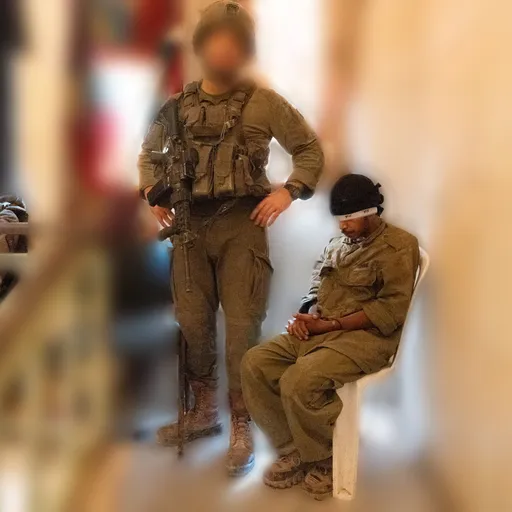
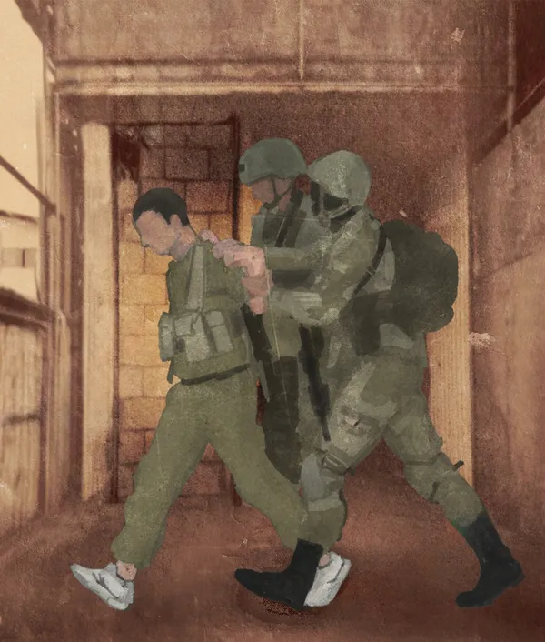
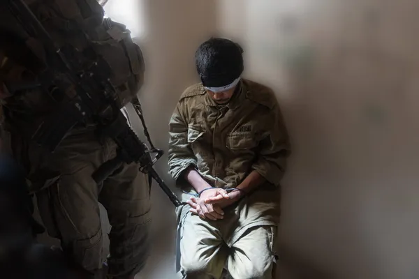
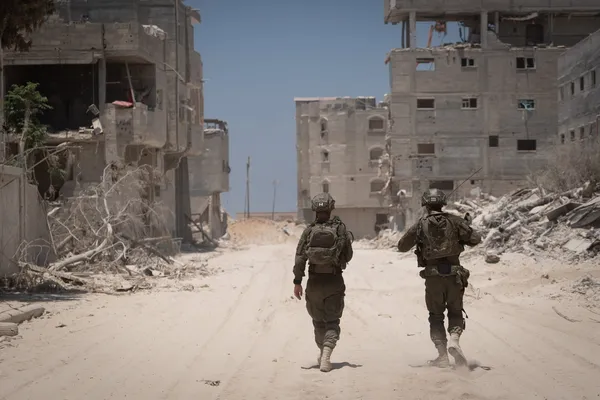
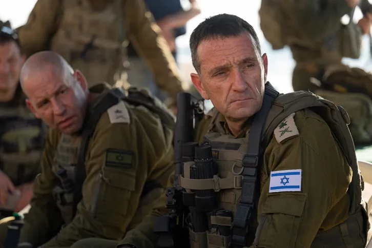
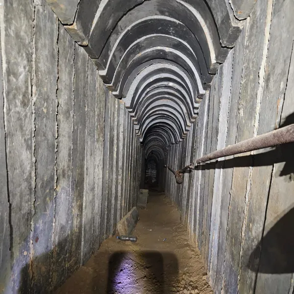
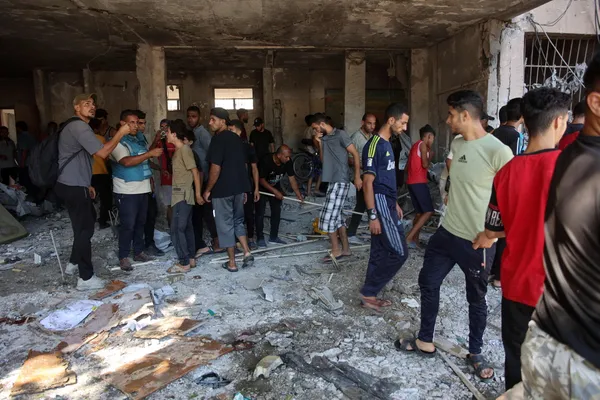
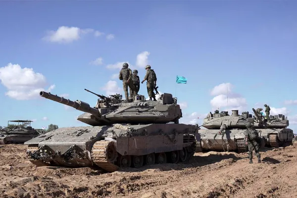

# Haaretz-Untersuchung: Israelische Armee setzt palästinensische Zivilisten zur Inspektion von möglicherweise mit Sprengfallen versehenen Tunneln in Gaza ein

:::lead
„Unsere Leben sind wichtiger als ihre Leben“: Gaza-Bewohner, die nicht des Terrorismus verdächtigt werden, werden verhaftet und als menschliche Schutzschilde eingesetzt, um Tunnel und Häuser zu durchsuchen, bevor die IDF-Soldaten eindringen - mit vollem Wissen hochrangiger israelischer Offiziere, wie mehrere Quellen berichten; die IDF behaupten, diese Praxis sei verboten
:::

Auf den ersten Blick ist es schwer, sie zu erkennen. Sie tragen in der Regel Uniformen der israelischen Armee, viele von ihnen sind in ihren 20ern, und sie sind immer mit israelischen Soldaten verschiedener Dienstgrade unterwegs.

Aber wenn man genauer hinsieht, sieht man, dass die meisten von ihnen Turnschuhe und keine Armeestiefel tragen. Ihre Hände sind hinter dem Rücken gefesselt, und ihre Gesichter sind voller Angst. Die Soldaten nennen jeden von ihnen *„shawish“*, ein obskures arabisches Wort türkischen Ursprungs, das „Sergeant“ bedeutet.

Die israelischen Armeeeinheiten im Gazastreifen haben willkürliche Palästinenser zu einem einzigen Zweck eingesetzt: als menschliche Schutzschilde für Soldaten bei Operationen.

„Unsere Leben sind wichtiger als ihre Leben“, wurde den Soldaten gesagt. Der Gedanke ist, dass es für die israelischen Soldaten besser ist, am Leben zu bleiben, und für die Shawishim, diejenigen zu sein, die von einem Sprengsatz in die Luft gejagt werden.

Diese Beschreibung ist eine von vielen, die Haaretz erhalten hat, einige von Soldaten im Kampf, andere von Kommandanten. Das Bild, das sich ergibt: In den letzten Monaten haben israelische Soldaten überall im Gazastreifen menschliche Schutzschilde auf diese Weise eingesetzt; selbst das Büro des Generalstabschefs weiß davon.

Die Soldaten wählen Gazaner für diese Einsätze aus und bringen sie zu den Brigaden und Bataillonen, die im Gazastreifen operieren. „Man ist stolz darauf“, sagte eine Quelle, die an einigen der ‚Ortungsarbeiten‘ beteiligt war.

„Die höheren Ränge wissen Bescheid“, so die Quelle. Trotz der Aufnahmen, die vor etwa zwei Monaten auf Al Jazeera gezeigt wurden, hat die Armee ihre Unschuld betont. Man sieht israelische Soldaten, die palästinensische Gefangene in Uniformen und kugelsichere Westen kleiden, sie mit Kameras ausstatten und sie mit gefesselten Händen in schwer beschädigte Häuser und Tunneleingänge schicken.

Die Amerikaner sind wütend, obwohl Vedant Patel, ein Sprecher des Außenministeriums, erklärt hat, dass die israelischen Verteidigungskräfte die Vorfälle untersuchen und dass die Beweise in den Videos nicht die Werte der IDF widerspiegeln und gegen Regeln und Vorschriften verstoßen.

„Als ich den Bericht von Al Jazeera sah, sagte ich: 'Ah, ja, es ist wahr'“, sagte ein Soldat einer IDF-Brigade, der an der Verwendung von Gazanern als menschliche Schutzschilde beteiligt war, gegenüber Haaretz. „Und dann habe ich die Antwort der IDF gesehen, die überhaupt nicht der Realität entspricht. Es geschieht mit zumindest dem Wissen des Brigadekommandeurs.“

> Vor etwa fünf Monaten wurden zwei Palästinenser zu uns gebracht. Einer war 20 und der andere 16 Jahre alt. Uns wurde gesagt: 'Benutzt sie, sie sind aus dem Gazastreifen, benutzt sie als menschliche Schutzschilde'. –Ein Soldat einer Brigade der Wehrpflichtigenarmee

(Einige der Kommentare der Soldaten in diesem Artikel wurden auch der Nichtregierungsorganisation Breaking the Silence mitgeteilt).

Der Soldat sagte, dass in der IDF „sie wissen, dass es sich nicht um einen einmaligen Vorfall eines jungen und dummen Kompaniechefs handelt, der von sich aus beschließt, jemanden mitzunehmen.“

::youtube[Das von Al Jazeera veröffentlichte Filmmaterial]{#7CfmBlu-qo4.w-full.aspect-video}

Es gibt auch Hinweise darauf, dass in einigen Fällen Minderjährige oder ältere Menschen eingesetzt werden. „Es gab Zeiten, in denen wirklich alte Menschen in Häuser hineingebracht wurden“, sagte ein Kampfsoldat. Wenn der Palästinenser Hebräisch kann, ist das ein Vorteil für die IDF; wenn Palästinenser in Gebäuden und Tunneln eingesetzt werden, müssen sie sich bei den Streitkräften draußen melden.

Wie ein Soldat es ausdrückte, wird den Palästinensern gesagt: „Erledige einen Einsatz in ... einem [Tunnel-]Schacht und du bist frei.“

Doch obwohl einige Palästinenser „nur“ 24 Stunden lang bei einer Einheit bleiben müssen, bleiben andere zwei Tage oder sogar eine Woche lang. „Wenn man in diesem Ding drin ist, weiß man nicht, wie man sagen soll, was in Ordnung ist“, sagte der Soldat. „Was sicher ist, ist, dass es ein schreckliches Gefühl ist.“

Die IDF-Sprechereinheit sagte ihrerseits: „Die Anweisungen und Befehle der IDF verbieten den Einsatz von Zivilisten aus dem Gazastreifen, die im Einsatz gefangen sind, für militärische Missionen, die ein absichtliches Risiko für ihr Leben darstellen. Die diesbezüglichen Anweisungen und Befehle der IDF wurden den Streitkräften deutlich gemacht. Nach Erhalt der Anfrage wurden die Vorwürfe an die zuständigen Behörden zur Überprüfung weitergeleitet.“

Die Vorfälle, die Haaretz geschildert wurden, ereigneten sich in verschiedenen Teilen des Gazastreifens, sind sich aber alle sehr ähnlich, wie die Geschichte eines Soldaten zeigt, der dort monatelang im Einsatz war. Eines Tages kamen er und seine Kameraden am Gebäude des Brigadekommandeurs an.

Der Soldat sah jemanden, den er nicht erkannte, in Begleitung von Soldaten, die ihn bewachten, hin und her gehen. „Er trug eine Uniform ohne [Splitterschutzweste] und mit Sportschuhen ... Sie baten uns, ihn zu begleiten, wenn er auf die Toilette gehen müsse, und dafür zu sorgen, dass er etwas zu essen habe.“

Der Soldat sagte, dass er zu diesem Zeitpunkt nicht verstand, was vor sich ging; er und seine Kameraden fragten sich, ob der Palästinenser ein Gefangener war, der nun mit den IDF kollaborierte.

Doch am nächsten Tag musste die Truppe einen Tunnel inspizieren, und als die Soldaten einen Bildschirm betrachteten, stellten sie fest, dass der Palästinenser in einer IDF-Uniform in den Tunnel geschickt worden war. Seine Hände waren auf dem Rücken gefesselt und eine Kamera war an seinem Körper befestigt.

„Wir hörten sehr tiefe Atemzüge; es klang, als hätte er ein wenig Angst“, sagte ein Soldat, der die Aufnahmen dieses Geschehens sah. „Sie haben ihn einfach reingeschickt und er hat es den Kommandanten aufgezeichnet, während der Brigadekommandeur von außen zusah.“

Ein Soldat sagte, als die Soldaten dort ihre Bedenken äußerten, wurde ihnen gesagt, dass „die Idee im Allgemeinen war, dass, wenn das Haus mit einer Sprengfalle versehen war, oder wenn es einen Hinterhalt gab oder Terroristen in der Gegend waren, sie [den Palästinenser, der hineingeschickt wurde] töten würden und nicht die Soldaten. Das war auch das erste Mal, dass die Kommandeure das Wort 'shawish' sagten.

Ein anderer Soldat dieser Einheit sagte, dass dies immer wieder passierte; er sagte, dass bei jeder Operation ein menschliches Schutzschild 10 Minuten vor allen anderen ausgesandt wurde; dann kam das Warten auf den Brigadekommandeur.

„Die Leute fingen an, Fragen zu stellen, und sehr schnell entstand ein Durcheinander über dieses Verfahren“, sagte ein Soldat. „Einige argumentierten, dass sie nicht bereit seien, Operationen durchzuführen, wenn dabei ein Gazaner geopfert werden müsse. Natürlich gab es auch Befürworter, aber zumindest bei uns waren es nur wenige, meist die Kommandeure, die Angst hatten, sich mit den ranghöheren Kommandeuren anzulegen.“

In einem Fall sagte ein israelischer Soldat, der an einer Razzia in einem Gebäude teilnahm, dass sich in einer der Einheiten ein Gazaner in einem weißen Overall befand. Als Teil eines Versuchs, bewaffnete Palästinenser aus dem Gebäude zu locken, wurde der Gazaner als eine Art Vermittler hingeschickt. Der Versuch schlug jedoch fehl, und die bewaffneten Männer erschossen den Mann.

## Wenn kein Zweifel besteht

Palästinenser wurden bereits während der zweiten Intifada im Jahr 2002 bei der Operation Defensivschild im Westjordanland als menschliche Schutzschilde eingesetzt. Dies war oft als „Nachbarschaftsprozedur“ bekannt - Soldaten, die Sprengfallen fürchteten, schickten Palästinenser in Gebäude; dies geschah auch bei der Suche nach gefahndeten Männern.

Rechtsgruppen reichten daraufhin eine Petition beim Obersten Gerichtshof ein, der 2005 entschied, dass diese Vorgehensweise illegal war und gegen internationales Recht verstieß. Der damalige Generalstabschef der IDF, Generalleutnant Dan Halutz, wies das Militär an, die Entscheidung des Gerichts konsequent umzusetzen.

In den letzten Monaten hat es die IDF jedoch vorgezogen, sich nicht offiziell zu der Angelegenheit zu äußern, obwohl sie Berichten zufolge von den höchsten Offizieren diskutiert wurde. Quellen zufolge gehört IDF-Stabschef Herzl Halevi zu den ranghöchsten Offizieren, die über den Einsatz von Gaza-Bewohnern als menschliche Schutzschilde informiert sind.

„Der Leiter des Südkommandos, Generalmajor Yaron Finkelman, weiß es auch“, so eine Quelle im Südkommando. „In jeder Sitzung, in der dieses Thema angesprochen wurde, gab es Kommandeure, die vor den ethischen und rechtlichen Konsequenzen warnten, wenn die Angelegenheit öffentlich gemacht würde. Es gab Offiziere, die darum baten, die Sitzung zu unterbrechen, damit sie die Sitzung verlassen können.

Ein Soldat einer Wehrpflichtigenbrigade fügte hinzu: „Vor etwa fünf Monaten wurden zwei Palästinenser zu uns gebracht. Einer war 20 und der andere 16 Jahre alt. Uns wurde gesagt: 'Benutzt sie, sie sind aus dem Gazastreifen, benutzt sie als menschliche Schutzschilde.'“

An diesem Tag, so der Soldat, begannen die Soldaten der Einheit, Fragen über diesen Einsatz von Zivilisten als menschliche Schutzschilde zu stellen; sie wollten auch wissen, wer den Befehl dazu gegeben hatte.

Der Soldat sagte: „Sie versuchten, etwas über den 7. Oktober zu sagen, aber nichts Konkretes. Eine Person sagte: 'Schlagt sie nicht zu sehr, denn wir brauchen sie, um die Gebäude zu öffnen'“, in die die Truppen eindringen müssen, wie Gebäude und Tunnel.

Dieser Befehl war nur einer von vielen, den die Soldaten erhielten. Sie mussten zum Beispiel auch dafür sorgen, dass die Bewohner des Gazastreifens gefesselt blieben und dass die Bewohner des Gazastreifens nicht entkamen oder die Räume und Stockwerke betraten, in denen sich die Kommandanten befanden. Die Bewohner des Gazastreifens erhielten Kampfrationen und Wasser.

Viele Soldaten fühlten sich dabei unwohl, verlangten Antworten und schrien sogar, sagte eine Person, die in der Nähe eines der Gazaner war. „Den meisten von ihnen war klar, dass es hier einen problematischen Vorfall gab, und es fiel ihnen schwer, das zu verarbeiten“, sagte er.

Er fügte hinzu: „Einer der Kommandeure wandte sich an einen der Soldaten, die versuchten, Antworten zu erhalten, und sagte ihm: 'Sind Sie nicht auch der Meinung, dass das Leben Ihrer Freunde viel wichtiger ist als deren Leben? Und ist es nicht besser, dass unsere Freunde leben und nicht von einem Sprengsatz in die Luft gejagt werden, als dass sie von einem Sprengsatz in die Luft gejagt werden?“

Dieser Soldat sagte, der Kommandant habe sich so aggressiv geäußert, dass für die Truppe kaum Raum blieb, um Zweifel zu äußern.

Ein Soldat sagte, als er und seine Kollegen nach dem „Warum“ fragten, habe man ihnen von den Hunden der Hundestaffel von Oketz erzählt. Die Hunde wurden getötet oder verwundet, wenn sie eingesetzt wurden, um Sprengstoff aufzuspüren oder den Feind anzugreifen. Oder die Hunde mussten nach ihrer Erfahrung entlassen werden, weil ihre Einsatzfähigkeit nachgelassen hatte.

Ein höherer Beamter bestätigte diese Behauptung, obwohl einige Soldaten meinten, dies sei nur ein Vorwand, um ihr Gewissen zu beruhigen.

## Ein irrelevantes Gesetz

Wie dem auch sei, viele Soldaten haben immer noch ein schlechtes Gewissen. „Sie schweigen und versuchen, sich selbst davon zu überzeugen: 'Yalla, okay, lass sie uns benutzen'. Sie haben versucht, die Sache rational zu erklären, aber am Ende saß ein 16-jähriger Junge mit gefesselten Händen im Haus und hatte die Augen zugedrückt“, sagte eine Person, die dabei war.

„Die Soldaten mussten ihm helfen, auf die Toilette zu gehen oder ihn zu füttern. Es war kein Vorfall, der mit dem Betreten von Häusern und Tunneln oder der Sprengung von Gebäuden beginnt und endet. Da ist die Zeit, die man mit denselben Leuten ein paar Tage lang in dem Haus verbracht hat.“

Nach zwei oder drei Tagen, in denen ein Jugendlicher von den Soldaten als menschliches Schutzschild benutzt wurde, baten sie um ein Gespräch mit dem Bataillonskommandeur und teilten ihm mit, dass sie nicht mehr mitmachen wollten. Einige äußerten auch Zweifel an einer anderen Frage - der Notwendigkeit des Befehls zum Niederbrennen von Gebäuden, nachdem diese durchsucht worden waren.

Der Begriff „internationales Recht“ fiel mehrmals, aber der Bataillonskommandeur hatte Berichten zufolge nur eine Antwort auf alle Fragen der Soldaten: „Ein Soldat braucht sich nicht für die Gesetze des Krieges zu interessieren. Du musst über die Werte der IDF nachdenken und nach den Werten der IDF handeln, nicht nach den Kriegsgesetzen.“

Am nächsten Tag wurde der Teenager freigelassen. Er wurde zu einem Kontrollpunkt gebracht und aufgefordert, nach Süden zu gehen. „Dann wurde uns endlich klar, dass es sich nicht um Terroristen handelte, sondern um Zivilisten, die speziell für diese Operationen entführt wurden“, sagte der Soldat.
