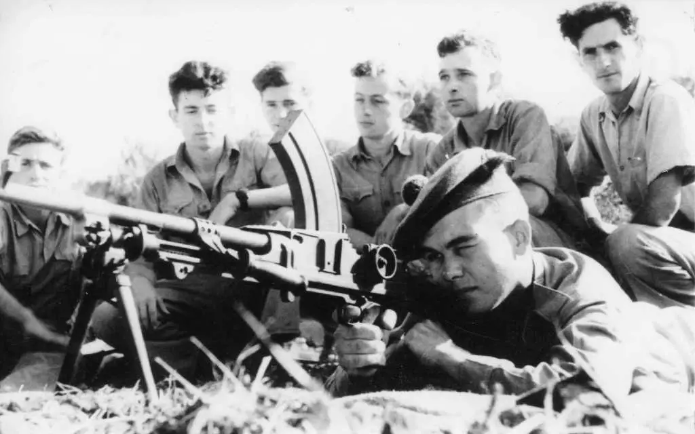
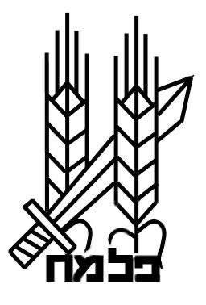
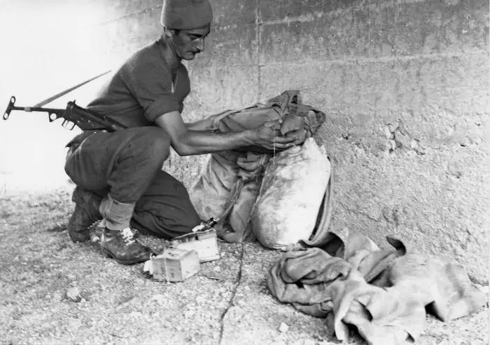
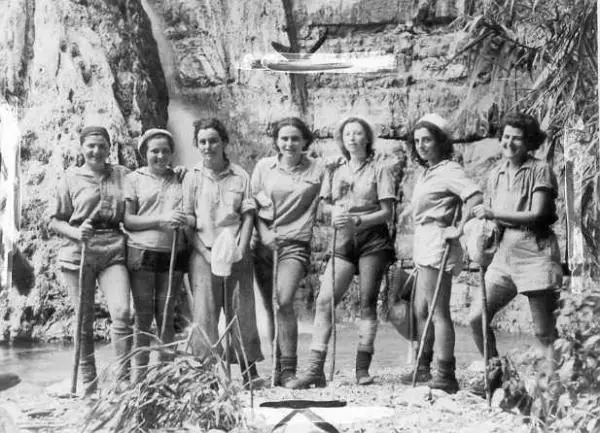
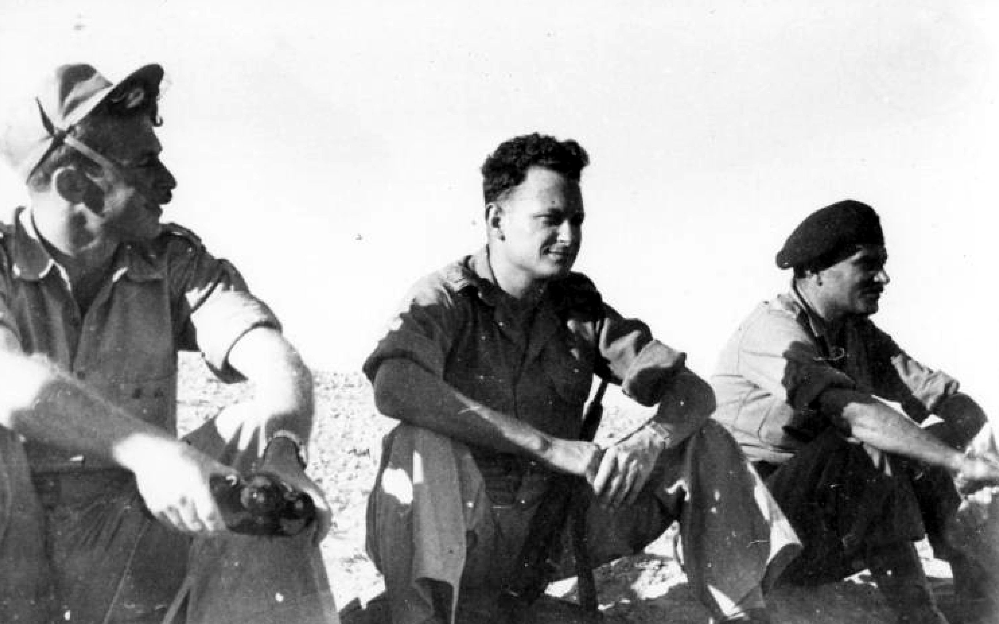

# Jüdische Verteidigungsorganisationen: Der Palmach

Die Palmach, ein Akronym für „*Pelugot Hamahatz*“, was so viel wie „Stoßtrupp“ bedeutet, wurde am 19. Mai 1941 als Teil der Haganah[^1] gegründet, da eine deutsche Invasion in Palästina[^2] befürchtet wurde. Die Truppe bestand ursprünglich aus neun Angriffskompanien mit mehr als 2.000 Männern und Frauen: drei in Nordgaliläa, zwei in Mittelgaliläa, zwei in Südgaliläa und eine in Jerusalem[^3]. Wie die Kibbuz[^4]-Bewegung förderte die Palmach die Werte der gegenseitigen Verantwortung, der Hilfe, der Aufopferung und des Beitrags zum Allgemeinwohl. Die Palmach-Stützpunkte befanden sich in den Kibbuzim, so dass die Mitglieder des Palmach sowohl für die landwirtschaftlichen Aufgaben als auch für die militärischen Übungen verantwortlich waren. Dieses vom Palmach geschaffene soziale Gefüge galt als Kern der Sabra, des gebürtigen Israeli.

Die Palmach führte Präventivschläge auf syrischem und libanesischem Gebiet durch und schickte häufig arabisch sprechende Mitglieder in arabischer Kleidung nach Syrien und in den Libanon, um Ziele zu sabotieren und auszukundschaften. Als die Briten nach dem Sieg der Alliierten in der zweiten Schlacht von El Alamein 1942 die Auflösung der Palmach anordneten, ging die Organisation in den Untergrund[^5].

Nach der Ermordung von Lord Moyne waren die Mitglieder des Palmach unter dem Kommando von Shimon Avidan sieben Monate lang an der „Jagdsaison“ beteiligt, in der sie mit den Briten zusammenarbeiteten, um die Irgun (Etzel[^6]) und die Stern-Bande (Lehi[^7]) zu zerschlagen. Später jedoch beschloss David Ben-Gurion am 1. Oktober 1945, dass sich die jüdischen Kampfkräfte gegen die Briten zur jüdischen Widerstandsbewegung[^8] zusammenschließen sollten. Am 10. Oktober 1945 wurde die erste Operation, ein Überfall auf das Internierungslager Atlit[^9], bei dem 208 dort festgehaltene „illegale“ Einwanderer befreit wurden, unter der Führung von Yitzhak Rabin durchgeführt. Im November 1945 startete die Bewegung einen Großangriff auf Eisenbahnen im ganzen Land und versenkte mehrere britische Schiffe. In den folgenden Monaten verübte die Bewegung Anschläge auf britische Polizeiposten, Küstenwachen, Radaranlagen und Flugfelder. Im Juni 1946 sprengte die Palmach zehn der elf Brücken, die Palästina mit seinen Nachbarländern verbinden.

Die britischen Behörden reagierten auf diesen Angriff am 29. Juni 1946 („Schwarzer Samstag“) mit der Verhaftung der Mitglieder des Vorstands der Jewish Agency[^10].

Die Jewish Agency ordnete daraufhin eine Einstellung der bewaffneten Operationen gegen die Briten an, doch die Irgun und die Stern-Bande weigerten sich, dem nachzukommen. Nachdem die Irgun im Juli 1946 die zentralen Regierungsbüros im King David Hotel in Jerusalem in die Luft gesprengt hatte, hörte die jüdische Widerstandsbewegung auf zu existieren.

Vor der arabischen Invasion am 14. Mai 1948 führte die Palmach eine Reihe von Operationen durch, einige offensiv, andere defensiv. Am 15. Januar 1948 wurden 35 Haganah-Mitglieder, darunter 18 vom Palmach, mit der Versorgung von Gush Etzion beauftragt, wurden jedoch entdeckt und in einen Kampf verwickelt, bei dem alle Männer getötet und ihre Körper verstümmelt wurden. Im April leitete die Palmach die Operation Nachshon ein, um die Straße nach Jerusalem zu öffnen, und am 30. April startete die Palmach die Operation Yiftach, um die strategisch wichtige Stadt Safed[^11] in Galiläa einzunehmen.

Die Palmach wuchs auf 12 Kompanien an. Sie spielte eine zentrale Rolle im Unabhängigkeitskrieg, dem Höhepunkt der Palmach-Aktivitäten. Von den 12 Brigaden der Haganah waren drei Palmach-Brigaden, die während des Krieges als „Spitze des Speers“ galten.

Der letzte Einsatz der Palmach als unabhängige Einheit war gegen die Irgun in der Altalena-Affäre. Am 22. Juni 1948 befahl Ben-Gurion der Palmach, die Irgun daran zu hindern, Waffen von dem Schiff zu entladen, von denen Ben-Gurion befürchtete, sie könnten gegen den neuen Staat eingesetzt werden. In der anschließenden Schlacht wurde das Schiff versenkt. 

Die Palmach wurde auf Befehl Ben Gurions am 7. November 1948 aufgelöst. Sie wurde in die israelischen Verteidigungskräfte integriert und in drei Brigaden umorganisiert - die Negev[^12]-Brigade, die Yiftach-Brigade und die Harel-Brigade. Die Negev- und die Yiftah-Brigade kämpften im Negev gegen die ägyptische Armee. Die Yiftah-Brigade wurde später in den Norden verlegt. Die Harel-Brigade war in Jerusalem stationiert. 

Zu den Führern der Palmach gehörten Yigal Allon, Moshe Dayan, Yitzhak Rabin, Haim Bar[^13]-Lev, Uzi Narkiss und Ezer Weizman.

[^1]: (hebr. Verteidigung) Jüdische Verteidigungsorganisation im Untergrund, die während der britischen Mandatszeit gegründet wurde. Nach der Ausrufung des Staates Israel fusionierte sie formell mit anderen Untergrundkräften zu den Israelischen Verteidigungsstreitkräften (Tzva Haganah L'yisrael).
[^2]: (griechische Form für Philister, für die Küstenbevölkerung, auf die frühe Geographen stießen) Eine antike Bezeichnung für das Gebiet zwischen Syrien (im Norden) und Ägypten (im Süden), zwischen dem Mittelmeer und dem Fluss Jordan; ungefähr das moderne Israel. Der Name bezieht sich auf das Land Israel während der Jahre des jüdischen Exils.
[^3]: Alte Hauptstadt des Königreichs Israel und Hauptstadt des modernen Staates Israel. Als Sitz des Felsendoms, der Grabeskirche und der Überreste des jüdischen Tempels ist Jerusalem für alle drei großen monotheistischen Religionen von großer Bedeutung. Nach dem israelischen Unabhängigkeitskrieg von 1948 wurde Jerusalem zwischen Israel und Jordanien aufgeteilt. Nach dem israelischen Sieg im Sechstagekrieg 1967 wurde die Stadt wiedervereinigt.
[^4]: (pl. Kibbuzim). Eine kommunale Siedlung im modernen Israel.
[^5]: Ein geheimes Netzwerk, das organisiert ist, um sich der Autorität zu widersetzen.
[^6]: Akronym für Irgun Tzvai L'umi, Nationale Militärische Organisation; revisionistische zionistische paramilitärische Organisation während der Zeit des britischen Mandats.
[^7]: (Abk. für Heb. Lohamei Herut Israel, Kämpfer für die Freiheit Israels, auch L.H.Y.). Anti-britische bewaffnete Untergrundorganisation in Palästina, gegründet 1940 von Dissidenten der I.Z.L.
[^8]: Das Wort, das üblicherweise verwendet wird, um zu beschreiben, wie Juden gegen die Nazis kämpften.
[^9]: Internierungslager, das nach dem Zweiten Weltkrieg in der Stadt Atlit an der Nordküste des britischen Mandatsgebiets Palästina eingerichtet wurde, um „illegale“ jüdische Einwanderer aus Europa aufzunehmen.
[^10]: Organisation, die 1929 als offizielle Vertretung der jüdischen Gemeinde gegenüber der britischen Mandatsregierung gegründet wurde. Sie erhielt nach und nach die Eigenschaften einer Proto-Regierung für die jüdische Gemeinschaft. Nach der Gründung des Staates Israel verlagerte die Jewish Agency ihren Schwerpunkt auf Fragen, die sowohl den Staat als auch die jüdischen Gemeinden im Ausland betrafen.
[^11]: Mystische Stadt im Norden Israels, die durch ihre Höhe in den Hügeln vor den meisten Angriffen geschützt ist.
[^12]: Die südliche, meist trockene Region Israels.
[^13]: (hebr. Sohn (Tochter)-des-Gebotes(s)). Der Ausdruck bezog sich ursprünglich auf eine Person, die für die Einhaltung der göttlichen Gebote des Judentums verantwortlich war; heute bezieht er sich auf die Gelegenheit, wenn ein Junge oder ein Mädchen das Alter der religiösen Reife und Verantwortung erreicht (dreizehn Jahre für einen Jungen; zwölf Jahre und einen Tag für ein Mädchen).
