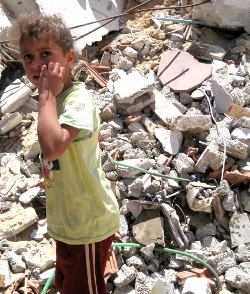

# UXOs: Hat Israel die Hamas absichtlich bewaffnet?

Israels Krieg gegen Palästina ist ein Friedhof von Fragen, die gestorben sind und darum betteln, gestellt zu werden.

Die Medien berichten über die Aktionen Israels und geben Erklärungen ab, die Israel selbst liefert. Die palästinensische Familie wurde aus ihrem Haus geworfen, weil sie nicht rechtmäßig in Ostjerusalem wohnt. Der Krankenwagen wurde bombardiert, weil er Terroristen transportierte. Zehntausend Palästinenser sitzen im Gefängnis, weil sie Kämpfer waren und Anschläge planten. Das Haus wurde plattgemacht, weil es ohne Genehmigung gebaut wurde. Diese Zeilen befriedigen die willfährigen Medien; es werden keine Fragen gestellt.

Vierzehn Monate lang, nach den so genannten „Cast Lead“-Angriffen vom 27. Dezember 2008 bis zum 18. Januar 2009, hat Israel die UN-Bombenexperten beharrlich daran gehindert, den riesigen Vorrat an nicht explodierten Kampfmitteln (UXO), den es im Gazastreifen hinterlassen hat, zu neutralisieren.

Auf diese Weise sorgte Israel vierzehn Monate lang dafür, dass die Kampfmittel, bei denen es sich um ein riesiges Sprengstofflager handelte, von militanten palästinensischen Gruppen erbeutet werden konnten.

Und warum?

Nachdem Israel die Operation „Cast Lead“ offiziell beendet hatte, begannen der Minenräumdienst der Vereinten Nationen und die britische Organisation Mines Advisory Group, ein Friedensnobelpreisträger, mit dem Einsammeln des gewaltigen Arsenals an Blindgängern, das Israel zurückgelassen hatte. Ihre Aufgabe war dringend - die Waffen mussten zerstört werden, damit sie keine Zivilisten gefährden oder von militanten Gruppen geplündert werden konnten.

Als die Vereinten Nationen versuchten, die für die Beseitigung der Munition benötigte Ausrüstung herbeizuschaffen, wurden sie jedoch von Israel daran gehindert, obwohl es im Gazastreifen keine rechtliche Zuständigkeit hat und behauptet, den Gazastreifen nicht zu besetzen.

Den Bombenexperten gelang es, einige weiße Phosphorgranaten zu entsorgen, indem sie sie in Wasser tauchten und mit Sand bedeckten[^1], aber die große Mehrheit der Blindgänger konnte nicht zerstört werden, bis Israel die UNO nicht mehr daran hinderte, ihre Ausrüstung mitzubringen.

So blieben die Blindgänger auf Halde, eine Gefahr für die nahe gelegenen, dicht besiedelten Gebiete und eine Versuchung für militante Gruppen. Die Munition wurde natürlich bewacht - und zwar von derselben Polizei des Gazastreifens, die Israel in den ersten Tagen von „Cast Lead“ gezielt ins Visier genommen hatte, mit der Begründung, es handele sich nicht um eine zivile Einheit, sondern um die Polizei der Hamas.

Die erste Nachricht darüber, dass Kampfmittel aus der Operation „Cast Lead“ in die Hände von Israels Gegnern gelangten, kam Anfang Februar, als die Hamas öffentlich Waffen ausstellte, die sie eingesammelt hatte, darunter nicht explodierte Ein-Tonnen-Bomben, Halbtonnen-Bomben, 250-Kilogramm-Bomben, 30-mm-Bomben, verschiedene Arten von Panzerabwehrraketen, Beleuchtungsgeschosse und die Minen, die Israel zum Sprengen von Häusern verwendet.[^2]

Doch Israel hinderte die UNO weiterhin daran, die gelagerten Blindgänger zu zerstören.

Nach weiteren Wochen der Blockade - inzwischen war es Mitte Februar - gab Israel als Reaktion auf die Proteste der Hilfskräfte eine außerordentliche Erklärung ab. Die Erklärung lautete wie folgt:

„Die Schlussfolgerung, dass die IDF die Einreise der [UXO-Beseitigungs-]Truppe nicht zulässt, entbehrt jeder sachlichen Grundlage, da keine Antwort erteilt wurde. Die Angelegenheit wird wohlwollend geprüft, und die Antwort der IDF wird innerhalb weniger Tage erfolgen."[^3]

Noch bevor die „paar Tage“ um waren, verschwanden fünf Tonnen von „Cast Lead“-Gebäuden aus dem Lager, das die UNO zerstören wollte - das unvermeidliche Ergebnis von Israels Einmischung. Israel gab sofort der Hamas die Schuld; aber ob es nun die Hamas oder eine andere militante Gruppe war, Israel stellte den Vorfall - zu Recht - als einen Schlag gegen seine Sicherheit dar.

Die Medien griffen die Geschichte vom „Diebstahl“ von Bomben durch die Hamas auf, äußerten sich aber nicht zu den Umständen. Die New York Times berichtete lediglich, dass die Munition „auf die sichere Beseitigung durch ein mit den Vereinten Nationen zusammenarbeitendes Team“[^4] gewartet habe, was den Leser zu der Annahme verleitete, dass das UN-Team einfach nicht dazu gekommen sei.

Die wenigen Medien, in denen erwähnt wurde, warum die Blindgänger nicht vernichtet wurden, taten dies mit bemerkenswerter Leichtgläubigkeit. Haartez berichtete, dass die Arbeit des UN-Teams „aufgehalten wird, weil Israel weder die Einreise ihrer Ausrüstung noch ein Gebiet für die Lagerung und Neutralisierung von Kampfmitteln genehmigt hatte.“[^5] Die BBC berichtete, dass „die UN-Mitarbeiter auf die Erlaubnis der israelischen Armee gewartet hatten, ihre Spezialausrüstung mitzubringen [und] auch auf die Erlaubnis des israelischen Militärs warteten, zwei sichere Gebiete für die Entsorgung der Munition zu nutzen.“[^6] Keines der Medien zeigte sich auch nur im Geringsten neugierig auf diese seltsamen Aussagen und die Fragen, die sie aufwerfen.

Selbst nachdem diese fünf Tonnen gelagerter Bomben in den Händen von Israels eingeschworenen Feinden gelandet waren, weigerte sich Israel immer noch, den Vereinten Nationen zu erlauben, die verbleibenden Blindgänger zu entschärfen. Ende Mai 2009 - drei Monate nach der Erklärung der IDF, dass keine Reaktion erfolgt sei, und unter dem anhaltenden Druck der UN - willigte Israel „im Prinzip“ ein, die Blockade der UN zu beenden, aber eben nur „im Prinzip“[^7].

Ein Experte des Minenräumdienstes der Vereinten Nationen, der damals mit der Situation im Gazastreifen befasst war, sagte mir mit einem Anflug von Verblüffung, dass Israel die Behinderung seiner Arbeit immer wieder als „bürokratisch“ darstellte: „Man braucht die Erlaubnis eines höheren Beamten usw.“ Aber um eine Erklärung für die Verzögerungen von den zuständigen israelischen Stellen zu bekommen, „sind die Chancen auf eine Antwort“, so der Offizier, „ungefähr so groß wie die Wahl von Khaled Meshal zum israelischen Premierminister“[^8] - nämlich genau null.

Erst nach weiteren zehn Monaten, am 10. März 2010, „erlaubte“ Israel den Bombenexperten schließlich, ihre Ausrüstung in den Gazastreifen zu bringen und mit der Zerstörung der restlichen „Cast Lead“-Munition zu beginnen. Das war ein Jahr und zwei Monate nach dem Ende von Gegossenes Blei.

Israels erklärter Grund für die Belagerung des Gazastreifens ist es, Material zur Waffenherstellung fernzuhalten. Israel bombardiert die Grenzen des Gazastreifens und beschießt seine Küste, schießt routinemäßig auf Bauern und Fischer im Gazastreifen und raubt internationale Hilfsschiffe aus, mit der bloßen Behauptung, dass seine Blockade durchbrochen wird.

Was angeblich Israels schlimmster Albtraum ist, begann in dem Moment, in dem „Cast Lead“ endete - ein riesiges Lager mit Sprengstoff im Gazastreifen, bewacht von Hamas-Vertretern. Doch Israels Reaktion darauf waren vierzehn Monate „Bürokratie“, die die Zerstörung der Waffen blockierten.

Im besten Fall war Israel nicht besorgt über das Vorhandensein eines riesigen Lagerbestands an Sprengstoff im Gazastreifen, der umverpackt und über die Grüne Linie geschickt werden könnte.

Doch „gleichgültig“ ist eine großzügige Auslegung. Israel hat nicht nur nichts unternommen, um diese Bedrohung für seine Sicherheit zu beseitigen, sondern sie aktiv verhindert. Israel hat bewusst dafür gesorgt, dass sich militante Gruppen Waffenmaterial beschaffen konnten.

Es ist interessant, darauf hinzuweisen, dass Israel Mitte September 2010 ein neues Phänomen meldete: Granaten mit weißem Phosphor, die vom Gazastreifen aus auf den Süden Israels abgefeuert wurden.[^9] Die Medien berichteten natürlich darüber - aber nicht über die wahrscheinliche Quelle der Militanten für diese Granaten.

Ob man die Raketen der Militanten als Terrorismus verurteilt, sie als politisch dumm abtut oder sie als Selbstverteidigung rechtfertigt, ist für die Frage irrelevant. Israelische Historiker, die mit den zionistischen Aufzeichnungen vertraut sind, haben dokumentiert, wie Israel in der Vergangenheit Angriffe provoziert hat, um Vergeltung („Verteidigung“) zu rechtfertigen[^10]. Die westlichen Medien berichten selten über israelische Angriffe auf Palästina, sondern nur über die palästinensische Reaktion.

So offensichtlich es auch erscheinen mag, dass die Aufrechterhaltung einer äußeren Bedrohung weiterhin Israels Modus Operandi ist, so schwierig ist es zu beweisen. Man muss nicht nur nachweisen, dass Israels Handlungen seiner Sicherheit zuwiderlaufen, sondern dass der eigentliche Zweck seiner Handlungen darin besteht, dies zu tun.

Und genau das ist die Bedeutung seiner Einmischung in die Beseitigung der Blindgänger: Israel wusste genau, dass das Ergebnis seines Handelns die Fortsetzung der Angriffe sein würde, die es zur Rechtfertigung von Gegossenem Blei anführte.

Israel muss aufgefordert werden, zu erklären, warum es die Vernichtung von Kampfmitteln im von der Hamas kontrollierten Gazastreifen über ein Jahr lang blockiert hat. Würden die Medien diese und unzählige andere nicht gestellte Fragen kritisch und unabhängig untersuchen, sähe das israelisch-palästinensische Debakel für die westliche Öffentlichkeit - die Menschen, von deren Duldung Israels ethnische Säuberung Palästinas abhängt - schon ganz anders aus.

*Vielen Dank an Nancy Elan für ihre Unterstützung. Bildnachweis, Tom Suarez.*

[^1]:  „Gaza-Minenräumungsteams warten auf israelische Genehmigung“, Haaretz, 17. Februar 2009.
[^2]:  Landmine Monitor Report 2009, Palästina. Auch Amira Hass, „“Gazaner richten eine behelfsmäßige Ausstellung israelischer Waffen ein, die bei Cast Lead eingesetzt wurden“, in Haartez, 4. Februar 2009
[^3]:  ebd.
[^4]:  „Amerikanische Gesetzgeber besuchen Gaza“, NY Times, 18. Februar 2009.
[^5]:  „Gaza-Minenräumungsteams warten auf israelische Genehmigung“, Haartetz, 17. Februar 2009.
[^6]:  „Sprengstofftransport in Gaza vermisst“, BBC News, 17. Februar 2009.
[^7]:  Elena Rice [U.N. Mine Action Service] „ Die schnelle Reaktion auf die Operation Cast Lead“, in The Journal of ERW and Mine Action, Winter 2009.
[^8]:  E-Mail-Korrespondenz zwischen einem Beamten des Minenräumdienstes der Vereinten Nationen und dem Autor, März 2010. Die israelischen Behörden, mit denen das UN-Team zu tun hatte, waren COGAT (Coordinator of Government Activities in the Territories) und CLA (Coordination and Liaison Administration). Khaled Meshal ist die wichtigste Figur der Hamas, die vor allem durch den verpatzten, nicht ganz ernst gemeinten Mordanschlag des Mossad auf ihn im Jahr 1997 bekannt wurde.
[^9]:  „Terroristen feuerten 2 Phosphorgranaten auf Israel ab“, in: Jerusalem Post, 15. September 2010.
[^10]:  Zum Beispiel Ilan Pappe, Ethnic Cleansing of Palestine, S. 51-52 [Oneworld, 2006]; und Zeev Maoz, Defending the Holy Land [University of Michigan Press, 2009].
