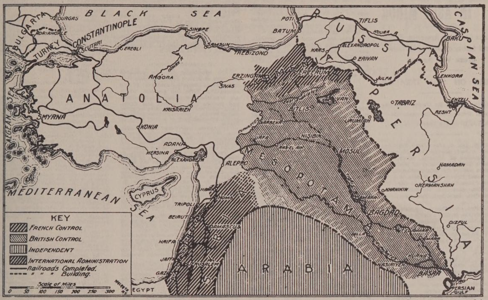

# Das künftige Kleinasien, wie es in den soeben angekündigten Verträgen vorgesehen ist

Diese Karte zeigt, wie Kleinasien aufgeteilt wird, wenn die geheimen Verträge von 1916 und 1917 zwischen den alliierten Mächten, die letzte Woche von Außenminister Pichon in Paris angekündigt wurden, umgesetzt werden. Diese Verträge, die Großbritannien und Frankreich 1916 und Großbritannien, Frankreich und Russland vor dem Zusammenbruch des letzteren 1917 geschlossen haben, sehen die Kontrolle Frankreichs über Syrien, den Libanon und einen Teil Armeniens und Großbritanniens über Mesopotamien vor. Sie sehen auch ein unabhängiges Königreich Arabien und eine internationale Verwaltung für Palästina vor. Jetzt frei von der Türkei. Es war auch vorgesehen, dass Konstantinopel an Russland gehen sollte, aber die Ereignisse seit der Unterzeichnung des russischen Vertrages von 1917 haben diesen Teil des Abkommens annulliert und das endgültige Schicksal der türkischen Hauptstadt wird auf der Friedenskonferenz von Versailles geregelt werden. Andere Bestimmungen des russischen Vertrages, die Frankreich und Großbritannien betreffen und die sich auf "Hilfsgebiete" in Kleinasien beziehen, bleiben bestehen, wie es hieß. Auf dieser Karte sind nur ungefähre Grenzverläufe angegeben.
