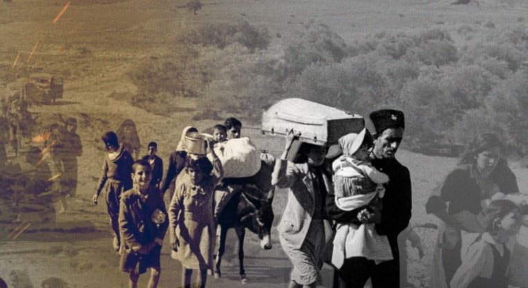

# Berliner Schulen verteilen Flugblätter, die die Nakba von 1948 als „Mythos“ abtun

:::lead
Eine Broschüre mit dem Titel „Mythos Israel 1948“ wurde an Schulen in Deutschland verteilt, um die Zwangsumsiedlung während der Nakba zu verharmlosen und Kritik an Siedlungen als „antisemitisch“ zu bezeichnen.
:::

Angesichts des anhaltenden israelischen Völkermords an den Palästinensern in Gaza und der zunehmenden Angst vor einer neuen Nakba wurden Schulen in Berlin angewiesen, Flugblätter zu verteilen, in denen der Nakba-Tag als „Mythos“ bezeichnet wird.

::twitter[Heute hat die Berliner Bezirksverordnetenversammlung beschlossen, eine Broschüre *in Schulen* zu verteilen, die mit rechtsgerichteter revisionistischer Geschichtsschreibung über I/P prahlt. Deutschland bleibt gegenüber Warnungen von Intellektuellen aus allen Ecken unempfindlich und klopft sich stattdessen selbst auf die Schulter für seine nie endende Kleingeistigkeit https://t.co/mioxwkN40N]{#1760791271260484034 user="hahauenstein" date="2024-02-22"}

Die von Bundeskanzler Olaf Scholz geführte Sozialdemokratische Partei Deutschlands (SPD) und die oppositionelle Christlich Demokratische Partei (CDU) haben die Gymnasien im Berliner Bezirk Neukölln beauftragt, Broschüren mit dem Titel „Der Mythos Israel 1948“ zu verteilen.

::twitter[In Neuköllner Schulen wird nun die Broschüre "Mythos Israel 1948" verteilt. Die Broschüre leugnet die Vertreibungen der Nakba, in deren Rahmen meine Familie Anfang 48 vertrieben wurde, und verharmlost den israelischen Siedlungsbau und dämonisiert jene, die ihn kritisieren.]{user=ju_khatib #1760602735798280270 date="2024-02-22"}

[In einem Antrag](https://www.berlin.de/ba-neukoelln/politik-und-verwaltung/bezirksverordnetenversammlung/online/vo020.asp?VOLFDNR=8771), der während einer öffentlichen Sitzung des Gemeinderats am vergangenen Mittwoch genehmigt wurde, heißt es, dass „das Bezirksamt aufgefordert wird, sich für die Verwendung der Broschüre ‚Mythen#Israel1948‘ in den weiterführenden Schulen Neuköllns einzusetzen“, um angeblich „antisemitischen Erzählungen im Rahmen des Schulunterrichts entgegenzutreten.“

„Die erweiterte Antisemitismus-Definition der IHRA (International Holocaust Remembrance Alliance) und der deutschen Regierung sollte ebenfalls kommuniziert werden“, heißt es weiter.

## Tiefer eintauchen

Zionistische Banden vertrieben mehr als 750 000 Palästinenser gewaltsam aus ihren angestammten Häusern in Palästina und zerstörten 500 Dörfer und Städte vor der illegalen Gründung des israelischen Staates zwischen 1947 und 1949, was später als Nakba bekannt wurde.

:::twitter{user=MayadeenEnglish #1659921934019166217 date="2023-05-20"}
„Sie sind einen ganzen Tag lang gelaufen, während meine Mutter blutete...“

Dies ist die Geschichte von Maryam Al-Nabulsi, die live Zeuge der israelischen Verbrechen während der palästinensischen #Nakba (Katastrophe) war...

#Palästina #Nakba75 #NakbaDay
:::

Am 15. Mai gedenken die Palästinenser alljährlich dieses Ereignisses, das als Tag der Nakba bekannt ist. Trotz zahlreicher glaubwürdiger Beweise für diese historische Tragödie wird sie in einem Flugblatt, das unter Gymnasiasten in Berlin-Neukölln verteilt wurde, unmissverständlich als „Mythos“ zurückgewiesen.

:::twitter{user=MayadeenEnglish #1525476033729703936 date="2022-05-14"}
„Israel“ feiert den Tag, an dem es Tausende von #Palästinensern ermordet und Zehntausende von Familien gewaltsam vertrieben hat.

Die Zahl der Massaker, die die israelische Besatzung begangen hat und immer noch begeht, offenbart eine Wahrheit: Die #Nakba hat nie geendet.

#Palästina
:::

Im Mai letzten Jahres begingen die Vereinten Nationen in Anerkennung der überzeugenden Beweise zum ersten Mal in ihrer Geschichte den 75. Jahrestag des Nakba-Tages. Der UN-Ausschuss für die Ausübung der unveräußerlichen Rechte des palästinensischen Volkes (CEIRPP) organisierte eine wichtige Sondersitzung unter dem Vorsitz von Botschafter Cheikh Niang aus Senegal, dem Vorsitzenden des Ausschusses.

## Deutschlands unnachgiebige Unterstützung des Völkermordes

Deutschland ist nach wie vor ein leidenschaftlicher und eifriger Befürworter der Besatzung und des massenhaften Leidens der Palästinenser.

Letzten Monat berichtete das deutsche Magazin Der Spiegel, dass die deutsche Regierung erwägt, Panzergranaten an „Israel“ zu liefern, um dessen völkermörderischen Krieg gegen Gaza zu unterstützen.

Das Magazin erklärte in einem Bericht, dass „Berlin im November letzten Jahres eine Anfrage zur Lieferung von etwa 10.000 Präzisionsgranaten des Kalibers 120 mm an die israelische Armee erhalten hat“ und betonte, dass „die zuständigen Behörden die Anfrage bereits vorläufig genehmigt haben.“

Der Spiegel fügte hinzu, dass Berlin erwägt, die IOF aus den Beständen der deutschen Armee zu beliefern, um der Bitte dringend nachzukommen, da die Rüstungsindustrie die benötigte Menge an Präzisionsmunition nicht sofort liefern kann.

Der deutsche Bundeskanzler Olaf Scholz hatte sich zuvor gegen einen „sofortigen“ Waffenstillstand im Gaza-Streifen ausgesprochen, nachdem weltweit immer mehr Appelle zur Beendigung des Krieges im Gaza-Streifen und der israelischen Massaker laut wurden.

Er sagte auch, dass „Israels“ angebliches Recht auf „Selbstverteidigung“ „nicht in Frage gestellt werden“ dürfe.

Dennoch ist die Sichtweise der Deutschen eine andere. Eine kürzlich von der Stiftung Forschungsgruppe Wahlen durchgeführte Umfrage ergab, dass die antiisraelische Völkermordstimmung unter den deutschen Wählern zugenommen hat.

Die Ergebnisse der Umfrage zeigen, dass 61 % der Wähler den israelischen Völkermord im Gazastreifen aufgrund der kolossalen palästinensischen Todesopfer kritisch sehen und ablehnen und das israelische Militärverhalten als „ungerechtfertigt“ bezeichnen. Im Gegensatz dazu unterstützen nur 25 % der Wähler den Völkermord.

Letzten Monat berichtete die Deutsche Welle über pro-palästinensische Massenkundgebungen in der deutschen Hauptstadt Berlin. Die Demonstranten riefen Slogans wie: „Nein zum Völkermord in Gaza“ und: „Alle gemeinsam gegen Faschismus“, während sie Kerzen zum Gedenken an die Märtyrer von Gaza anzündeten.

Auslöser der Proteste war die Entscheidung Deutschlands, die israelische Besatzung in dem von Südafrika angestrengten Verfahren vor dem Internationalen Gerichtshof zu unterstützen.
