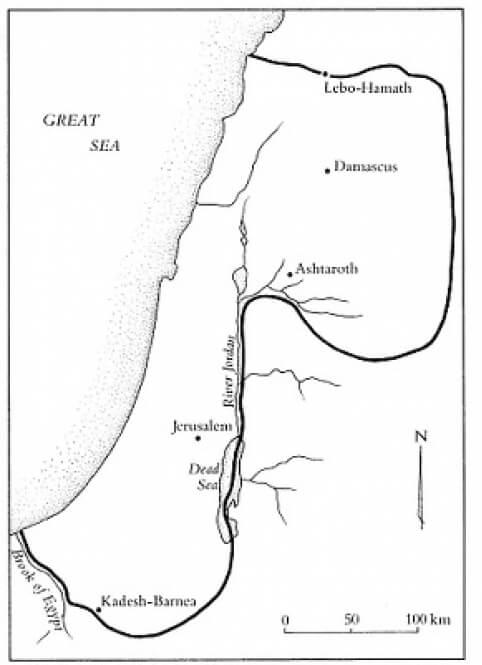
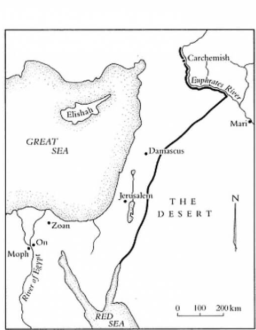

# Die Bibel und das Land

Von Rev. Dr. Munther Isaac

:::note
Normalerweise würde diese Website keine Bibelstudien übersetzen, aber da meine Mutter zugestimmt hat, etwas zu lesen, und sie sich selbst als christliche Zionistin sieht, dachte ich, ich übersetze einen Text von Rev. Dr. Munther Isaac, einem palästinensischen Pastor und Bibelwissenschaftler.
:::

## 1. Wem gehört das Land eigentlich?

Wenn es um die Frage „die Bibel und das Land“ geht, müssen wir mit der Frage beginnen: „Wem gehört das Land?“ Dies ist eine einfache, aber ungemein wichtige Frage. Wenn man sie falsch beantwortet, ist auch der Rest der Geschichte falsch. Und die gute Nachricht ist, dass man keinen Doktortitel braucht, um das richtig zu verstehen! Sind Sie bereit dafür?

DAS LAND GEHÖRT GOTT. IMMER.

Die Bibel ist eindeutig, dass die ganze Erde von Gott geschaffen wurde und ihm gehört. „Die Erde ist des Herrn und was darinnen ist, der Erdboden und die darauf wohnen“ (Ps 24,1; siehe auch Deut 14,10). Was die Bibel über die Schöpfung lehrt, ist grundlegend für unsere Diskussion über die Theologie des Landes. Gott schuf diese Erde und ernannte Adam zu seinem Stellvertreter auf ihr, und Adam wurde als Gottes Stellvertreter eingesetzt. Als Menschen sind wir Verwalter Gottes, und er macht uns für unser Handeln in Bezug auf seine Schöpfung verantwortlich. Die Erde - Gottes Erde - ist der Auftrag der Menschheit:

> Und Gott segnete sie; und Gott sprach zu ihnen: Seid fruchtbar und mehrt euch und füllt die Erde und macht sie euch untertan; und herrscht über die Fische im Meer und über die Vögel des Himmels und über alles Lebendige, das sich regt auf der Erde! (Genesis 1:28)

Dieses Konzept des Schöpfungsauftrags spiegelt sich auch in der israelischen Theologie des Landes wider. Als Gott dem biblischen Israel gemäß den Verheißungen an seine Vorväter das Land gab, machte er deutlich, dass das Land in jedem Fall sein Land bleiben wird:

> Ihr sollt das Land nicht für immer verkaufen; denn das Land gehört mir, und ihr seid Fremdlinge und Gäste bei mir. (Leviticus 25:23)

„Das Land ist mein“, sagt Gott. Das Land gehört Gott. Es war sein Land. Es ist sein Land. Es bleibt sein Land.

Dieser Vers steht im Zusammenhang mit den Jubiläumsgesetzen im Buch Levitikus. Die Bedeutung dieser Gesetze liegt darin, dass sie das biblische Israel daran erinnern, dass es das Land nicht besitzt, denn das Land gehört letztlich Gott. Das biblische Israel ist nicht frei, mit dem Land zu tun, was es will, oder ewigen Besitz zu beanspruchen. Diese Gesetze erinnern daran, dass „das Land nicht von Israel stammt, sondern ein Geschenk an Israel ist, und dass das Land nicht vollständig der Selbstbestimmung Israels überlassen ist“[^1].

> Wie alle Pächter waren die Israeliten daher gegenüber ihrem göttlichen Grundherrn für die ordnungsgemäße Behandlung dessen, was letztlich sein Eigentum war, rechenschaftspflichtig.[^2]

Eine solche Art der Verwaltung des Landes in der Bibel war eine Herausforderung für das Konzept des Reiches, in dem der König das Land besaß und verwaltete und die Menschen nur Diener oder Sklaven waren (1 Sam. 8:10-17). Hier werden wir daran erinnert, dass Gott der oberste König ist.

Dies ist auch eine Erinnerung für uns heute, dass wir nichts besitzen. Wir glauben, dass wir etwas besitzen, aber in Wirklichkeit gehört alles, was wir besitzen, letztlich Gott. Wir sind Gottes Verwalter auf Erden.

Wenn wir diesen entscheidenden Grundstein gelegt haben, dann - und nur dann - können wir mit dem Studium des Landes in der Bibel fortfahren. Das Land gehört Gott. Amen.

## 2. Was waren die Grenzen des Gelobten Landes?

Viele bibelgläubige Christen gehen davon aus, dass die heutige Region, die als Israel und Palästina bekannt ist, die tatsächlichen Grenzen des biblischen Gelobten Landes widerspiegelt. Aber ist das wahr? Was waren die Grenzen des Gelobten Landes? Diese Frage ist umstritten, weil die Bibel unterschiedliche Beschreibungen dieser Grenzen enthält[^3] Die Bibel gibt nicht nur eine einzige Beschreibung der Grenzen. So einfach ist das nicht.

Ich möchte jedoch versuchen, die Dinge zu vereinfachen, indem ich diese verschiedenen Grenzbeschreibungen in zwei Karten einteile: (1) das Land Kanaan (siehe Karte 1 unten) und (2) ein größeres Gebiet (von Fluss zu Fluss), das den größten Teil des Alten Orients umfasst (siehe Karte 2 unten). Darüber hinaus hatte das Land in den verschiedenen Epochen unterschiedliche Formen. Das zugewiesene Land zur Zeit Josuas unterscheidet sich beispielsweise von dem Land zur Zeit Davids und dann Salomos. In beiden Fällen gingen die Grenzen über das heutige Israel und Palästina hinaus.

Quelle: M. Weinfeld, 2003, The Promise of the Land: The Inheritance of the Land of Canaan by the Israelites, University of California Press, Berkeley, S. 57-58

Die Verheißung an Abraham in Genesis 15 ist für uns besonders eindrucksvoll:

> An jenem Tag machte der HERR einen Bund mit Abram und sprach: Deinem Samen habe ich dieses Land gegeben, vom Strom Ägyptens bis an den großen Strom, den Euphrat: die Keniter, die Kenisiter, die Kadmoniter, die Hetiter, die Pheresiter, die Rephaiter, die Amoriter, die Kanaaniter, die Girgasiter und die Jebusiter. (Genesis 15:18-21)

Ich möchte innehalten und unseren christlich-zionistischen Freunden vorschlagen, dass sie, wenn sie darauf bestehen, die Bibel zu benutzen, um die jüdische Souveränität über das heutige Palästina und Israel zu rechtfertigen, auch dazu aufrufen sollten, dass Israel in Jordanien, Libanon, Syrien, Irak, Saudi-Arabien und Ägypten einmarschiert. Das heißt, wenn sie konsequent sein wollen, oder sie sollten einfach aufhören, die Bibel zu benutzen!

Aber mal ganz im Ernst: Was haben diese Grenzen zu bedeuten? Laut dem jüdischen Gelehrten Wazana hatte die Verwendung von Wassergrenzen im Alten Orient wichtige Hinweise:

> Die Verheißung, die sich in den räumlichen Abgrenzungen widerspiegelt, ist nicht wörtlich zu verstehen und sollte auch nicht in Grenzlinien auf Landkarten übersetzt und umgewandelt werden. Es ist ein Versprechen der Weltherrschaft. Die räumlichen Abgrenzungen in der Terminologie der Verheißung spiegeln ein Land wider, das überhaupt keine Grenzen hat, sondern sich nur immer weiter ausdehnt; sie verweisen auf die Weltherrschaft.[^4]

Ähnlich argumentiert der palästinensische Theologe Yohanna Katanacho:

> Es scheint, dass das Land Abrahams keine festen Grenzen haben wird. Es wird sich weiter ausdehnen und damit sowohl territorial als auch demographisch an Größe gewinnen. Das Land Abrahams wird sich weiter ausdehnen, bis es der ganzen Erde entspricht[^5].

Außerdem sehen wir in vielen messianischen Prophezeiungen das, was wir als das „messianische Land“ bezeichnen können. So heißt es in Psalm 2,8, dass Gott dem König die Völker zum Erbe und die Enden der Erde zum Besitz geben wird (Ps. 2,8; siehe auch Ps. 72,8.11). In Micha 5,4 heißt es, dass der Herrscher von Bethlehem „groß sein wird bis an die Enden der Erde“, und Sacharja 9,10 spricht von dem kommenden König, dass „seine Herrschaft von Meer zu Meer und vom Strom bis an die Enden der Erde reichen wird“. Schließlich spricht Jesaja 54,2-4 deutlich von der Ausdehnung Jerusalems im Eschaton.

Kurz gesagt, die Theologie des Landes hat eine universelle Dimension. Wir können nicht einfach von der Theologie des Landes sprechen, sondern wir sollten stattdessen von der Theologie der Erde sprechen. Das Land ist nach diesem biblischen Glauben tatsächlich die ganze Erde. Die Theologie des Bodens ist letztlich die Theologie der Erde, und diese wiederum führt uns zurück zur Schöpfung (Ps 24,1).

Es sollte uns also nicht überraschen, wenn wir in Römer 4,13 lesen, dass Abraham verheißen wurde, dass er „die Welt“ erben wird (nicht nur das Land!). Wir sollten auch nicht überrascht sein, als Jesus vor seiner Himmelfahrt erklärte, dass ihm alle Macht „im Himmel und auf Erden“ gegeben wurde.

Gott kümmert sich nicht nur um ein kleines Stück Land im Alten Orient. Er ist der Gott aller Völker und aller Länder. Kanaan war nur die erste Etappe - nicht das Ziel.

## 3. Das Land und der Bund

Wann immer ich an einer Debatte oder Diskussion über die Theologie des Landes teilnehme, bekomme ich fast immer die Frage gestellt: „Aber sind die Verheißungen des Landes nicht ewig und bedingungslos?“ Dies ist eine Annahme, die von vielen Christen geteilt wird, aber in der Regel ohne die vollen Konsequenzen einer solchen Aussage zu bedenken. Wenn das stimmt, dann bedeutet das, dass das biblische Israel und seine Vorfahren immer die rechtmäßigen Besitzer des Landes sein werden, ganz gleich, was es getan hat.

Ich habe ein ernsthaftes Problem mit dieser Denkweise, denn sie macht Gott gleichgültig gegenüber unserer Treue und unserer Verantwortung gegenüber unseren Nächsten oder dem Land selbst. Es gibt keine Rechenschaftspflicht. Wir müssen uns also fragen, ob dieses Denken überhaupt biblisch ist. Ich möchte behaupten, dass die Antwort „Nein“ lautet. Diese Denkweise ignoriert auch den größeren Rahmen der Theologie des Landes im Alten Testament, nämlich den Bund. Wie Chris Wright sagt:

Es ist unzureichend, einfach zu sagen, dass der Herr Israel das Land gab“, ohne den Kontext der Gabe zu berücksichtigen, nämlich die Bundesbeziehung und ihre gegenseitigen Verpflichtungen. Das Land war nicht nur ein integraler Bestandteil der Treue des Herrn gegenüber Israel, sondern auch der Bundesverpflichtung Israels gegenüber dem Herrn[^6].

Bei der Diskussion über das Land im Alten Testament müssen wir fragen: „Hat Gott Israel das Land ohne Bedingungen gegeben, oder waren die Verheißungen wirklich bedingungslos?

Dazu müssen wir bei der ersten Berufung Abrahams beginnen (Gen 12,1-3). Dort sollte die genauere Übersetzung von Vers zwei lauten: „Sei ein Segen, damit ich die segnen kann, die dich segnen“. Mit anderen Worten: Der erste Ruf an Abraham enthält ein Element der Bedingtheit. Die Übersetzung des hebräischen Textes von Gen 12:2b ist in der Tat ein starkes Indiz und wird durch die größere abrahamitische Erzählung unterstützt. Dem Bund von Gen 15,17-18 geht ein Hinweis auf Abrahams Glauben voraus (15,6): „Und er (Abraham) glaubte dem Herrn, und er rechnete es ihm als Gerechtigkeit an“. Die Erzählung in Gen 17 beginnt mit einem Aufruf an Abraham, vor Gott zu gehen und vollkommen zu sein (17,1), und endet mit dem Gebot der Beschneidung (17,9-10). In Gen 18,19 wird die Gerechtigkeit zur Bedingung für die Erfüllung der Verheißung gemacht, und in Gen 22 wird betont, dass Abraham den Segen, einschließlich des Landes, nur erhalten wird, weil er gehorcht hat.

Wenn wir uns in der Geschichte in die Zeit vor dem Einzug Israels in das Land begeben, sehen wir deutlich, dass der Status Israels im Land an den Gehorsam geknüpft war:

> Ihr sollt euch durch all diese Dinge nicht verunreinigen. Denn durch das alles haben sich die Heiden verunreinigt, die ich vor euch her austreibe, und dadurch ist das Land verunreinigt worden, und ich suchte ihre Schuld an ihm heim, sodass das Land seine Einwohner ausspeit. Ihr aber sollt meine Satzungen und Rechtsbestimmungen halten und keinen dieser Gräuel verüben, weder der Einheimische noch der Fremdling, der in eurer Mitte wohnt — denn alle diese Gräuel haben die Leute dieses Landes getan, die vor euch waren, sodass das Land verunreinigt worden ist —, damit euch nun das Land nicht ausspeie, wenn ihr es verunreinigt, wie es die Heiden ausgespien hat, die vor euch gewesen sind. (Leviticus 18:24-28)

(Entschuldigung für die starke und anschauliche Sprache, das ist die Bibel!)

Die Warnungen in diesen Versen sind deutlich und klar. Das Land duldet keine Gottlosigkeit. Heiligkeit ist eine Voraussetzung, um im Land wohnen zu können. In der Tat setzt der Text Israel mit den Völkern gleich, die vor ihm im Land wohnten. Israel ist nicht besser als diese Völker. Es wird keinen besonderen Status im Land haben. Wenn überhaupt, dann werden an sie höhere Anforderungen gestellt, da sie das Gesetz erhalten haben. Es gibt hier kein „kostenloses Geschenk“, an das „keine Bedingungen geknüpft sind“.

Bibelgelehrte sehen in der Regel drei Bereiche, die Israel einhalten musste, um im Bund mit Gott zu bleiben. Der erste ist der Götzendienst. Die Anbetung anderer Götter führt dazu, dass Israel sein Recht auf den Verbleib im Land verwirkt. Das zweite sind die Sabbat- und Jubiläumsgesetze. Die dritte ist die Gerechtigkeit. Und raten Sie mal, welche dieser Sünden am unmittelbarsten mit der Vertreibung aus dem Land verbunden ist? Es ist in der Tat die Sünde der sozioökonomischen Ungerechtigkeit. Schauen wir uns einige Hinweise an:

> Der Gerechtigkeit, ja der Gerechtigkeit jage nach, damit du lebst und das Land besitzen wirst, das der HERR, dein Gott, dir geben will. (Deuteronomy 16:20)

Jeremia weist auf etwas Ähnliches hin:

> Denn nur wenn ihr euren Wandel und eure Taten ernstlich bessert, wenn ihr wirklich Recht übt untereinander, wenn ihr die Fremdlinge, die Waisen und Witwen nicht bedrückt und an dieser Stätte kein unschuldiges Blut vergießt und nicht anderen Göttern nachwandelt zu eurem eigenen Schaden — dann will ich euch an diesem Ort wohnen lassen, in dem Land, das ich euren Vätern gegeben habe, von Ewigkeit zu Ewigkeit. (Jeremiah 7:5-7)[^7]

Diese Gesetze der sozialen Gerechtigkeit sind so wichtig für unser Verständnis der Theologie des Landes. Das Land sollte ein Ort der Gleichheit und Gerechtigkeit sein, an dem die Machtlosen geschützt werden.

Das galt auch für das Israel nach dem Exil. So warnt Hesekiel 33,24-26 eindringlich davor, sich auf ethnische Zugehörigkeit oder die Vergangenheit zu verlassen, um das Land wieder in Besitz zu nehmen:

> Menschensohn, die Bewohner dieser Ruinen im Land Israel sagen: »Abraham war nur ein einzelner Mann und hat das Land zum Besitz erhalten; wir aber sind viele, und uns ist das Land zum Besitz gegeben!« Darum sprich zu ihnen: So spricht GOTT, der Herr: Ihr habt [das Fleisch] mitsamt dem Blut gegessen; ihr habt eure Augen zu euren Götzen erhoben und habt Blut vergossen; und ihr solltet dennoch das Land besitzen? Ihr verlasst euch auf euer Schwert; ihr [Frauen] verübt Gräuel und ihr [Männer] verunreinigt einer die Frau des anderen; und ihr solltet dennoch das Land besitzen? (Ezekiel 33:24-26)

Es ist erstaunlich, wie relevant diese Verse für die heutige Zeit sind, in der wir viele sehen, die sich „auf das Schwert verlassen“ und darauf, leibliche Kinder Abrahams zu sein. „Sollt ihr denn das Land in Besitz nehmen?“

Auch nach dem Exil war das Wohnen im Land an den Gehorsam gebunden. Kurzum, in der Bibel gibt es keine „billige Gnade“. Gott legt allen, die seine Gaben empfangen, Rechenschaft vor ihm ab. Wir haben das bei Adam und Eva gesehen, und jetzt sehen wir es bei Israel. Mit der Erwählung kommt die Verantwortung. So wie Adam und Eva Eden wegen ihres Ungehorsams verloren haben, hat Israel das Land wegen seines Ungehorsams verloren.

## 4. Ewiger Besitz?

Wenn die Bibel behauptet, dass etwas ewig dauern soll, dann bedeutet das doch sicher, dass es ewig dauern wird, oder? Jeder bibelgläubige Christ, der die Bibel wörtlich liest, muss das wissen. Aber ist das wirklich so? Bedeutet „ewig“ in der Bibel immer ewig? Im Sinne von unendlich?

Ein Beispiel aus dem Alten Testament genügt, um zu zeigen, dass „ewig“ nicht immer bedingungslos bedeutet. Schauen wir uns 1 Samuel 2:30 an:

> Darum spricht der HERR, der Gott Israels: Ich habe allerdings gesagt, dein Haus und das Haus deines Vaters sollen ewiglich vor mir aus- und eingehen; aber nun spricht der HERR: Das sei ferne von mir! Sondern wer mich ehrt, den will ich wieder ehren; wer mich aber verachtet, der soll auch verachtet werden!

In diesem Vers verspricht Gott Eli ein ewiges Priestertum, indem er den Begriff „für immer“ verwendet, aber dann widerruft er dieses ewige Versprechen überraschenderweise fast sofort. Dieser Vers und andere Verheißungen im Alten Testament zeigen, dass ewige Verheißungen von Gott „widerrufen“ werden können[^8] Chris Wright schlägt daher vor, dass der Ausdruck „ewig“ im Alten Testament „nicht so sehr im Sinne von ‚Ewigkeit‘ in linearer Zeit gesehen werden muss, sondern eher als ein intensiver Ausdruck innerhalb der Bedingungen und des Kontextes der betreffenden Verheißung“[^9] (Ich hoffe, das hat Ihren Glauben nicht erschüttert!).

Was ist mit dem Begriff „Erbe“? Was bedeutet es, dass das biblische Israel das Land als Erbe erhalten hat? Es bedeutet eindeutig nicht, dass Gott gestorben ist und das Land seinen Kindern Israel als Besitz hinterlassen hat. Bibelwissenschaftler können uns hier weiterhelfen. Rendtorff schlägt vor, dass „Erbe“ „der Besitz Gottes ist, der Israel als treuhänderisch gegebener Besitz, gleichsam als ‚Lehen‘, übergeben und überlassen wird“[^10].

Es ist daher wichtig zu betonen, dass das geschenkte Land immer ein vertraglich zugesichertes Land ist. Es ist daher besser und entspricht eher der biblischen Erzählung, „Erbe“ als ein beauftragtes Land zu definieren. Mit den Worten von Brüggemann:

> Land bei Jahwe bringt Verantwortung mit sich. Dasselbe Land, das ein Geschenk ist, das frei gegeben wird, ist eine Aufgabe, die scharf gestellt ist. Das gelandete Israel steht unter einem Mandat.[^11]

Chris Wright verwendet ebenfalls eine sehr hilfreiche Analogie, um die Beziehung des biblischen Israels zu Gott und dem Land zu beschreiben, und er leitet sie aus Lev. 25,23 ab. Für ihn ist Gott der göttliche „Hausherr“, und die Israeliten sind seine Pächter. Sie „haben“ das Land. Sie „bewohnen“ und nutzen es. Aber Gott „besitzt“ das Land. Er schließt daraus:

> Wie alle Pächter waren die Israeliten daher gegenüber ihrem göttlichen Vermieter für die ordnungsgemäße Behandlung dessen, was letztlich sein Eigentum war, rechenschaftspflichtig.[^12]

Das Land wurde dem biblischen Israel als Geschenk gegeben, aber das machte es nicht zu seinem Eigentum. Das Land war nicht einfach ein willkürliches Geschenk, an dem Israel sich erfreuen konnte, sondern ein Auftrag, der mit Verantwortung verbunden ist. Dies ist der Grund, warum Israel überhaupt in ein Land gebracht wurde. Der palästinensische Theologe Tarazi interpretiert die Zuteilung des Landes daher nicht als Zuteilung von Land an jeden der Stämme, als ob jeder zum Eigentümer würde. Vielmehr war die Zuteilung eine Zuweisung der Stämme zu bestimmten Teilen des Landes[^13] Mit anderen Worten: Israel erhält im Land ein Mandat - eine Verantwortung und eine Aufgabe. Es ist nicht andersherum. Israel ist dem Land zugeteilt und nicht das Land Israel. Das könnte erklären, warum den Leviten kein Land zugewiesen wurde, denn sie hatten bereits eine Aufgabe oder einen Auftrag:

> Darum hat Levi weder Anteil noch Erbe mit seinen Brüdern; denn der HERR ist ihr Erbteil, wie der HERR, dein Gott, es ihm verheißen hat. (Deuteronomy 10:9)

Das Erbe des Stammes Levi ist Gott, und das bedeutet, dass es ihre Aufgabe ist, ihm zu dienen. Auch die übrigen Stämme haben einen anderen Anteil und eine andere Aufgabe. Der Stamm Levi dient dem Herrn im Heiligtum, so wie die Israeliten dem Herrn im Land dienen. Es geht nicht so sehr um das Territorium. Es geht um den Dienst.

Daher kann und darf der Begriff „Erbe“ nicht mit „Besitz“ gleichgesetzt werden. Ein besseres Verständnis für Erbe im größeren biblischen Bild ist „Auftrag“ oder „Aufgabe“.

Darf ich uns daran erinnern, dass wir letztlich nichts „besitzen“. Alles, was wir heute haben, gehört Gott. Wir sind nur Verwalter, und unsere Häuser, Nachbarschaften und Ländereien gehören letztlich Gott. „Die Erde ist des Herrn und was darinnen ist, der Erdkreis und die darauf wohnen“. (Ps. 24:1).

## 5. Das Land und die Gerechtigkeit

Gerechtigkeit ist für Gott wichtig! Ich bin erstaunt, wie oft dieses Konzept in vielen christlichen Theologie- und Missionsbüchern fehlt. Es fehlt auch in der Lehre und Verkündigung der Kirche, und das ist wirklich traurig!

In der Bibel wird viel über Gerechtigkeit gesprochen. Ich meine sehr viel. Und die Theologie des Landes ist ein guter Ausgangspunkt dafür. Keine andere Sünde im Alten Testament war so unmittelbar mit der Vertreibung aus dem Land verbunden wie die Sünde der sozioökonomischen Ungerechtigkeit. Die Gerechtigkeit wird in fast allen Traditionen betont. In Genesis 18,19 sagt Gott über Abraham:

> Denn ich habe ihn ersehen, dass er seinen Kindern und seinem Haus nach ihm gebiete, den Weg des HERRN zu bewahren, indem sie Gerechtigkeit und Recht üben, damit der HERR auf Abraham kommen lasse, was er ihm verheißen hat.

Abraham wurde aus diesem Grund auserwählt: weil er Recht und Gerechtigkeit tat, wodurch die Verheißung in Erfüllung ging. In Deut. 16,19-20 wird die Gerechtigkeit erneut als Voraussetzung für den Verbleib im Land dargestellt:

> Du sollst das Recht nicht beugen. Du sollst auch die Person nicht ansehen und kein Bestechungsgeschenk nehmen, denn das Bestechungsgeschenk verblendet die Augen der Weisen und verdreht die Worte der Gerechten. Der Gerechtigkeit, ja der Gerechtigkeit jage nach, damit du lebst und das Land besitzen wirst, das der HERR, dein Gott, dir geben will.

In den ersten fünf Büchern der Bibel wird viel über die Armen, die Fremden, die Gastarbeiter, die Witwen und die Waisen gesagt[^14] und sie werden nach Brüggemann als „Brüder und Schwestern“ neu definiert. „Es ist eine der Aufgaben, die mit dem Land des Bundes einhergehen und das Land als Bundeswirklichkeit bewahren: Diejenigen, die scheinbar keinen Anspruch haben, müssen geehrt und umsorgt werden"[^15], denn das Land ist nicht ‚für die eigene Sicherheit, sondern für die Brüder und Schwestern‘[^16].

Doch es waren die „klassischen“ Propheten, die dieses Thema über alle anderen Überlegungen stellten und es direkt mit dem Exil in Verbindung brachten. Wie Chris Wright sagt: „Die Propheten wollten einfach nicht zulassen, dass Israel den Segen und den Schutz der Bundesbeziehung für seine Gesellschaft beansprucht und gleichzeitig die sozioökonomischen Anforderungen dieser Beziehung mit Füßen tritt.“[^17]

Amos fällt durch seine Betonung der sozialen Gerechtigkeit auf. Seinem Aufruf, „die Gerechtigkeit wie Wasser herabströmen zu lassen“ (5,24), folgt eine Warnung vor dem Exil: „und ich werde euch ins Exil jenseits von Damaskus schicken“ (5,27)[^18] Jeremia weist in eine ähnliche Richtung:

> Denn nur wenn ihr euren Wandel und eure Taten ernstlich bessert, wenn ihr wirklich Recht übt untereinander, wenn ihr die Fremdlinge, die Waisen und Witwen nicht bedrückt und an dieser Stätte kein unschuldiges Blut vergießt und nicht anderen Göttern nachwandelt zu eurem eigenen Schaden — dann will ich euch an diesem Ort wohnen lassen, in dem Land, das ich euren Vätern gegeben habe, von Ewigkeit zu Ewigkeit. (Jeremiah 7:5-7)[^19]

Jeremia vergleicht in Kapitel zweiundzwanzig die Herrschaft zweier Könige Israels: Josia, der gerecht war, und Jojakim, der seine Macht missbrauchte. Für Jeremia hat das allgemeine Wohlbefinden des Königreichs mit Gerechtigkeit zu tun. Wenn es Gerechtigkeit gibt, wird alles gut gehen. „Joschija“, erklärt Jeremia, “richtete die Sache der Armen und Bedürftigen; dann war es gut.“ Dann fügt er etwas sehr Wichtiges hinzu: „Ist das nicht, mich zu erkennen?“ (22:16)

Haben Sie das verstanden? Gott zu kennen und Gerechtigkeit zu üben ist ein und dasselbe! Sie sind von Natur aus miteinander verbunden. Man kann nicht behaupten, Gott zu kennen, ohne sich um die Armen zu kümmern! So einfach ist das! Deshalb lesen wir in Jeremia 9:22-23:

> So spricht der HERR: Der Weise rühme sich nicht seiner Weisheit und der Starke rühme sich nicht seiner Stärke, der Reiche rühme sich nicht seines Reichtums; sondern wer sich rühmen will, der rühme sich dessen, dass er Einsicht hat und mich erkennt, dass ich der HERR bin, der Barmherzigkeit, Recht und Gerechtigkeit übt auf Erden! Denn daran habe ich Wohlgefallen, spricht der HERR.

Noch einmal: Gott zu kennen und ein Gewissen für Gerechtigkeit zu haben, lässt sich nicht trennen! So einfach ist das. (Wie in vielen Büchern der systematischen Theologie wird die Gerechtigkeit als eine Eigenschaft Gottes neben der Allgegenwart und Allmacht usw. erwähnt).

Gerechtigkeit ist wichtig! Sie ist wichtig für Gott! Sie war zu biblischen Zeiten wichtig und sie ist heute wichtig. Sie ist in der Tat ein zentrales Thema in der Bibel. Doch leider fehlt das Thema Gerechtigkeit auf seltsame Weise in der Mission, Lehre, Theologie und im Dienst der meisten Kirchen und Missionswerke. Es ist an der Zeit, innezuhalten und tiefgreifende und ernsthafte Fragen darüber zu stellen, wie wir die Bibel und die Mission verstehen, und warum wir die Gerechtigkeit ignoriert haben!

## 6. Konfiszierung von Land

Stellen Sie sich vor, Sie haben jahrelang hart gearbeitet und Geld gespart, um ein Stück Land zu erwerben, um Ihre Zukunft und die Ihrer Kinder zu sichern, und dann kommt eine Besatzungsarmee in dieses Land und konfisziert es gewaltsam für den Gebrauch des „Reiches“. In Palästina ist das keine Einbildung. Das ist die Realität unter der Besatzung.[^20]

Die Konfiszierung von Land ist kein neues Phänomen in diesem Land. In der biblischen Überlieferung veranschaulicht vielleicht keine andere Geschichte diesen Machtmissbrauch des „Königs“ in Bezug auf das Land mehr als die Geschichte von König Ahab und dem Weinberg des Naboth (1. Könige 21). Der relativ große Raum, den diese Erzählung im Buch der Könige einnimmt, ist ein Hinweis darauf, dass die Geschichte besondere Aufmerksamkeit verdient. Ahab, der König des Nordreiches, sah den Weinberg von Nabot, dem Jesreeliter, begehrte ihn und nahm an, dass er das göttliche Recht habe, Nabot zu bitten, ihn ihm zu verkaufen (21,2). Nabot hingegen lehnte dies ab, weil er der Meinung war, dass es sich um ein Land handelte, das ihm von Gott als Erbe anvertraut worden war, und er es deshalb nicht verkaufen konnte (21:3).

Die berüchtigte Königin Isebel mischte sich in die Geschichte ein und erinnerte Ahab daran, dass er als König von Israel das Recht habe, den Weinberg zu nehmen (21,7). Die Vermutung ist einfach: „Nur weil du es kannst, musst du es auch tun!“ Ein Komplott wurde geschmiedet, Nabot wurde getötet, und Ahab erhielt den Weinberg (21,16). Es wurde keine Entschuldigung ausgesprochen. Macht und Manipulation waren hier im Spiel. Das Opfer in dieser Erzählung war Nabot, der für die machtlosen Bauern Israels steht. Die Art und Weise, wie Naboth und Ahab mit dem Land umgingen, zeigte einen verblüffenden Widerspruch. Der eine betrachtete es als ein Geschenk, der andere als ein Anrecht. Der eine glaubte, es gehöre der Gemeinschaft, der andere wollte es für sein Reich haben.

Die Haltung von Naboth ähnelt der vieler zeitgenössischer palästinensischer Bauern. Es ist nicht verwunderlich, dass die Palästinenser den Olivenbaum als Symbol betrachten, denn er erinnert sie an ihre Verwurzelung und Zugehörigkeit zum Land. Diese Haltung lässt sich mit den Worten von Brüggemann zusammenfassen:

> Naboth ist für das Land verantwortlich, aber er hat nicht die Kontrolle darüber. Es ist nicht so, dass das Land ihm gehört, sondern dass er zum Land gehört.[^21]

Die Bibel ist ein Buch der Hoffnung und der Gerechtigkeit, und das war noch nicht das Ende der Geschichte. Die Geschichte endete mit dem Urteil über Ahab. Er wurde des Mordes und der „Besitzergreifung“ für schuldig befunden.

> Du sollst aber zu ihm sagen: So spricht der HERR: »Hast du gemordet und in Besitz genommen?« Und du sollst weiter mit ihm reden und sagen: So spricht der HERR: »An der Stelle, wo die Hunde das Blut Nabots geleckt haben, sollen die Hunde auch dein Blut lecken, ja, das deinige!« (1. Könige 21:19)

Der König, der eigentlich der Hüter der Gerechtigkeit im Land sein sollte (Psalm 72), war stattdessen dafür verantwortlich, dass den Menschen im Land Ungerechtigkeit widerfuhr. Gott griff ein und sorgte für Gerechtigkeit, denn er ist ein Gott, der auf Gerechtigkeit bedacht ist. Ahab hatte das vergessen:

> Der Gerechtigkeit, ja der Gerechtigkeit jage nach, damit du lebst und das Land besitzen wirst, das der HERR, dein Gott, dir geben will. (Deuteronomium 16:20)

Interessanterweise fand die Gerechtigkeit an demselben Ort statt, an dem Naboth getötet wurde, was vielleicht darauf hindeutet, dass das Land den Tod Naboths rächte. Gott ist ein Gott der Gerechtigkeit, und das ist unsere biblische Hoffnung.

Erinnern wir uns daran, dass unsere biblische Hoffnung in dem Kind von Bethlehem offenbart wurde, das eine neue Art des Königtums propagierte und verkörperte. Jesus ist der ultimative gerechte und demütige König. Von ihm sagte der Prophet Jeremia:

> Siehe, es kommen Tage, spricht der HERR, da werde ich dem David einen gerechten Spross erwecken; der wird als König regieren und weise handeln und wird Recht und Gerechtigkeit schaffen auf Erden. (Jeremiah 23:5)

Als seine Nachfolger lädt Jesus uns heute ein, sein Reich und seine Vision für das Land zu fördern. Der gerechte König von Bethlehem regiert mit Gerechtigkeit und Rechtschaffenheit, und so sollten Gerechtigkeit und Rechtschaffenheit auch unseren Dienst prägen.

## 7. Wer ist Israel in der Bibel?

Viele Christen gehen einfach davon aus, dass der moderne Staat Israel eine direkte Fortsetzung des Israels der Bibel ist und dass die heutigen Juden die direkten Nachkommen Abrahams sind. Somit ist der abrahamitische Bund, der die Verheißung des Landes einschloss, immer noch gültig und gilt für das moderne Israel. Außerdem wird die Verheißung in Gen 12,1-3, dass Gott diejenigen segnen wird, die Abraham segnen, und diejenigen verfluchen wird, die Abraham verfluchen, heute auf das moderne Israel übertragen: diejenigen, die den Staat Israel segnen, werden gesegnet und diejenigen, die sich dem Staat Israel widersetzen, werden verflucht.

Ich möchte hier nur die Prämisse in Frage stellen, dass die Zugehörigkeit zu Israel im Alten Testament ausschließlich von der Ethnie abhängt. Mit anderen Worten: Ist das Israel der Bibel ein ausschließlich durch die Ethnie definiertes Gebilde? Wir müssen vorsichtig sein, bevor wir diese Frage beantworten; eine Beantwortung mit „Ja“ würde bedeuten, dass Gott rassistisch ist!

Wenn wir die biblische Geschichte lesen, wird deutlich, dass sich die biblische Erzählung fast ausschließlich auf das konzentriert, was man den „heiligen Samen“ nennen könnte - den von Gott für die Erlösung der Welt auserwählten Samen. Das ist der Same Abrahams, aus dem das Volk Israel wurde. Doch wenn wir die Geschichte aufmerksam lesen, stellen wir fest, dass jemand in die Familie Israels hineingeboren werden kann und dennoch nicht als Teil des Samens gilt. Das zeigt sich zum Beispiel an den Beispielen Ismael und Esau. Und dies wurde von Paulus in seinem Brief an die Römer festgehalten:

> Nicht aber, dass das Wort Gottes nun hinfällig wäre! Denn nicht alle, die von Israel abstammen, sind Israel; auch sind nicht alle, weil sie Abrahams Same sind, Kinder, sondern »in Isaak soll dir ein Same berufen werden«. (Röm. 9:6-7)

Darüber hinaus gibt es Menschen, die außerhalb der Familie geboren wurden und dennoch als Teil Israels betrachtet wurden. Rut, die Moabiterin, ist das offensichtliche Beispiel. Sie erklärte ihrer Schwiegermutter Naomi: „Dein Volk soll mein Volk sein, und dein Gott mein Gott“ (Rut 1,16).

Das Buch Rut veranschaulicht, dass die Vorteile des Gottesbundes nicht durch nationale, rationale oder geschlechtsspezifische Grenzen begrenzt sind. Rut wird ständig als Moabiterin bezeichnet. Ihr ethnischer und nationaler Hintergrund wird in dem Buch nicht vergessen, das lehrt, dass auch diese moabitische Frau im Bund mit Jahwe leben und von einer treuen Beziehung zu ihm profitieren kann[^22].

Denken Sie einen Moment nach: Wenn Rut, die Moabiterin, an den Gott Israels glaubte und somit als Teil Israels betrachtet wurde, glauben dann nicht alle Christen heute an den Gott Israels?

Außerdem ist die Bibel voll von Mischehen. Juda heiratete eine Kanaaniterin, Joseph eine Ägypterin, Moses eine Medianerin und Salomo viele ausländische Frauen. Nicht nur das, sondern wir lesen auch in Richter:

> Als nun die Söhne Israels mitten unter den Kanaanitern, Hetitern, Amoritern, Pheresitern, Hewitern und Jebusitern wohnten, da nahmen sie deren Töchter zu Frauen und gaben ihre Töchter deren Söhnen und dienten ihren Göttern. (Richter 3:5-6)

Und was ist mit den Völkern, die während der persischen Zeit zu Juden wurden:

> Und in allen Provinzen und in allen Städten, wohin das Wort und Gebot des Königs gelangte, da war Freude und Frohlocken unter den Juden, Gastmahl und Festtag, sodass viele von der Bevölkerung des Landes Juden wurden; denn die Furcht vor den Juden war auf sie gefallen. (Est 8:17)

Diese Menschen, die zum Judentum konvertierten oder durch Mischehen Teil Israels wurden - bedeutet das, dass sie das Land erben?! Ist es also eine Frage der ethnischen Zugehörigkeit? Oder nach dem Glauben?!

Mit anderen Worten: Israel ist, zumindest im Alten Testament, nicht ausschließlich eine Frage der DNA. Der Glaube und die göttliche Erwählung sind ebenfalls Faktoren. Dies wird entscheidend, wenn wir das Zeugnis des Neuen Testaments über „wer ist Israel?“ oder „der Same Abrahams“ betrachten. Wenn jemand durch den Glauben zu Israel gehören kann, dann muss dies entscheidende Konsequenzen für unsere Diskussion über das Land haben. Darüber hinaus müssen wir auf der Grundlage des alttestamentlichen Zeugnisses fragen: Kann jemand eine reine DNA von Abraham bis heute beanspruchen - und dann das Land in Besitz nehmen?

## 8. Warum ein Land?

Haben Sie sich jemals gefragt: „Warum hat Gott Abraham und seinen Nachkommen überhaupt ein Land versprochen?“ Denken Sie mit mir nach: Warum hat Gott Abraham nicht einfach gesagt, er solle sich im Universum umsehen und die Botschaft des lebendigen Gottes verkünden? Warum war das Land notwendig?

Um diese Frage zu beantworten, schlagen wir vor, im Garten Eden und dem Sündenfall und der Vertreibung aus Eden zu beginnen und die Erwählung Abrahams und die Zuweisung von Land an seinen Samen als Wiederherstellung der Menschheit in Eden zu lesen. Wie Hamilton bemerkt:

> Der Segen Abrahams versprach Samen, Land und Segen. Die Verheißung des Samens überwindet die verfluchte Schwierigkeit des Kinderkriegens und den Verlust der Harmonie zwischen Mann und Frau. Die Verheißung des Landes deutet auf einen Ort hin, an dem Gott wieder bei seinem Volk wohnen wird. Die Verheißung des Segens verkündet den Triumph des Samens der Frau über den Samen der Schlange.

Wenn wir das Land aus dieser Perspektive betrachten, können wir zu dem Schluss kommen, dass die Landverheißung kein Selbstzweck ist, sondern vielmehr der erste Schritt einer Antwort auf ein universelles und menschliches Problem. Israel wird das Land nicht um seinetwillen versprochen und gegeben, oder um ein Land zu erhalten. Israel wird auserwählt und erhält ein Land, damit es „das Instrument wird, durch das der Segen der Erlösung schließlich den Rest der Menschheit erfassen wird“. Durch Abraham und die neu gegründete Gemeinschaft und von diesem neu verheißenen Land aus sollen die Familien der Erde gesegnet werden, und Abraham wird schließlich zum „Vater vieler Völker“.

Wir sollten auch das Muster beachten, das sich in der biblischen Theologie des Alten Testaments wiederfindet - das einer gesegneten Menschheit, die die Erde erfüllt. Nach dem biblischen Kanon beinhaltete die erste Kommunikation Gottes mit der Menschheit einen Segen, gefolgt von einem Gebot:

> Und Gott segnete sie; und Gott sprach zu ihnen: Seid fruchtbar und mehrt euch und füllt die Erde und macht sie euch untertan; und herrscht über die Fische im Meer und über die Vögel des Himmels und über alles Lebendige, das sich regt auf der Erde! (Genesis 1:28)

Diese Berufung ist genau das, was in Gottes Berufung Abrahams widerhallt - etwas, das wir vielleicht übersehen, wenn wir die biblische Theologie des Landes in Gen 12 beginnen. Sicher, Israel mag in Gen 12 seinen Anfang nehmen, aber es bleibt nur ein Bestandteil der biblischen Geschichte insgesamt. Die biblische Geschichte beginnt vor Israel und wird nach Israel und über Israel hinaus weitergehen. Die biblische Hoffnung auf die Erlösung Israels und seines Landes ist letztlich eine biblische Hoffnung auf die Erlösung der Welt und ihrer Völker.

Darüber hinaus unterstreicht die Gabe eines Landes als Teil dieses Erlösungsprojekts, dass Gott sich für seine Schöpfungsordnung und die Erlösung der menschlichen Gesellschaft einsetzt. Bei der Erlösung im Alten Testament geht es nicht nur um Einzelpersonen, persönliche Frömmigkeit oder spirituelle existenzielle Erfahrungen. Es geht um die Erlösung ganzer Gesellschaften auf der Erde und letztlich der gesamten Menschheit. Sie ist ein „irdisches“ Phänomen.

In der Tat hätte die biblische Geschichte auch anders verlaufen können: Gott hätte Abraham moralische Gebote für sich und seine Familie geben können. Er hätte ihn anweisen können, in der Welt umherzuziehen und die Anbetung des einen wahren Gottes zu verkünden. Stattdessen entschied er sich, Abraham an einen Ort zu bringen, sich auf die menschliche Geschichte und Geografie einzulassen und aus Abrahams Nachkommen eine einzigartige und eigenständige Gesellschaft zu schaffen - eine Gesellschaft, die sein Bild auf der Erde inmitten der Völker widerspiegeln sollte. Dies ist das biblische Muster der Erlösung.

All dies führt uns zu der Schlussfolgerung, dass es in der Theologie des Landes nach dem Muster von Eden nicht um ein kleines Stück Land in ANE oder um die kleine ethnische Gruppe geht, die es geerbt hat. Das Land ist Teil eines größeren Plans, bei dem es um die Erlösung und Wiederherstellung der gesamten Schöpfung geht. Die Wiederherstellung der ganzen Erde beginnt mit einem bestimmten Land und einer Familie.

Außerdem sollte Israel eine ideale Gemeinschaft inmitten der Völker sein (Ex 19,5). Daher können die Vorschriften und Gesetze über das Land in der israelitischen Gesellschaft als ein Modell für das Ideal in der Antike angesehen werden. Chris Wright nennt dies „ein paradigmatisches Verständnis“ der Bedeutung des alttestamentlichen Israels für andere Völker in anderen Ländern. Wrights Buch Old Testament Ethics for the People of God (Alttestamentliche Ethik für das Volk Gottes) untersucht einige der Landgesetze im Alten Testament im Detail und ihre Bedeutung für die heutige Welt. Er argumentiert:

> Viele der alttestamentlichen Gesetze und Institutionen der Landnutzung deuten auf ein übergeordnetes Anliegen hin, die relative Gleichheit der Familien auf dem Land zu erhalten. So war auch das Wirtschaftssystem institutionell und prinzipiell auf die Erhaltung einer breit angelegten Gleichheit und Selbstversorgung der Familien auf dem Lande und auf den Schutz der Schwächsten, der Ärmsten und der Bedrohten ausgerichtet - und nicht auf die Interessen einer wohlhabenden, landbesitzenden Minderheit.

Wright beobachtet zum Beispiel, wie in der kanaanäischen Gesellschaft der König das gesamte Land besaß und es feudalistische Vereinbarungen mit denjenigen gab, die als steuerzahlende Pächter auf dem Land lebten und arbeiteten. Im Gegensatz dazu war das Land in Israel so weit wie möglich aufgeteilt, so dass es sich im Besitz mehrerer Großfamilien befand. Mit anderen Worten: Israels Art, auf dem Land zu leben, sollte ein Beispiel und eine Herausforderung für andere Nationen in anderen Ländern sein.

Schließlich unterstreicht dieses Muster, ein Volk und ein Land zu wählen und inmitten der Menschen zu wohnen, Gottes Wunsch nach Gemeinschaft mit der Menschheit. Im Alten Testament wird Gott als ein Gott dargestellt, der unter den Menschen wohnen will. Dies wird in der gesamten biblischen Geschichte des Alten Testaments deutlich, sei es im Garten Eden, in der Stiftshütte oder im Tempel. In diesem Sinne könnten wir den Glauben Israels als „inkarnatorisch“ bezeichnen.

## 9. Das Land im Alten Testament: Universell und inklusiv

[Was ist das verheißene Land?](#2-was-waren-die-grenzen-des-gelobten-landes) [Warum ein bestimmtes Land?](#8-warum-ein-land) Dies sind Fragen, die wir bereits diskutiert haben. Sie haben uns zu dem Schluss geführt, dass das Land im Alten Testament immer eine universelle Dimension hatte und auf eine Ausdehnung des Landes und die Aufnahme neuer „Familien“ und neuer „Länder“ in die Familie und das Land des biblischen Israel hinweist. Dieser integrative Charakter muss wiederentdeckt und hervorgehoben werden, insbesondere angesichts der vielen exklusiven Stimmen heute.

Betrachten wir den abrahamitischen Bund. Von Anfang an sagte Gott zu Abram, dass in ihm „alle Geschlechter der Erde gesegnet werden sollen“. Abrams Name wurde in Abraham geändert, weil Gott ihn zum „Vater einer Vielzahl von Völkern“ machen wollte (Gen 17,5). T.D. Alexander bemerkt dazu:

> Die Verheißung, dass Abraham eine große Nation werden wird, die sowohl zahlreiche Nachkommen als auch Land umfasst, muss so verstanden werden, dass sie dem Hauptwunsch Gottes, alle Familien der Erde zu segnen, untergeordnet ist.[^23]

Außerdem sehen wir in vielen messianischen Prophezeiungen, was wir als „messianisches Land“ bezeichnen können. So heißt es in Psalm 2,8, dass Gott dem König die Völker zum Erbe und die Enden der Erde zum Besitz geben wird (Ps. 2,8; siehe auch Ps. 72,8.11). In Micha 5,4 heißt es, dass der Herrscher von Bethlehem „groß sein wird bis an die Enden der Erde“, und Sacharja 9,10 spricht von dem kommenden König, dass „seine Herrschaft von Meer zu Meer und vom Strom bis an die Enden der Erde reichen wird“. Jesaja 54,2-4 schließlich spricht deutlich von der Ausdehnung Jerusalems im Eschaton.

Psalm 87 ist sehr auffällig in seiner Inklusivität. Er spricht von einem Tag, an dem Jerusalem eine multinationale Stadt sein wird:

> Er hat sie gegründet auf heiligen Bergen; der HERR liebt die Tore Zions mehr als alle Wohnungen Jakobs. Herrliches ist über dich verheißen, du Stadt Gottes! (Sela.)

Unter denen, die mich kennen, erwähne ich Rahab und Babylon; siehe, Philistäa und Tyrus, mit Kusch - „Dieser ist dort geboren“, sagen sie. Und von Zion wird man sagen: „Dieser und jener ist in ihr geboren“; denn der Allerhöchste selbst wird sie gründen. Der Herr schreibt auf, wenn er die Völker registriert: „Dieser ist dort geboren.“ Selah

Yohanna Katanacho kommentiert diesen Psalm:

> Psalm 87 stellt uns eine Vision der Gleichheit und der Abwesenheit von Unterordnung vor Augen. In Zion gibt es keine Bürger zweiter Klasse. Diese Gleichheit ist nicht nur staatsbürgerlich, sondern auch bundesstaatlich. Sie alle haben denselben Gott, sind in derselben Stadt geboren und von derselben Hand eingetragen. Ihre sprachlichen, historischen und militärischen Unterschiede sind nicht wichtig. Was sie vereint, ist Gott selbst. Die Geographie ist nicht länger ein Spannungspunkt, denn Zion gehört Gott, nicht Israel. Es ist die Stadt Gottes, und nur er kann das Bürgerrecht in seiner Stadt verleihen. Die Staatsbürgerschaft entsteht durch göttliche Erklärung, nicht durch biologische Rechte.[^24]

Eine weitere bemerkenswerte Aussage, die von der umfassenden Natur Israels im kommenden Zeitalter spricht, ist die von Hesekiel gegen Ende seines Buches, wenn er sagt, dass den Gastarbeitern ein Erbteil unter den Israeliten zugeteilt werden soll:

> Dieses Land sollt ihr unter euch verteilen nach den Stämmen Israels. Ihr sollt es aber als Erbbesitz verlosen unter euch und unter die Fremdlinge, die unter euch wohnen und unter euch Kinder gezeugt haben. Und sie sollen euch gelten wie Eingeborene unter den Kindern Israels. Sie sollen mit euch unter den Stämmen Israels ihren Erbbesitz erhalten. Und es soll geschehen, in dem Stamm, bei dem der Fremdling wohnt, sollt ihr ihm sein Erbteil geben, spricht GOTT, der Herr. (Ezekiel 47:21-23)

Hesekiel scheint hier eine Spannung im nachexilischen Israel widerzuspiegeln, die mit der Haltung gegenüber Ausländern zusammenhängt. Hesekiel 44,5-9 vertritt in ähnlicher Weise wie Esra-Nehemia eine ausschließende Theologie in dem Versuch, die Identität und Reinheit Israels zu bewahren. Hesek 47,20-23 hingegen nimmt eine Zeit vorweg - im kommenden Zeitalter -, in der ein verwandeltes und sicheres Israel Nicht-Israeliten einbeziehen und ihnen sogar ein Erbe im Land zugestehen wird.

Das Buch Jesaja hat auch eine sehr positive und integrative Haltung gegenüber den Nationen. Der Zion, den wir dort finden, wird andere Ethnien und Nationalitäten einschließen, und die Worte Gottes werden alle Völker leiten (Jes 2,2-3). Eine der deutlichsten Aussagen in Jesaja, die eine bemerkenswert positive Haltung gegenüber den Völkern in Bezug auf den Tempel zeigt, findet sich in Jesaja 56. Dort behauptet Jesaja, dass der Tempel eines Tages ein „Haus des Gebets für alle Völker“ sein wird. In dem neuen Tempel werden alle gleich sein, was an den ursprünglichen Zustand der Menschheit erinnert:

> Und der Fremdling, der sich dem HERRN angeschlossen hat, soll nicht sagen: Der HERR wird mich gewiss von seinem Volk ausschließen! Und der Verschnittene soll nicht sagen: Siehe, ich bin ein dürrer Baum! Denn so spricht der HERR: Den Verschnittenen, die meine Sabbate halten und erwählen, was mir gefällt, und an meinem Bund festhalten, denen will ich in meinem Haus und in meinen Mauern einen Platz und einen Namen geben, der besser ist als Söhne und Töchter; ich will ihnen einen ewigen Namen geben, der nicht ausgerottet werden soll. Und die Fremdlinge, die sich dem HERRN anschließen, um ihm zu dienen und den Namen des HERRN zu lieben [und] um seine Knechte zu sein, und alle, die darauf achten, den Sabbat nicht zu entheiligen, und die an meinem Bund festhalten, die will ich zu meinem heiligen Berg führen und sie in meinem Bethaus erfreuen; ihre Brandopfer und Schlachtopfer sollen wohlgefällig sein auf meinem Altar; denn mein Haus soll ein Bethaus für alle Völker genannt werden. (Isaiah 56:3-7)

Jesajas bemerkenswerte Vision eines universalen Zions und seine Aussage, dass der Tempel ein Haus des Gebets für alle Völker sein wird, sowie Hesekiels Worte über die Gleichberechtigung der Gastarbeiter und ihre Teilhabe am Erbe offenbaren eine Stimme innerhalb der alttestamentlichen Tradition, die auf eine Zukunft hofft, in der Jerusalem, der Tempel und das Land für alle offen sein werden.

Daraus können wir schließen, dass das Alte Testament für eine Vision eintritt, in der das Land sowohl universell als auch inklusiv wird. Ein Ort für alle Völker - ein auffälliger Kontrast zu unserer heutigen Realität.

## 10. Das Neue Testament und das Land

Eine christliche Theologie des Landes muss fragen: Wie hat das Neue Testament das Alte Testament gelesen? Dies ist in der Tat eine sehr wichtige Frage, wenn es um eine christliche Theologie des Landes geht. Als palästinensischer Christ bin ich verblüfft, wie viele Christen die Verheißungen des Landes an Israel so lesen, als wäre Jesus nie gekommen. Jesus ist nicht nur das Zentrum unseres Glaubens, sondern auch der Punkt, auf den die alttestamentliche Erzählung die ganze Zeit über hingearbeitet hat.

Der Ort, an dem wir unsere Untersuchung des Landthemas im NT beginnen sollten, ist daher das Leben Jesu. „Es ist keine biblische Theologie des Landes möglich, die Jesus in dieser Frage umgeht"[^25] Es ist von großer Bedeutung, dass alle vier Evangelien ihre Erzählung von Jesus damit beginnen, dass sie ihn mit der alttestamentlichen Erzählung in Verbindung bringen und argumentieren, dass Jesus diese Erzählung tatsächlich fortführt. Die Genealogie bei Matthäus (1,1-17), das Zitat von Jesaja und Maleachi bei Markus (1,2-3), der Bericht des Lukas über die Worte des Engels und die Gebete von Maria und Zacharias (1,16-17, 46-55, 68-79) und die Behauptung des Johannes, dass Jesus zu den „Seinen“ kam (1,11) - all das deutet darauf hin, dass die Evangelisten das „Jesus-Ereignis“, das sie erzählen, als Fortsetzung und Höhepunkt der Geschichte Israels betrachten. Wie Dunn bestätigt:

> Solange eine neutestamentliche Theologie nicht erkennt und herausstellt, in welchem Maße sich die neutestamentlichen Autoren in Kontinuität mit der alttestamentlichen Offenbarung sahen und diese Offenbarung zumindest in gewissem Maße fortsetzten oder vollendeten, kann sie kaum eine getreue Darstellung dessen liefern, worum es ihnen ging. [^26]

Die Überzeugung, dass das Jesus-Ereignis den Höhepunkt der Geschichte Israels darstellt, wird in der lukanischen Erzählung deutlich, in der Jesus nach seiner Auferstehung zu seinen Jüngern sagt, dass sich alles erfüllen muss, was über ihn „im Gesetz des Mose und in den Propheten und in den Psalmen“ geschrieben steht: sein Leiden, seine Auferstehung und die von Jerusalem ausgehende Verkündigung des Evangeliums an die Völker (Lk. 24,44-47). Und wie Enns kommentiert:

> Jesus sagt nicht, dass es einige interessante alttestamentliche Prophezeiungen gibt, die von ihm sprechen... Vielmehr sagt er, dass alle Schriften von ihm in dem Sinne sprechen, dass er der Höhepunkt der Geschichte Israels ist. Das Alte Testament als Ganzes handelt von ihm, nicht eine unterschwellige Prophezeiung oder ein paar Zeilen, die bei einem kleinen Propheten versteckt sind. Vielmehr ist Christus - wer er ist und was er getan hat - das, wohin das Alte Testament die ganze Zeit über geführt hat. [^27]

Darüber hinaus weist N.T. Wright darauf hin, dass es Jesus selbst war, der diesen Eindruck vermittelte, und nicht einfach die Verfasser des NT:

> Jesus ... behauptete in Wort und Tat, dass die traditionelle Erwartung nun erfüllt werde. Der neue Exodus war im Gange: Israel kehre nun endlich aus seinem langen Exil zurück. All dies geschah in und durch sein eigenes Werk.[^28]

Eine der wichtigsten Aussagen des Paulus in diesem Zusammenhang ist 2 Kor 1,20: „Denn alle Verheißungen Gottes finden ihr Ja in ihm“. Dies ist „eine der theologisch bedeutsamsten Aussagen in allen Schriften des Paulus“[^29] Außerdem argumentiert Walker, dass die Formulierung „alle Verheißungen“ notwendigerweise die Verheißungen in Bezug auf das Land einschließt[^30] Mit anderen Worten: Die Geschichte Israels in ihrer Gesamtheit, einschließlich des Teils, der sich auf das Land bezieht, muss ihre Erfüllung - ihr Ja - in Jesus finden. Der Ort, an dem wir unsere Untersuchung der Landthematik im NT beginnen sollten, ist daher das Leben Jesu.

Aus diesem Grund bestehen palästinensische Theologen darauf, dass wir die alttestamentlichen Prophezeiungen durch die Brille des Neuen Testaments lesen müssen. Das Kommen Jesu gibt der Geschichte und der Theologie Israels eine neue Bedeutung und neue Einsichten:

Wir, die christlichen Palästinenser, glauben wie alle Christen in der Welt, dass Jesus Christus gekommen ist, um das Gesetz und die Propheten zu erfüllen. Er ist das Alpha und das Omega, der Anfang und das Ende, und in seinem Licht und unter der Führung des Heiligen Geistes lesen wir die Heilige Schrift. Wir meditieren über die Heilige Schrift und legen sie aus, so wie Jesus Christus es mit den beiden Jüngern auf dem Weg nach Emmaus tat. So steht es im Evangelium nach Lukas geschrieben: „Und er fing an bei Mose und allen Propheten und legte ihnen aus, was in der ganzen Heiligen Schrift über ihn steht“ (Lk 24,27)[^31].

[^1]: Brüggemann, Walter, 2002, The Land: Place as Gift, Promise, and Challenge in Biblical Faith, Fortress Press, Minneapolis, S. 59.
[^2]: C.J.H. Wright, 2004, Old Testament Ethics for the People of God, Inter-Varsity Press, Illinois, S. 94.
[^3]: Gen. 12,5; 17,8; 15,18-21; Ex. 23,31; Num. 34,1-12; Deut. 1,7; 11,24; Josh. 1:3-4; Judg. 20:1; 1 Sam. 3:20; 2 Sam. 3:10; 17:11; 24:2, 15; 1 Kgs. 4:25m; 10:23-24.
[^4]: N. Wazana, 2003, From Dan to Beer-Sheba and from the Wilderness to the Sea: Literal and Literary Images of the Promised Land in the Bible, in M.N. MacDonald (ed), Experiences of place, Harvard University Press, Cambridge, Mass, S. 71.
[^5]: Y. Katanacho, 2012, The Land of Christ, Bethlehem Bible College, Bethlehem, S. 80.
[^6]: C.J.H. Wright, 2004, Old Testament Ethics for the People of God, Inter-Varsity Press, Illinois, S. 92.
[^7]: Siehe auch Jer. 7:8-15; 21:12-14; 22:3-5; Isa. 5,12-13; Hesek. 16,49.
[^8]: Andere Beispiele, die diesen Gebrauch von „für immer“ illustrieren, sind Ex. 29:9; Jer. 35:19; Num. 25:10-13; 1 Sam. 2:30; 1 Chr. 23:13.
[^9]: C.J.H. Wright, 1992, A Christian Approach To Old Testament Prophecy Concerning Israel, in Walker (ed), Jerusalem Past and Present in the Purposes of God, Tyndale House, Cambridge, S. 6.
[^10]: R. Rendtorff, 2005, The Canonical Hebrew Bible: A Theology of the Old Testament, Deo, Leiden, S. 460 (Hervorhebung hinzugefügt).
[^11]: Brüggemann, Walter, 2002, The Land: Place as Gift, Promise, and Challenge in Biblical Faith, Fortress Press, Minneapolis, S. 94.
[^12]: C.J.H. Wright, 2004, Old Testament Ethics for the People of God, Inter-Varsity Press, Illinois, 2004, S. 94 (Hervorhebung hinzugefügt). Auch Cohn verwendet die gleiche Terminologie von Israel als Mieter. R. Cohn, 1990, From Homeland to the Holy Land: Die Territorialität der Tora, Continuum, 1(1), S. 6.
[^13]: P.N. Tarazi, 2009, Land and Covenant, Ocabs Press, St. Paul, Minnesota, S. 130.
[^14]: Siehe zum Beispiel Ex 22:21-24, 23:6, 9; Deut 10:19; 15:7-11; 24:19-22.
[^15]: Brüggemann, Walter, 2002, Das Land: Place as Gift, Promise, and Challenge in Biblical Faith, Fortress Press, Minneapolis, S. 61.
[^16]: Ebd., S. 73.
[^17]: C.J.H. Wright, 2004, Old Testament Ethics for the People of God, Inter-Varsity Press, Illinois, 2004, S. 98
[^18]: Siehe auch Amos 6,6-7.
[^19]: Siehe auch Jer. 7:8-15; 21:12-14; 22:3-5; Isa. 5:12-13; Hesek. 16:49.
[^20]:
    Siehe zum Beispiel den Fall von Cremisan:  
    http://www.aljazeera.com/news/2016/10/palestinians-mourn-final-cremisan-valley-olive-harvest-161031094433899.html 
    https://blog.eappi.org/tag/cremisan/ 
    http://en.lpj.org/2016/04/25/construction-of-separation-wall-at-cremisan-it-is-our-history-which-they-snatch-from-us-to-erase-it/ 

[^21]: Brüggemann, 2002, S. 88.
[^22]: B. T. Arnold & B/ E. Beyer, 1999, Encountering the Old Testament. Baker Books, Grand Rapids, MI., S. 193.
[^23]: T.D. Alexander, 2002, From Paradise to the Promised Land: An Introduction to the Pentateuch, Paternoster Press, Cumbria, S. 146 (Hervorhebung hinzugefügt).
[^24]: Y. Katanacho, 2012, Jerusalem is the City of God: A Palestinian Reading of Psalm 87, in: S. Munayer & L. Loden (Hrsg.), The Land Cries Out. Theology of the Land in the Israeli-Palestinian Context, Wipf and Stock, Eugene, OR, S. 196.
[^25]: Walker, Peter. „The Land in the Apostles' Writings“ (Das Land in den Schriften der Apostel). In The Land of Promise. Herausgegeben von Philip Johnston und Peter Walker. Illinois: Apollos Intervasity Press, 2000, S. 115.
[^26]: J.D.G. Dunn, 2009, New Testament Theology: Eine Einführung, Abingdon Press, Nashville, TN, S. 23.
[^27]: P. Enns, 2005, Inspiration und Inkarnation: Evangelicals and the Problem of the Old Testament, Baker Academic, Grand Rapids, Mich., S. 120 (Hervorhebung im Original).
[^28]: Wright, N. T. Jesus and the Victory of God. Minneapolis: Fortress Press, 1996, S. 243.
[^29]: G.K. Beale, 2011, A New Testament Biblical Theology: The Unfolding of the Old Testament in the New, Baker Academic, Grand Rapids, Michigan, S. 638.
[^30]: P.W.L. Walker, 1996, Jesus and the Holy City: New Testament Perspectives on Jerusalem, Eerdmans, Grand Rapids, S. 117.
[^31]: [Das Kairos-Palästina-Dokument](http://www.kairospalestine.ps/index.php/about-us/kairos-palestine-document) (2.2.1).
