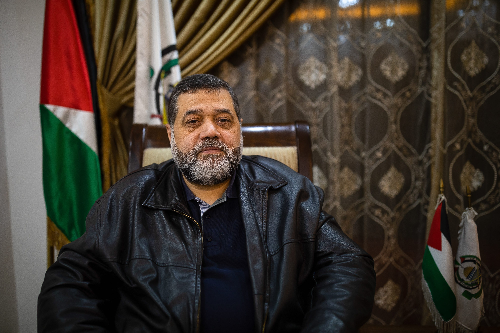
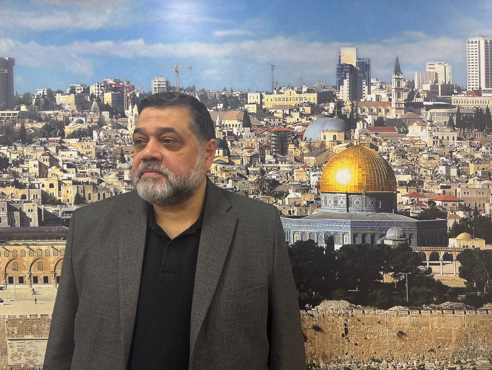
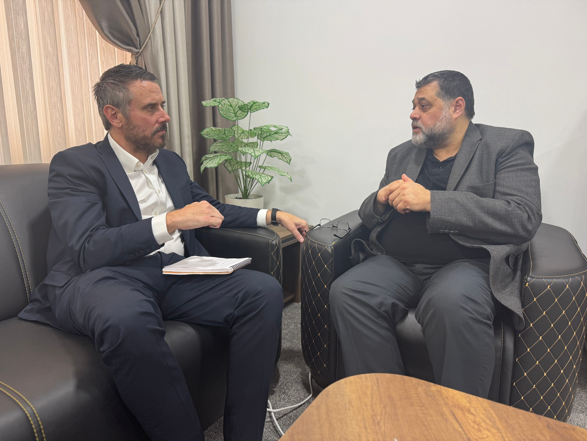

:::important
Bei diesem Beitrag handelt es sich um einen hochaktuellen Artikel, der vor Kurzem von Drop Site publiziert wurde. Wir möchten Sie höflich einladen, die unabhängige journalistische Arbeit von Drop Site durch Ihre Unterstützung zu fördern: [Unterstützungsmöglichkeiten](https://www.dropsitenews.com/p/ways-to-give)
:::

# Wie die Hamas die aktuelle Lage sieht: Ein Exklusiv-Interview mit Osama Hamdan

:::lead
In einem ausführlichen Interview mit Drop Site erörtert der ranghohe Hamas-Führer die Verhandlungsstrategie, warum die Entwaffnung eine rote Linie darstellt, seine direkten Gespräche mit US-Vertretern und vieles mehr.
:::

In einem [Exklusivinterview](https://www.dropsitenews.com/p/osama-hamdan-hamas-interview-podcast-gaza-israel) mit Drop Site News sagte ein hochrangiger Hamas-Beamter, dass die Bewegung nicht vor den Forderungen Israels oder der USA kapitulieren werde, ihre Waffen niederzulegen, und schwor, dass die Hamas jedes vorübergehende Waffenstillstandsabkommen ablehnen werde, das nicht einen klaren Weg zu einem vollständigen israelischen Rückzug aus dem Gazastreifen und einem Ende des Völkermords vorsehe.

„Wir brauchen keinen kurzfristigen Waffenstillstand“, sagte Osama Hamdan, einer der dienstältesten Hamas-Führungskräfte. „Was die Israelis anbieten, ist: Wir werden euch für eine kurze Zeit einen Waffenstillstand gewähren, und dann werden wir zurückkommen und euch wieder töten. Was ist also der Sinn, euch für 12, 40 Tage, zwei oder drei Wochen Nahrung zu geben und dann zurückzukommen, um euch zu töten? Das bedeutet, dass Sie den Völkermord an Ihrem eigenen Volk gutheißen und akzeptieren“.

Zwei Monate sind vergangen, seit die erste Phase des im Januar zwischen der Hamas und Israel unterzeichneten Waffenstillstandsabkommens für den Gazastreifen zu Ende ging und Israel eine umfassende Blockade verhängte - die längste in der jüngeren Geschichte. Seit dem 2. März hat Israel verhindert, dass Lebensmittel, Wasser, Medikamente, Treibstoff und andere Hilfsgüter in die belagerte Enklave gelangen, was den Gazastreifen nach Angaben der UNO in die schlimmste humanitäre Krise des 19-monatigen Krieges stürzte. Am 18. März nahm Israel seine Bombardierungen der verbrannten Erde wieder auf und tötete mehr als 2.400 Palästinenser, vor allem Frauen und Kinder. In dieser Zeit ist es den regionalen Vermittlern Katar und Ägypten nicht gelungen, Israel davon zu überzeugen, zum ursprünglichen Drei-Phasen-Plan zurückzukehren, der einen vollständigen Rückzug der israelischen Streitkräfte aus dem Gazastreifen und die Ausrufung eines dauerhaften Waffenstillstands vorsah.

Stattdessen hat Israel eine Reihe weitreichender neuer Forderungen als Bedingung für eine Einstellung seiner völkermörderischen Operationen gestellt. Im Mittelpunkt stehen dabei die vollständige Entmilitarisierung des Gazastreifens, die Entfernung der Hamas-Führer ins Exil und die Abschaffung der Hamas als Regierungsbehörde in Gaza.

„Ich glaube, dass die Israelis nicht an eine Lösung mit den Palästinensern glauben. Wenn sie von der Entwaffnung der Palästinenser sprechen, wollen sie damit die Hoffnung der Palästinenser auf Befreiung zerstören. Und wenn sie sie dann vertreiben wollen, haben die Palästinenser keine Möglichkeit, sich zu verteidigen“, sagte Hamdan und bezog sich dabei auf den Plan des israelischen Premierministers Benjamin Netanjahu für eine ‚Endphase‘ des Völkermords, der die gewaltsame Entfernung der Bevölkerung aus dem Gazastreifen vorsieht. „Wenn sie von der Entwaffnung der Palästinenser sprechen - nicht nur der Hamas, sondern aller Palästinenser - bedeutet das, dass sie wollen, dass die Palästinenser sich ergeben. Und wenn man sich ergibt, muss man den Willen des Besatzers akzeptieren.“

Hamdan sagte, die Hamas sei überrascht gewesen, als die ägyptischen Vermittler einen israelischen Plan vorlegten, der eine vollständige Entmilitarisierung des Gazastreifens vorsah. „Warum waren wir erstaunt, dass sie über dieses Thema sprachen? Weil es eine israelische Angelegenheit ist, und als Vermittler darf man nicht einfach jeden Vorschlag der israelischen Seite akzeptieren. Man muss sich damit auseinandersetzen. Sie müssen direkt mit den Israelis sprechen [und sagen]: 'Das wird nicht funktionieren'“, sagte Hamdan. „Wenn die Hamas zum Beispiel sagt, wir wollen, dass Netanjahu die Macht abgibt und Tel Aviv für die Palästinenser aufgibt, werden sie direkt antworten: Das wird nicht funktionieren. Warum sprechen [sie] nicht auf dieselbe Weise mit den Israelis?“

Hamdan sagte, die Palästinenser hätten sowohl eine moralische Verpflichtung als auch ein rechtliches Mandat nach internationalem Recht, bewaffneten Widerstand gegen eine israelische Besatzung zu leisten, die wiederholt von internationalen Gerichten als illegal eingestuft und von den weltweit führenden Menschenrechtsorganisationen als Apartheidsystem verurteilt wurde. „Man kann nicht über die Entwaffnung einer Nation sprechen, die unter Besatzung steht, während sie von der mächtigsten Armee der Region besetzt ist“, sagte er. „Die Hamas hat den Widerstand für Palästina nicht erfunden. Tatsächlich haben die Palästinenser jahrzehntelang Widerstand gegen die britische und dann gegen die israelische Besatzung geleistet. Wenn wir über die Entwaffnung der Palästinenser sprechen, wird dies das Problem nicht lösen. Die neue Generation wird kämpfen, weil Sie die Nation ständig unterdrücken. Es gibt also keine Möglichkeit für die Palästinenser, diese Besatzung ohne den Widerstand loszuwerden, keine andere Möglichkeit.“

Die Hamas hat seit Anfang der 1990er Jahre wiederholt Vereinbarungen zur Beendigung der Besatzung vorgeschlagen, die Israel stets abgelehnt hat. Letzte Woche lehnte es das jüngste Angebot der Hamas ab, das die Rückgabe aller israelischen Gefangenen im Gazastreifen an Israel im Rahmen eines mehrjährigen Abkommens vorgesehen hätte. „Sie haben es abgelehnt und werden es vielleicht ein weiteres Mal ablehnen, aber dies ist auch eine Antwort für die internationale Gemeinschaft, wenn sie die Palästinenser immer wieder fragt: 'OK, wie können wir das Problem lösen?'“ erklärte Hamdan. „Man kann das Problem nicht lösen, indem man über die Sicherheit Israels spricht. Man muss das Problem lösen, indem man über die Rechte der Palästinenser spricht, die einem die Option geben, die genau mit dem internationalen Recht, mit den internationalen Resolutionen übereinstimmt, die das Problem lösen und dem palästinensischen Volk seine Rechte geben kann.“

In dem Interview mit Drop Site erläuterte Hamdan auch die Beweggründe der Hamas für das Angebot eines fünf- bis siebenjährigen Waffenstillstands mit Israel, der im Arabischen als Hudna bezeichnet wird. „Das Hauptziel dieser langfristigen Hudna ist, dass jede Seite glauben muss, dass sie von der anderen Seite nicht angegriffen wird, was zumindest eine Art von Sicherheit schaffen kann. Und es ist eine Chance, Vertrauen zu schaffen, dass es eine Chance für eine Art von Stabilität und Sicherheit geben kann“, sagte er. „Das war zum Beispiel die Erfahrung in Südafrika, das war die Erfahrung in Vietnam, das war die Erfahrung in jeder Besatzungssituation - nicht nur in der palästinensischen Situation. Wir sind also nach wie vor einer sehr ernsthaften politischen Idee verpflichtet, nämlich dem langfristigen Waffenstillstand.“

## Israel will nicht, dass die USA mit der Hamas reden

Osama Hamdan schloss sich 1992, wenige Jahre nach der Gründung der Gruppe, der Hamas an und diente ihr als Vertreter im Iran und im Libanon sowie als Leiter der internationalen Beziehungen. Er war einer der wichtigsten Berater des Hamas-Führers Ismail Haniyeh, der letzten Sommer in Teheran von Israel ermordet wurde. Nach dem 7. Oktober 2023 wurde Hamdan zu einer festen Größe in den arabischsprachigen Medien und gab vom Libanon aus regelmäßig Presseerklärungen ab.

In dem ausführlichen Interview sagte Hamdan, dass die Hamas glaubt, dass das Waffenstillstandsabkommen vom Januar ohne den Wahlsieg von Donald Trump in den USA unwahrscheinlich gewesen wäre. „Ich denke, es hat geholfen. Wenn Kamala Harris die Wahlen gewonnen hätte, denke ich, dass die Politik der Biden-Administration, die die Israelis voll und ganz unterstützt hat, weitergeführt worden wäre... sie haben sich selbst zu einem Teil des Krieges und des Kampfes gegen die Palästinenser gemacht“, sagte er. „Wir wissen, dass die Trump-Leute gute Arbeit geleistet haben, um [den Waffenstillstand vom Januar] zustande zu bringen. Aber das ist nicht genug. Wir müssen ehrlich und ernsthaft sein, es ist nicht genug.“

Hamdan wies den israelischen Propagandabegriff zurück, mit dem beschrieben werden soll, was nach dem Ende des Krieges in Gaza geschehen soll. Die Israelis haben diesen Begriff „der Tag danach“ verwendet, um alle davon zu überzeugen, dass sie die Situation in Gaza innerhalb weniger Wochen übernehmen und den Widerstand beseitigen werden und dass es ein Problem mit einigen Menschen geben wird, die auf dem Land von Gaza leben“, sagte er. „Es gibt einen Tag, nachdem der Völkermord aufgehört hat. Und dieser Tag soll ein palästinensischer Tag sein, ein palästinensischer Nationalfeiertag, weil wir den Völkermord gestoppt haben und wir als Palästinenser selbst entscheiden müssen, was wir tun sollen.“

Hamdan sagte, sobald eine politische Lösung zur Beendigung des Völkermords erreicht sei, sei die Hamas bereit, die Verwaltung des Gazastreifens an ein unabhängiges Gremium von Palästinensern oder ein technokratisches Komitee abzugeben. „Es gab einen Vorschlag von ägyptischer Seite, ein Komitee von unabhängigen Führern aus dem Gazastreifen einzusetzen, das für eine Weile die Kontrolle im Gazastreifen übernimmt, und dann können wir zu allgemeinen Wahlen übergehen. Wir haben zugestimmt, denn wenn sie nationalistisch sind und sich für das Wohl des Gazastreifens und des Volkes einsetzen, warum sollten wir sie nicht haben“, sagte Hamdan. Er fügte hinzu, dass die Hamas und andere palästinensische Parteien der Palästinensischen Autonomiebehörde 40-45 Namen als Kandidaten für ein 15-köpfiges Gremium vorgeschlagen haben, das die Kontrolle über den Gazastreifen übernehmen soll, sobald die Hamas offiziell zurücktritt. Sie haben noch keine Antwort erhalten.

„Wir sind bereit, alles zu tun, um diesen Ausschuss zu unterstützen, denn wir wissen, dass es unsere Pflicht ist, den Palästinensern zu helfen, dieses Massaker und diesen Völkermord zu überleben“, sagte Hamdan und fügte hinzu, dass die Hamas die Abhaltung demokratischer Wahlen nicht nur im Gazastreifen, sondern in allen Gebieten des historischen Palästina unterstützt.

Hamdan war einer von zwei Hamas-Vertretern, die Ende Februar direkte Gespräche mit Donald Trumps Sonderbeauftragtem für Geiselnahmen führten. „Als die Treffen mit Adam Boehler stattfanden, gab es eine reale Möglichkeit [für ein langfristiges Abkommen]. Deshalb waren die Israelis wütend und verärgert“, sagte Hamdan. „Wir haben über Politik gesprochen, nicht nur über die Frage des Gefangenenaustauschs. Und ich glaube, er hat etwas gehört, was er von der Hamas nicht erwartet hat.“

Hamdan und ein weiterer hochrangiger Hamas-Beamter, der an den direkten Gesprächen mit Boehler teilnahm, beschrieben die Treffen als produktiv und diplomatisch. Sie sagten, dass Boehler aufrichtig daran interessiert schien, die Position der Hamas zu verstehen, sowohl historisch als auch in Bezug auf die laufenden Verhandlungen. Seit diesen Treffen und dem Beginn einer israelischen Verleumdungskampagne, die Boehler als von der Hamas getäuscht darstellt, hat es jedoch keine weiteren direkten Gespräche mehr gegeben.

„Ich glaube, einer der Gründe, warum die Israelis einige der palästinensischen Führer ermordet haben, war, dass sie die Möglichkeit haben, direkt mit den Vereinigten Staaten zu sprechen“, behauptete Hamdan. „Sie wollen jede Art von Kontakt zwischen dem palästinensischen Widerstand und der US-Regierung verhindern, weil sie ein Bild davon haben, dass es sich um Terroristen handelt.“ Er sagte, dass die direkten Gespräche mit Boehler und anderen US-Beamten zum ersten Mal die israelische Kontrolle über das Bild der Hamas umgingen. „Die Regierung entdeckte, dass es sich um Freiheitskämpfer handelt, die ein politisches Narrativ haben, einen politischen Standpunkt vertreten und eine politische Lösung anstreben“, sagte Hamdan. „Das ist es, was die Israelis zu verhindern versuchen.“

In den Gesprächen sprach Bohler auch das Problem von Edan Alexander an, dem amerikanisch-israelischen Doppelbürger, der sich zum israelischen Militär gemeldet hatte und am 7. Oktober 2023 von palästinensischen Kämpfern auf dem israelischen Militärstützpunkt, auf dem er stationiert war, gefangen genommen wurde. „Er ist amerikanischer Staatsbürger, aber er war Soldat in der israelischen Armee“, sagte Hamdan. „Warum ist es ihm erlaubt, ein Kämpfer oder ein Soldat in einer anderen Armee zu sein, nicht in irgendeiner anderen Armee, einer Armee, die das palästinensische Land besetzt, die das palästinensische Volk tötet?“

Hamdan fügte hinzu: „Sie wollen garantieren, dass keine Amerikaner als Gefangene gehalten werden, weil sie Soldaten in der israelischen Armee waren. Wir wollen also verhindern, dass die israelische Armee die Palästinenser tötet. Und das öffnete die Tür für ein politisches Gespräch. Und ich respektiere, dass [Boehler] den Mut hat, darüber zu sprechen, zuzuhören. Er hat genau zugehört.“

Letzten Monat sagte der Sprecher der Qassam-Brigaden, Abu Obeida, dass sie den Kontakt zu der Gruppe, die Alexander festhielt, verloren hätten, nachdem israelische Luftangriffe das Gebiet, in dem er gefangen gehalten wurde, getroffen hatten. Hamdan und ein weiterer hochrangiger Hamas-Beamter erklärten gegenüber Drop Site, dass sie seit dem Kontaktabbruch keine Informationen über Alexanders Schicksal erhalten hätten.

Hamdan und der andere Hamas-Beamte sagten gegenüber Drop Site, dass die Treffen mit Boehler zu direkten Gesprächen mit Steve Witkoff, Trumps Sondergesandtem für den Nahen Osten und Chefunterhändler der Regierung, führen sollten. Die Hamas glaubt, dass es Israel gelungen ist, diese Treffen zu vereiteln. „Wir erwarten mehr von Trumps Regierung, nicht nur die Sicherheit Israels zu wahren, nicht nur auf die israelische Seite zu hören. Die ganze Welt, vor allem die Regierung der Vereinigten Staaten, muss den Palästinensern zuhören. Man muss sich ihre Seite der Geschichte anhören“, sagte er. „Man kann das Problem nicht lösen, indem man nur auf Netanjahu hört, der sein eigenes Volk belügt, nicht nur die Amerikaner oder die Araber, sondern auch sein eigenes Volk.

---

[ANHÖREN: Vollständiges Interview von Drop Site mit dem hochrangigen Hamas-Funktionär Osama Hamda](https://www.dropsitenews.com/p/osama-hamdan-hamas-interview-podcast-gaza-israel)

---

Hamdan fand auch scharfe Worte für den Präsidenten der Palästinensischen Autonomiebehörde, Mahmoud Abbas. In einer am 23. April im Fernsehen übertragenen Rede vor dem Palästinensischen Nationalrat nannte der 89-jährige Führer die Hamas „Söhne von Hunden“ und forderte die Bewegung auf, ihre Waffen abzugeben und die israelischen Gefangenen freizulassen. Hamdan sagte, Abbas habe in den letzten 19 Monaten Israels völkermörderischen Krieg nur zurückhaltend angeprangert und gleichzeitig den palästinensischen Widerstand angegriffen und verurteilt. „Ich glaube, er hat seine Glaubwürdigkeit als palästinensischer Führer verloren und wird von den Palästinensern nicht mehr respektiert“, sagte Hamdan. „Er zerstört gerade seinen Ruf und sein Image. Ich weiß nicht, wie seine Söhne und Enkel nach seinem Tod unter dem palästinensischen Volk wandeln werden.“

Hamdan sprach die Zusammenarbeit der Palästinensischen Autonomiebehörde mit Israel bei dessen anhaltenden Angriffen auf das besetzte Westjordanland an. Er führte das Beispiel des Flüchtlingslagers Dschenin an, wo die Sicherheitskräfte der Palästinensischen Autonomiebehörde 40 Tage lang eine Belagerung verhängten, Widerstandszellen auflösten und Waffen beschlagnahmten und so den Weg für eine israelische Invasion ebneten, die zur Zerstörung von über 600 Häusern führte. Mehr als 40 000 Palästinenser wurden seit Januar aus ihren Häusern im Westjordanland vertrieben, die größte Vertreibung seit 1967. „Ich glaube, das Hauptziel der Israelis ist es, das gesamte Westjordanland zu übernehmen“, sagte er. „Ich glaube, dass sie sich irren, wenn sie eine Zeit lang glauben, dass die Palästinensische Autonomiebehörde die Situation unter Kontrolle halten wird. Die Menschen werden sich wehren.“ Hamdan bezeichnete Abbas' Truppen als eine Art „Sicherheitskräfte“ für die Besatzung, die über die Palästinenser wachen, „die wie Sklaven leben sollen“, und sagte: „Niemand in der Palästinensischen Autonomiebehörde versucht zu sagen, ‚genug ist genug‘. Sie wollen keinen Widerstand leisten.“

Hamdan kritisierte auch die jüngste Ernennung von Hussein Al-Sheikh, einem langjährigen Mitglied von Abbas' regierender Fatah-Partei, der für seine engen Beziehungen zu Israel bekannt ist, zum Vizepräsidenten der Palästinensischen Befreiungsorganisation und bezeichnete dies als Beweis für israelischen Einfluss. Seit 2007 ist Sheikh Leiter der Allgemeinen Behörde für zivile Angelegenheiten - der wichtigsten Koordinierungsstelle für die israelischen Streitkräfte im besetzten Westjordanland. „Wenn man ihn in einem geschlossenen Raum reden hört, hat man das Gefühl, dass man mit einem israelischen Soldaten spricht“, sagte Hamdan. „Das sind nicht meine Worte. Es sind die Worte einiger wichtiger Führer der Fatah.“ Die Israelis drängten auf die Ernennung von Sheikh zum Stellvertreter und wahrscheinlichen Nachfolger von Abbas, behauptete Hamdan, weil „sie wissen, dass er von sich aus bereit ist, diesen schmutzigen Job in ihrem Namen zu erledigen.“

Die Hamas vertritt seit 2017 offiziell die Position, dass sie das akzeptieren würde, was von westlichen Führern gemeinhin als „Zweistaatenlösung“ bezeichnet wird. Die Bewegung hat erklärt, dass sich die Hamas nicht dagegen aussprechen würde, wenn das palästinensische Volk für einen Staat in den Grenzen, wie sie vor dem Krieg im Juni 1967 bestanden, und mit Ost-Jerusalem als palästinensischer Hauptstadt stimmen würde.

„Ich denke, die Israelis haben gezeigt, dass sie nicht einmal zu einer Zweistaatenlösung bereit sind, und sie sprechen von der so genannten Endlösung, um die Palästinenser loszuwerden. Unter diesen Umständen geht jeder davon aus, dass es dazu nicht kommen wird“, sagte Hamdan, fügte aber hinzu: “Ich glaube, dass es immer noch eine reale Möglichkeit dafür gibt, wenn die internationale Gemeinschaft die Ordnung aufrechterhalten will. Andernfalls denke ich, dass die internationale Ordnung komplett scheitern wird, was zu noch komplizierteren Konsequenzen führen wird, nicht nur für die palästinensische Situation, sondern für die ganze Welt.“

Wenn sich die Welt weigere, Israel für den Völkermord im Gazastreifen zur Rechenschaft zu ziehen, so Hamdan, werde dies weitreichende Folgen haben. „Wenn sie Straffreiheit haben, bedeutet das, dass andere das Gleiche an verschiedenen Orten der Welt tun können. Was wäre, wenn das passieren würde? Einige andere Supermächte, wachsende Supermächte in der Welt, haben dieses Recht an kleine Länder gegeben, die von diesen Supermächten unterstützt werden“, sagte er. „Ich denke, wir werden die Welt in eine Art Dschungel verwandeln, vielleicht schlimmer als ein Dschungel, denn selbst im Dschungel töten die Tiere, um zu essen, aber sie töten nicht mehr als das. Aber wenn man einen Völkermord begeht, ist das wirklich eine Katastrophe, die man nicht mit Worten erklären kann oder indem man sagt: 'Tut mir leid, ich habe das getan und ich werde es nicht wieder tun.'“

## Wenn eine politische Lösung scheitert, wird der Widerstand weitergehen

Hamdan wies die Darstellung zurück, die Hamas führe einen Krieg gegen Israel, weil es ein jüdischer Staat sei, und sagte, diese Darstellung ziele darauf ab, die legitime Sache der Befreiung und Selbstbestimmung zu untergraben. „Wir haben klar gesagt, dass wir ein Volk unter Besatzung sind. Wir kämpfen nicht, nur weil wir gerne kämpfen oder weil es eine gute Idee ist, andere zu bekämpfen. Wir kämpfen nicht gegen die Israelis, weil sie zum Beispiel jüdische Menschen sind. Wir haben kein Problem mit dem jüdischen Volk“, sagte er. „Selbst wenn ein Muslim mein Land besetzen würde, würde ich ihn bekämpfen. Das hat nichts mit der Religion zu tun. Es geht darum, ob ich ein Besatzer bin oder nicht.

Trotz Berichten in israelischen und einigen arabischen Medien, wonach die Hamas in Erwägung ziehe, ihre Waffen vorübergehend im Gazastreifen zu lagern oder sie einem neutralen Dritten zu übergeben, sagte Hamdan, dass es keine offiziellen Gespräche über einen solchen Vorschlag gegeben habe. „Was ist mit den israelischen Waffen? Werden sie ihre Waffen auch lagern? Was bedeutet es, die Waffen zu lagern“, sagte er. „Eine solche Erfahrung wurde in Nordirland gemacht. Aber dort gab es eine echte politische Vereinbarung, die von beiden Seiten akzeptiert wurde.“ Andernfalls werde die Hamas ihre Waffen nicht abgeben, solange die Palästinenser keine volle Staatlichkeit erlangten. „Wenn es einen palästinensischen Staat gäbe, würden diese Waffen an die palästinensische Regierung übergeben“, sagte er. „Selbst die [Widerstands-]Kämpfer werden Teil der Armee oder der Polizei dieser Regierung sein.“

Hamdan wies die Darstellung zurück, die Hamas führe einen Krieg gegen Israel, weil es ein jüdischer Staat sei, und sagte, diese Darstellung ziele darauf ab, die legitime Sache der Befreiung und Selbstbestimmung zu untergraben. „Wir haben klar gesagt, dass wir ein Volk unter Besatzung sind. Wir kämpfen nicht, nur weil wir gerne kämpfen oder weil es eine gute Idee ist, andere zu bekämpfen. Wir kämpfen nicht gegen die Israelis, weil sie zum Beispiel jüdische Menschen sind. Wir haben kein Problem mit dem jüdischen Volk“, sagte er. „Selbst wenn ein Muslim mein Land besetzen würde, würde ich ihn bekämpfen. Das hat nichts mit der Religion zu tun. Es geht darum, ob ich ein Besatzer bin oder nicht.

Trotz Berichten in israelischen und einigen arabischen Medien, wonach die Hamas in Erwägung ziehe, ihre Waffen vorübergehend im Gazastreifen zu verstauen oder sie einem neutralen Dritten zu übergeben, sagte Hamdan, dass es keine formellen Gespräche über einen solchen Vorschlag gegeben habe. „Was ist mit den israelischen Waffen? Werden sie ihre Waffen auch einlagern? Was bedeutet es, die Waffen zu verstauen?“, sagte er. „Eine solche Erfahrung wurde in Nordirland gemacht. Aber dort gab es eine echte politische Vereinbarung, die von beiden Seiten akzeptiert wurde.“ Andernfalls werde die Hamas ihre Waffen nicht abgeben, solange die Palästinenser keine volle Staatlichkeit erlangten. „Wenn es einen palästinensischen Staat gäbe, würden diese Waffen an die palästinensische Regierung übergeben“, sagte er. „Selbst die [Widerstands-]Kämpfer werden Teil der Armee oder der Polizei dieser Regierung sein.“

Am Wochenende versprach Netanjahu, die israelischen Angriffe in den kommenden Wochen zu verstärken und die Bodenoperationen der Armee im Gazastreifen auszuweiten. Am Montag billigte das israelische Kabinett einen Plan zur Einnahme großer Gebiete des Gazastreifens, in denen die israelischen Streitkräfte auf unbestimmte Zeit verschanzt bleiben würden. Unter dem Codenamen „Gideon's Chariots“ (Gideons Wagen) sollen die Operationen auch die gewaltsame Vertreibung von Palästinensern in kleine Gebiete im südlichen Gazastreifen umfassen. Ein israelischer Sicherheitsbeamter erklärte gegenüber YNet, die Einzelheiten des Plans seien als Druckmittel aufgedeckt worden, um die Hamas zur Annahme eines kurzfristigen Waffenstillstandsabkommens zu zwingen, das die Freilassung einer großen Zahl israelischer Gefangener zur Folge hätte, ohne dass der Krieg beendet würde.

Diese durchgesickerten Vorschläge stehen in direktem Zusammenhang mit Donald Trumps geplantem Besuch im Nahen Osten, der am 13. Mai beginnen soll. Trump wird an einer Reihe von Gipfeltreffen mit arabischen Führern in Saudi-Arabien, Katar und den Vereinigten Arabischen Emiraten teilnehmen. Es gibt Anzeichen dafür, dass die USA Israel zu einem kurzfristigen Waffenstillstand mit der Hamas drängen, der als Kulisse für Trumps Reise dienen soll. Israelische Beamte erklärten, ihre Drohungen, „alle eroberten Gebiete“ im Gazastreifen zu beschlagnahmen, zielten darauf ab, die Hamas vor Trumps Reise zu einem Abkommen zu zwingen.

In dem Interview mit Drop Site, das vor dem Bekanntwerden der israelischen Pläne geführt wurde, betonte Hamdan, dass die Hamas keine befristeten Vereinbarungen eingehen werde, die nicht einen Weg zu einem dauerhaften Waffenstillstand und einem israelischen Rückzug aus dem Gazastreifen beinhalten. „Strebt die US-Regierung und Präsident Trump nur einen kurzfristigen Waffenstillstand an oder ist er bereit, einen dauerhaften Waffenstillstand zu schließen, der zu einer politischen Lösung führen kann?“ sagte Hamdan. „[Trump] muss die Wahl treffen, ob er die Israelis dazu bringen will, einen langfristigen Waffenstillstand zu akzeptieren und eine politische Lösung anzustreben, die zu einem unabhängigen, souveränen palästinensischen Staat führt.“

Die Alternative, so Hamdan, sei ein Krieg auf unbestimmte Zeit, der die Region weiter destabilisieren und den Rest von Trumps Nahost-Agenda beeinflussen werde. „Wir kämpfen dafür, von der Besatzung befreit zu werden. Wenn das auf politischem Wege geschehen kann, ist das gut. Wir werden das akzeptieren, wenn es auf friedliche Weise geschieht. Wir wollen nicht umgebracht werden. Wir mögen es nicht, andere zu töten. Aber wenn es nicht auf diese Weise geschieht, werden wir kämpfen“, sagte Hamdan. „Lasst uns über die Befreiung der Palästinenser von der Besatzung sprechen. Lasst uns über den Rückzug Israels aus den besetzten palästinensischen Gebieten sprechen“, fügte er hinzu. „Dies wird der Anfang sein, um Vertrauen und Stabilität zu schaffen. Wenn dies geschieht, ist es eine sehr gute Idee. Wenn es nicht geschieht, kann niemand seine Waffen abgeben, während er getötet, gefoltert und eingesperrt wird.“

Wenn Trump tatsächlich die Freilassung aller israelischen Gefangenen und ein schnelles Ende des Krieges erreichen wolle, so Hamdan, könne er die umfangreichen Hebel des US-amerikanischen Einflusses auf Netanjahu als Israels größten Geldgeber und Waffenlieferanten nutzen. „Das ist nicht genug Druck. Sie wissen, dass sie das tun können“, erklärte er. „Wenn sie sagen würden: 'OK, wir liefern euch keine neuen Waffen', dann würde das den Israelis zeigen, dass die Regierung es ernst meint und sie sich an den Waffenstillstand halten müssen.“

Hamdan sagte, dass die Verantwortung für die Auseinandersetzung mit Israels Apartheid, Besatzung und dem Vernichtungskrieg gegen das palästinensische Volk letztlich bei der internationalen Gemeinschaft liege. Und wie sie mit dem Schicksal Palästinas umgeht, wird für kommende Generationen nachhallen. „Der Wille der Palästinenser, befreit zu werden, ist nach 70 Jahren Besatzung immer noch vorhanden und wird es auch bleiben, bis die Palästinenser die Besatzung loswerden können“, sagte Hamdan. „Das wird eine wichtige Wende sein, nicht in der palästinensischen Geschichte, aber ich denke, in der internationalen Geschichte, weil es eine Art von ausgeglichener Gerechtigkeit in der Welt ausdrücken wird. Andernfalls, denke ich, wird es ein Zeichen für das Ende dieser internationalen Ordnung sein, und wer weiß, wozu das führen wird.“

