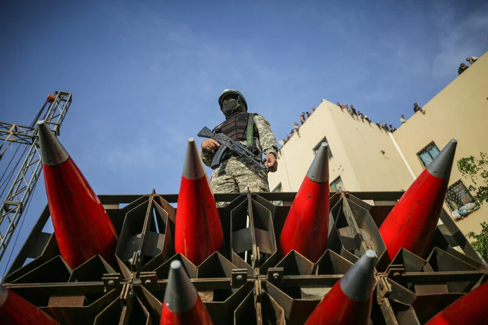

# Es ist an der Zeit, den liberalen Diskurs über die Hamas zu ändern

Die Abgeordnete Ilhan Omar mag gedacht haben, sie tue den Palästinensern einen Gefallen, als sie Außenminister Anthony Blinken am Montag in einer Kongressanhörung herausforderte.

Aber ihre Kommentare über die Hamas verstärken nur die israelische Propaganda, die den palästinensischen Widerstand delegitmiert.

Traurigerweise ist Omars Beidseitigkeit ein gängiges Merkmal des Diskurses, selbst unter angeblich pro-palästinensischen Liberalen.

Omar postete diesen Videoclip von ihrem Austausch mit Blinken. In ihrem Tweet schrieb sie: „Wir müssen für alle Opfer von Verbrechen gegen die Menschlichkeit das gleiche Maß an Verantwortlichkeit und Gerechtigkeit haben.“

:::twitter{user=Ilhan #1401985884191404041 date="2021-06-07"}
Wir müssen für alle Opfer von Verbrechen gegen die Menschlichkeit das gleiche Maß an Rechenschaftspflicht und Gerechtigkeit schaffen.

Wir haben unvorstellbare Gräueltaten gesehen, die von den USA, der Hamas, Israel, Afghanistan und den Taliban begangen wurden.

Ich habe @SecBlinken gefragt, wohin die Menschen gehen sollen, um Gerechtigkeit zu erfahren.
:::

Sie behauptete: „Wir haben unvorstellbare Gräueltaten gesehen, die von den USA, der Hamas, Israel, Afghanistan und den Taliban begangen wurden.“

Omar fordert Blinken zu Recht wegen des Widerstands der USA gegen die Untersuchung dieser angeblichen „Kriegsverbrechen und Verbrechen gegen die Menschlichkeit“ durch den [Internationalen Strafgerichtshof](https://electronicintifada.net/tags/international-criminal-court) heraus.

„Ich möchte betonen, dass dies in Israel und Palästina Verbrechen einschließt, die sowohl von den israelischen Sicherheitskräften als auch von der Hamas begangen wurden“, sagt sie. „In Afghanistan sind es Verbrechen, die von der afghanischen Regierung und den Taliban begangen wurden.“

In ihren mündlichen Äußerungen lässt Omar insbesondere die von den Vereinigten Staaten begangenen Verbrechen aus.

Blinkens Antwort ist - wie viele richtig bemerkt haben - so heuchlerisch und unehrlich wie erwartet. Er behauptet fälschlicherweise, dass Palästinenser in Israel Gerechtigkeit suchen können.

:::twitter{user=maureenclarem #1401968677210279937 date="2021-06-07"}
Die israelischen Streitkräfte haben mehr als 1.000 Palästinenser im Westjordanland und im Gazastreifen getötet, seit die Untersuchung des IStGH im Jahr 2015 begann. Ich kann die Anzahl der israelischen Soldaten, die im Zusammenhang mit dem Tod eines Palästinensers vor Gericht gestellt wurden, an einer Hand abzählen, _vielleicht_ an zwei. https://twitter.com/AssalRad/status/1401949936116289537
:::

## Keine Gleichsetzung

Aber es ist zutiefst beunruhigend, dass Omar - die mit ihrer rhetorischen Unterstützung für die Palästinenser [Wahlkampfgelder](https://twitter.com/AliAbunimah/status/1396862372862648321) gesammelt hat - den palästinensischen Widerstand und die Selbstverteidigung als „Verbrechen gegen die Menschlichkeit“ bezeichnet und mit Israels kolonialer Gewalt gleichsetzt.

Dies ist ein billiger und einfacher Weg, um eine falsche Gleichbehandlung zu demonstrieren, genauso wie die Kritik an Benjamin Netanjahu für US-Politiker zu einem politisch akzeptablen Weg geworden ist, um [den Anschein zu erwecken, gegenüber Israel hart zu sein](https://electronicintifada.net/blogs/ali-abunimah/bernie-sanders-must-stop-whitewashing-israels-next-racist-government), ohne dessen grundlegenden Rassismus tatsächlich in Frage zu stellen.

Das politisch schwierigere, aber richtige Argument ist, dass es keine moralische Gleichwertigkeit gibt zwischen einem kolonisierten Volk, das mit den ihm zur Verfügung stehenden Mitteln [sein international anerkanntes Recht auf Widerstand](https://electronicintifada.net/blogs/ali-abunimah/why-un-telling-palestinians-protect-their-occupiers) ausübt, und einem atomar bewaffneten Staat, der hochentwickelte Waffen einsetzt, um dieses Volk zu ermorden und zu terrorisieren, damit es sich unterwirft.

Die Liste der Gräueltaten Israels ist zu lang und bekannt, um sie hier zu wiederholen. Zusätzlich zur Vertreibung von 800.000 Palästinensern während seiner Gründung hat Israel seit 1948 [etwa 100.000 Palästinenser und Araber getötet](https://electronicintifada.net/content/balfour-declarations-many-questions/22216) - und das schon Jahrzehnte vor der Gründung der Hamas im Jahr 1988.

Bei Israels [Angriff auf den Gazastreifen im vergangenen Monat](https://electronicintifada.net/tags/may-2021-attack-gaza) wurden gezielt Häuser von Zivilisten angegriffen - ganze Familien wurden ausgelöscht - und Unternehmen, Medienbüros und die Infrastruktur in großem Umfang zerstört.

Der Schrecken war so groß, dass selbst [die New York Times](https://electronicintifada.net/tags/new-york-times-0) - Israels inoffizieller amerikanischer Imageberater - ihn nicht mehr einfach unter den Teppich kehren konnte.

:::twitter{user=MahaGaza date="2021-06-08" #1402211489545703431}
Mein Vater
Meine Mutter
Meine Schwester
Mein ältester Bruder
Meine Stiefschwester
Meine Ehefrau
Mein ältestes Kind
Mein 16-jähriges Kind
Meine Tochter
Mein Neffe
Meine Nichte
Die Frau meines Neffen
Ihr 3 Monate altes Kind
5 meiner Cousins und Cousinen
Die Töchter meiner Cousins und Cousinen

-Shukri Kolak aus Gaza über die Menschen, die er während des israelischen Angriffs verloren hat.

https://x.com/i/status/1402211489545703431
:::

:::twitter{user=itranslate123 date="2021-05-28" #1398288662220128257}
Sie waren nur Kinder. Israel hat sie abgeschlachtet.
Palästinensische Kinder, die von Israel ermordet wurden, auf der Titelseite der New York Times
![Bild der Titelseite der New York Times mit Bildern von 67 Kindern, die von Israel während des Konflikts in diesem Monat getötet wurden] (https://pbs.twimg.com/media/E2e4IKxXwAI9iyR?format=jpg&name=medium)
:::

Wenn es schon lächerlich ist, die Gewalt der Hamas - sowohl in Bezug auf den Kontext als auch auf das Ausmaß - mit derjenigen Israels zu vergleichen, so ist es noch absurder, die palästinensische Gruppe mit den Vereinigten Staaten in einen Topf zu werfen.

Seit dem Zweiten Weltkrieg haben die USA eine beispiellose Bilanz von Tod und Zerstörung in der Welt hinterlassen.

Millionen von Menschen wurden durch US-Kriege, Putsche und Interventionen getötet, von [Südostasien](https://gsp.yale.edu/sites/default/files/walrus_cambodiabombing_oct06.pdf) über [Guatemala](https://www.democracynow.org/1999/3/1/u_s_role_in_genocide_in) bis zum Irak und vielen Ländern dazwischen.

Aber was sind die „Gräueltaten“, die Ilhan Omar der Hamas vorwirft?

## „Wahllose“ Raketen

Es wird oft behauptet, die Hamas sei schuldig, auf Zivilisten gezielt zu haben, weil sie „wahllos“ Tausende von Raketen auf israelische Städte und strategische Einrichtungen abgefeuert habe.

Der Hauptzweck dieser Raketen besteht darin, Israel abzuschrecken und ihm einen Preis für seine ethnischen Säuberungen und Angriffe auf Palästinenser aufzuerlegen - sei es in Gaza oder in Jerusalem.

Their [development](https://electronicintifada.net/blogs/nora-barrows-friedman/podcast-ep-36-how-palestinian-resistance-defeated-israel) was a response to Israel’s attempt to physically isolate Gaza from the rest of Palestine, in order to fragment and weaken Palestinians and facilitate the colonial theft of their land.

Ihre [Entwicklung](https://electronicintifada.net/blogs/nora-barrows-friedman/podcast-ep-36-how-palestinian-resistance-defeated-israel) war eine Reaktion auf Israels Versuch, den Gazastreifen physisch vom übrigen Palästina zu isolieren, um die Palästinenser zu zerteilen und zu schwächen und den kolonialen Raub ihres Landes zu erleichtern.

:::twitter{user=VICENews date="2021-06-02" #1400201089652297731}
„Wir haben beschlossen, unser Volk mit allen Waffen zu verteidigen, die wir haben.“

@HindHassanNews traf sich mit Yahya Sinwar, dem Hamas-Führer von Gaza. Das Gebiet wird derzeit von der militanten Palästinensergruppe regiert. #VWN

https://twitter.com/i/status/1400201089652297731
:::

Wie Yahya Sinwar, der Hamas-Führer in Gaza, kürzlich in einem Interview mit Vice News erklärte, verwenden die Palästinenser ungelenkte Raketen nicht freiwillig.

„Israel, das über ein komplettes Waffenarsenal, modernste Ausrüstung und Flugzeuge verfügt, bombardiert absichtlich unsere Kinder und Frauen“, [sagte Sinwar](https://twitter.com/VICENews/status/1400201089652297731).

„Das kann man nicht mit denen vergleichen, die Widerstand leisten und sich mit Waffen verteidigen, die im Vergleich dazu primitiv aussehen. Wenn wir die Möglichkeit gehabt hätten, Präzisionsraketen abzuschießen, die auf militärische Ziele zielen, hätten wir die Raketen nicht eingesetzt, die wir eingesetzt haben.“

„Wir sind gezwungen, unser Volk mit dem zu verteidigen, was wir haben, und das ist es, was wir haben“, fügte er hinzu.

In der Tat hört man selten jemanden, der sich darüber beschwert, dass die palästinensischen Raketen „wahllos“ sind, der die Vereinigten Staaten oder die Europäische Union auffordert, die Palästinenser mit Präzisionswaffen zu bewaffnen, so wie sie Israel bewaffnen.

Es stimmt jedoch, dass die Raketen für die Zivilbevölkerung nicht ungefährlich sind.

Während der 11 Tage verschärfter Gewalt im letzten Monat wurden in Israel 11 Menschen durch Raketenbeschuss getötet und ein Soldat wurde nahe der Grenze zwischen Gaza und Israel durch eine Panzerabwehrwaffe getötet.

Sinwar zufolge hat die Hamas bei der jüngsten Eskalation [nicht ihre vollen Möglichkeiten](https://www.timesofisrael.com/sinwar-says-next-fight-will-reshape-region-denies-idf-crippled-tunnel-network/) genutzt.

Sollte diese Behauptung zutreffen, würde dies darauf hindeuten, dass das Ziel der Gruppe nicht darin bestand, ein Maximum an Tod und Zerstörung zu verursachen, sondern ein Minimum an Gewalt anzuwenden, um die Ziele des Widerstands, nämlich Abschreckung und Selbstverteidigung, zu erreichen.

Im Gegensatz dazu wurden 250 Palästinenser, darunter mindestens 67 Kinder, in Gaza getötet, als Israel das Gebiet Tag und Nacht mit seinen „Präzisions“-Waffen bombardierte, um den Widerstand gegen ein Apartheidregime zu brechen.

Jedes Leben ist kostbar, aber die Gleichsetzung der israelischen kolonialen Gewalt mit dem palästinensischen Widerstand, wie sie Omar vornimmt, verschleiert diese Tatsachen.

## Gewalt beginnt beim Unterdrücker

Der Vollständigkeit halber müssen wir überlegen, ob sich die von Omar erwähnten „Gräueltaten“ der Hamas möglicherweise auf die Selbstmordattentate beziehen, die Palästinenser seit Mitte der 1990er Jahre als verzweifelte asymmetrische Reaktion auf die Gewalt der israelischen Besatzung verübten.

Palästinensische Organisationen haben diese weithin verurteilte Taktik nach 2008 aufgegeben.

Ähnliche Gewalt war jedoch schon immer ein fester Bestandteil des antikolonialen Kampfes, wobei indigene Gruppen versuchten, ihren Kolonisatoren eine Kostprobe des Terrors zu verpassen, den die Kolonisatoren ihnen zuerst auferlegt hatten.

Nelson Mandela – der heute von westlichen Politikern, die Israels Massaker an Palästinensern unterstützen und den palästinensischen Widerstand verurteilen, als [Heiliger](https://www.youtube.com/watch?v=XkHjrKDrhjg) [behandelt](https://www.youtube.com/watch?v=ciGe1mBXw1Y) wird – erklärt dies in seiner Autobiografie Der lange Weg zur Freiheit.

„Es ist immer der Unterdrücker, nicht die Unterdrückten, der die Form des Kampfes bestimmt“, schreibt Mandela. „Wenn der Unterdrücker Gewalt anwendet, haben die Unterdrückten keine andere Möglichkeit, als mit Gewalt zu antworten. In unserem Fall war es eine legitime Form der Selbstverteidigung“.

„Es liegt an euch, nicht an uns, der Gewalt abzuschwören“, erinnert sich Mandela an seine Worte an das Apartheid-Regime.

In den ersten Tagen des bewaffneten Kampfes bevorzugte der Afrikanische Nationalkongress Taktiken, bei denen keine Menschen getötet wurden, so Mandela.

Aber er stellt klar, dass „wenn Sabotage nicht die gewünschten Ergebnisse brachte, waren wir bereit, zur nächsten Stufe überzugehen: Guerillakrieg und Terrorismus“.

In Palästina begann die Bombardierung von Marktplätzen, Hotels und anderen zivilen Gebieten nicht als Teil eines antikolonialen Kampfes, sondern als eine koloniale Taktik [eingeführt](https://journals.lib.unb.ca/index.php/JCS/article/view/10538) von zionistischen Siedlern in den 1930er Jahren, um [die einheimischen Palästinenser zu terrorisieren](https://electronicintifada.net/content/how-zionist-terrorism-determined-palestines-fate/19871) und sie daran zu hindern, ihr Recht auf Selbstbestimmung wahrzunehmen.

Selbst wenn die Palästinenser nur den Zionisten nacheiferten, scheint es unwahrscheinlich, dass die Selbstmordattentate der 1990er und frühen 2000er Jahre die „Gräueltaten“ sind, auf die sich Omar bezog.

Erstens ist diese Taktik, wie bereits erwähnt, seit langem aufgegeben worden.

Zweitens wurden Selbstmordattentate nicht nur von der Hamas, sondern auch von anderen palästinensischen Gruppen verübt, [einschließlich](https://scholar.harvard.edu/files/benmelech/files/terror_nber_0207.pdf) der Fatah-Fraktion von Mahmoud Abbas, dem von den USA unterstützten Führer der Palästinensischen Autonomiebehörde, der [nach wie vor ein enger Verbündeter Israels ist](https://electronicintifada.net/tags/security-coordination) und zu dem Blinken gerne [wieder herzliche Beziehungen aufbauen möchte](https://abcnews.go.com/Politics/blinken-resets-ties-palestinians-1st-mideast-trip/story?id=77895565).

Drittens kann man kaum behaupten, dass die Opfer solcher Bombenanschläge keinen Zugang zu „Gerechtigkeit“ hatten – oder zu dem, was man eigentlich Rache nennen könnte.

Israel führte zahlreiche außergerichtliche Hinrichtungen durch, angeblich als Reaktion auf die Anschläge, unter anderem an Scheich Ahmad Jassin, dem Gründer der Hamas, der blind war und seit seiner Kindheit einen Rollstuhl benutzte.

Im Jahr 2003, dem Jahr vor der Ermordung Jassins, tötete Israel nach Angaben der US-Regierung bei solchen Racheangriffen mehr „Unbeteiligte“ als „Terroristen oder mutmaßliche Terroristen,“ nach [angaben](https://2009-2017.state.gov/j/drl/rls/hrrpt/2003/27929.htm) der Vereinigten Staaten.

Dies wird jedoch von den Vereinigten Staaten nicht als „Terrorismus“ betrachtet.

Israel hält auch den Fatah-Führer Marwan Barghouti seit 2002 in Haft. Es [beschuldigt](https://mfa.gov.il/MFA/ForeignPolicy/Issues/Pages/On-Marwan-Barghouti-s-murder-record,-political-maneuvering-and-exploitation.aspx) ihn, einer der Anführer der „palästinensischen Terrorkampagne mit Selbstmordattentaten und Schießereien auf israelische Bürger“ während der zweiten Intifada Anfang der 2000er Jahre zu sein.

In einem Prozess, an dem Barghouti weder teilnahm noch sich selbst verteidigte, wurde er von Israel [für eine Rolle bei Anschlägen, bei denen fünf Menschen getötet wurden](https://www.irishtimes.com/news/barghouti-sentenced-to-five-life-jail-terms-1.1143739) zu fünfmal lebenslänglich verurteilt.

Bemerkenswert ist, dass selbst die israelischen Richter – die Barghouti mit „Piloten, die Flugzeuge fliegen und Bomben auf Palästinenser abwerfen“ verglich – ihn aus Mangel an Beweisen von der Beteiligung an Dutzenden anderer Gewalttaten freisprachen.

In der Zwischenzeit haben die USA zahllose [„Anti-Terrorismus“-Gesetze](https://electronicintifada.net/tags/anti-terrorism-act) erlassen, die Palästinenser und [palästinensische Amerikaner](https://electronicintifada.net/tags/holy-land-five) vor US-Gerichten kollektiv für Taten bestrafen, derer die Hamas beschuldigt wird.

Im Gegensatz dazu haben die Palästinenser vor US-Gerichten keine Möglichkeit, die von den USA unterstützten Verbrechen Israels gegen sie zu ahnden.

Wie Ilhan Omar zu Recht hervorhebt, versuchen die USA nun, den Palästinensern den Zugang zur Justiz auch vor dem Internationalen Strafgerichtshof zu verwehren.

Gleichzeitig wird jede Form des palästinensischen Widerstands – vom bewaffneten Kampf bis zum gewaltlosen Boykott – von der so genannten internationalen Gemeinschaft routinemäßig verurteilt.

## „Wohlerzogene Opfer“

Eine der einfachsten politischen Methoden des Westens ist es, die Hamas – und andere palästinensische Gruppen – als wilde religiöse Fanatiker zu verteufeln, die auf Tod und Zerstörung um ihrer selbst willen oder aufgrund eines irrationalen Hasses auf Juden aus sind.

Das war schon immer die Propagandabotschaft Israels, und leider ist es eine, zu der Omars Kommentare beitragen, ob sie es nun will oder nicht.

Seit ihrer Gründung und vor allem in den letzten zwei Jahrzehnten hat sich die Hamas in den Mainstream der palästinensischen nationalen Politik eingereiht.

Sie hat ihre Unabhängigkeit von der Muslimbruderschaft, der vor einem Jahrhundert in Ägypten gegründeten transnationalen Organisation, bekräftigt und die Grenzen von 1967 als Grundlage für einen palästinensischen Staat neben Israel akzeptiert.

Außerdem hat sie in einigen ihrer früheren Dokumente ausdrücklich Formulierungen zurückgewiesen, die Anleihen bei klassischen europäischen antisemitischen Tropen machten.

Diese Änderungen wurden [in einem Dokument](https://electronicintifada.net/blogs/ali-abunimah/whats-behind-hamas-new-charter) bestätigt, das 2017 veröffentlicht wurde und ihre Leitprinzipien umreißt.

„Die Hamas bekräftigt, dass ihr Konflikt mit dem zionistischen Projekt und nicht mit den Juden aufgrund ihrer Religion besteht“, heißt es in dem Dokument. „Die Hamas kämpft nicht gegen die Juden, weil sie Juden sind, sondern gegen die Zionisten, die Palästina besetzen. Dabei sind es die Zionisten, die das Judentum und die Juden ständig mit ihrem eigenen kolonialen Projekt und illegalen Gebilde identifizieren.“

In dem Dokument wird auch das Recht der Palästinenser auf militärischen Widerstand gegen Israel bekräftigt, aber es wird deutlich gemacht, dass militärische Maßnahmen ein Mittel zur Erreichung politischer und nationaler Ziele und kein Selbstzweck sind.

Und es ist auch nicht das bevorzugte Mittel, wie Hamas-Führer Sinwar in seinem Interview mit Vice News erklärte.

„Wir wissen, dass wir keinen Krieg oder Kampf wollen, weil er Menschenleben kostet und unser Volk Frieden verdient“, sagte Sinwar.

In einer wahrscheinlichen Anspielung auf den [Großen Marsch der Rückkehr](https://electronicintifada.net/tags/great-march-return) von 2018 – auf den Israel mit dem [Befehl an Scharfschützen, Kinder zu erschießen](https://electronicintifada.net/blogs/ali-abunimah/snipers-ordered-shoot-children-israeli-general-confirms) reagierte – fügte Sinwar hinzu: „Wir haben es lange Zeit mit friedlichem Widerstand und Volkswiderstand versucht.“

Aber anstatt zu handeln, um Israels Verbrechen und Massaker zu stoppen, „sah die Welt zu, wie die Kriegsmaschinerie der Besatzung unsere jungen Menschen tötete“, sagte Sinwar.

„Erwartet die Welt von uns, dass wir brave Opfer sind, während wir getötet werden, dass wir abgeschlachtet werden, ohne einen Laut von uns zu geben?“

Eine faktenbasierte Bewertung der Hamas-Politik widerlegt die [rassistische Propaganda und Lügen](https://electronicintifada.net/blogs/ali-abunimah/former-israeli-war-minister-confuses-pakistan-palestine), dass es sich lediglich um eine blutrünstige Organisation handelt, die so sehr auf Gewalt aus ist, dass sie sogar palästinensische Kinder als menschliche Schutzschilde einsetzt.

## Die Ablehnung der USA und Israels

Seit vielen Jahren besteht die politische und militärische Strategie der Hamas darin, den politischen Weg anderer nationaler Befreiungs- und antikolonialer Bewegungen nachzuahmen, insbesondere Sinn Fein und die Irisch-Republikanische Armee.

Diese irischen Gruppen, die von den Briten lange Zeit als „Terroristen“ verteufelt wurden, waren nichtsdestotrotz [Teil der Verhandlungen](https://www.nytimes.com/2010/08/29/opinion/29abunimah.html), die 1998 zum Belfaster Abkommen führten, das die jahrzehntelange Gewalt im Norden Irlands beendete.

Dieses Abkommen legte auch die [politischen Bedingungen](https://al-shabaka.org/briefs/reclaiming-self-determination/) fest, mit denen die irischen Nationalisten ihr Ziel erreichen konnten, Nordirland abzuschaffen, den geteilten Staat, der von den Briten geschaffen wurde, um die Macht und die Privilegien der überwiegend protestantischen Siedler-Kolonialgemeinschaft zu schützen.

Wenn die Hamas und andere palästinensische Gruppierungen ihren militärischen Widerstand fortsetzen, dann deshalb, weil Israel und seine amerikanischen und europäischen Sponsoren alle großzügigen und weitreichenden palästinensischen Angebote für ein Entgegenkommen gegenüber den Israelis abgelehnt haben.

Sogar die Hamas hat sich schließlich mit der so genannten Zwei-Staaten-Lösung [abgefunden](https://electronicintifada.net/blogs/ali-abunimah/whats-behind-hamas-new-charter), bei der die Palästinenser einen Staat auf nur 22 Prozent ihres Landes akzeptieren.

Die Antwort Israels war immer die totale Ablehnung, die darauf bestand, dass Israel das gesamte Land zwischen dem Jordan und dem Mittelmeer dauerhaft besitzen, kontrollieren und [die jüdische Vorherrschaft](https://electronicintifada.net/blogs/tamara-nassar/israel-passes-law-entrenching-apartheid) behalten sollte.

In der Tat ist diese Ablehnung so extrem, dass die USA zwar direkt mit den Taliban verhandeln – mit denen sie einen Krieg führen –, aber jeden Kontakt mit der Hamas ablehnen, die sich nie im Krieg mit den Vereinigten Staaten befunden hat.

Die von den USA vermittelten [Normalisierungsabkommen](https://electronicintifada.net/tags/arab-normalization), die verschiedene arabische Regime im letzten Jahr mit Israel unterzeichnet haben, gaben Israel weiteres grünes Licht für die Ausweitung seiner ethnischen Säuberung in Jerusalem.

Dies [zwang die palästinensischen Widerstandsgruppen](https://electronicintifada.net/content/time-its-different/33006) in Gaza zu einer militärischen Antwort zur Verteidigung der Palästinenser in Jerusalem, die vom Rest der Welt ihrem Schicksal überlassen wurden.

Die Gewalt der palästinensischen Widerstandsgruppen mit der Gewalt der kolonialen Besatzer oder der Vereinigten Staaten gleichzusetzen, ist eine verwerfliche moralische Gleichsetzung. Es ist nicht anders als bei denen, die „[All Lives Matter](https://www.elle.com/uk/life-and-culture/culture/a32800835/all-lives-matter-fake-equality)“ rufen, wenn sie mit der Realität des systematischen Rassismus und der Polizeigewalt gegen Schwarze in den Vereinigten Staaten konfrontiert werden.

Ja, das Leben aller Menschen ist wichtig, aber die Verantwortung für die Gewalt, die dieses Leben nimmt, ist nicht gleichmäßig verteilt.

Ohne eine klare Diagnose, wo die Verantwortung liegt – und in Palästina ist die Grundursache aller politischen Gewalt die zionistische Kolonisierung – gibt es keine Hoffnung auf einen gerechten Frieden, der sie beendet.
