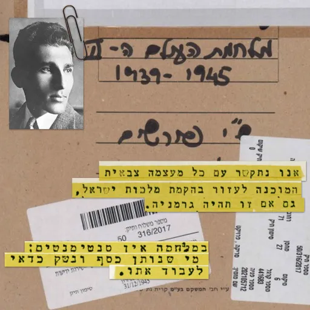
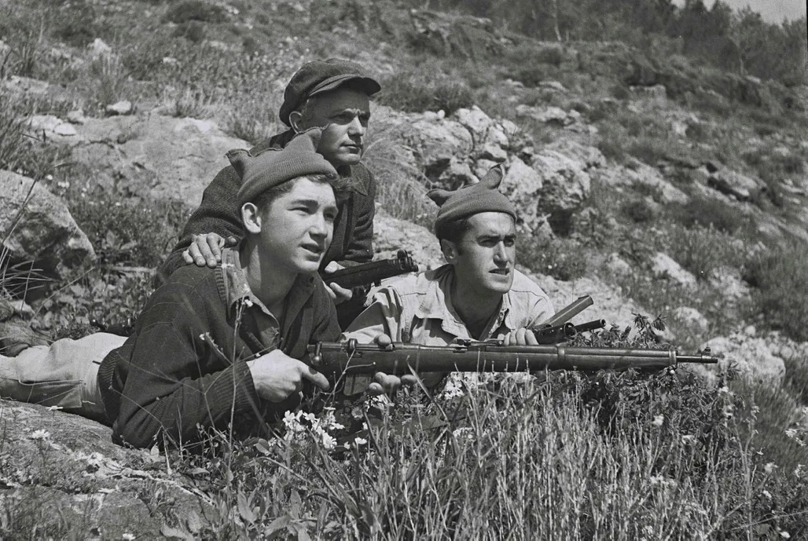
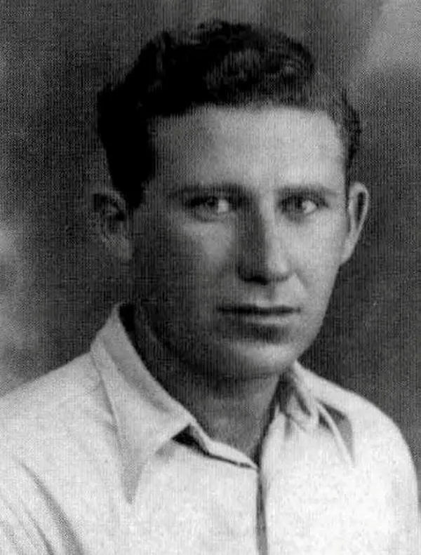
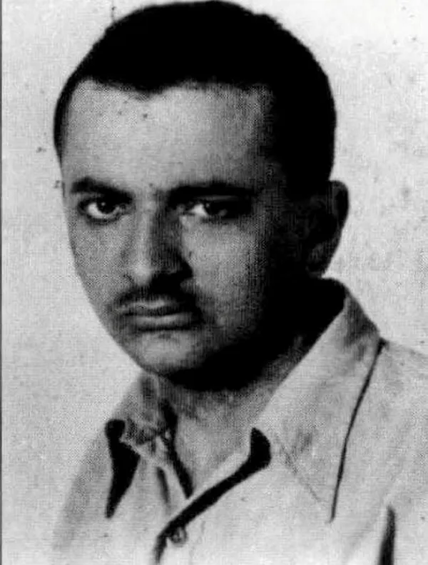
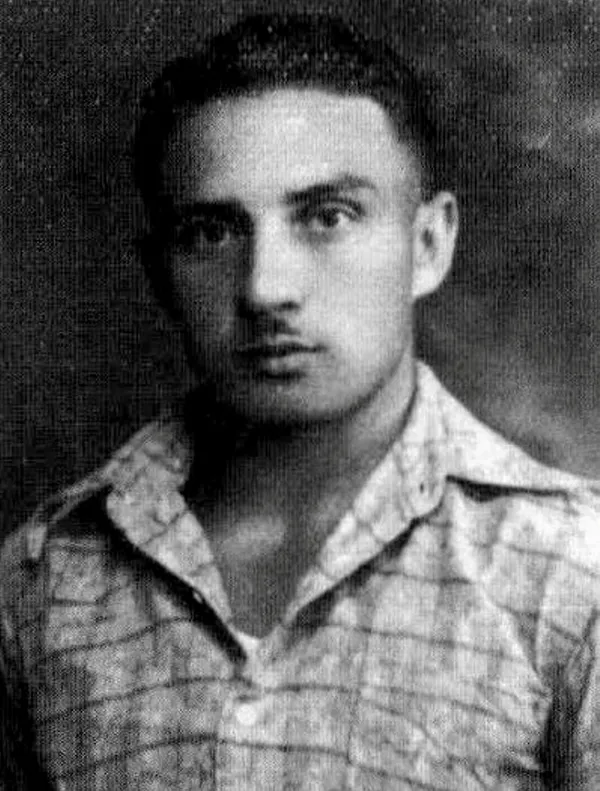
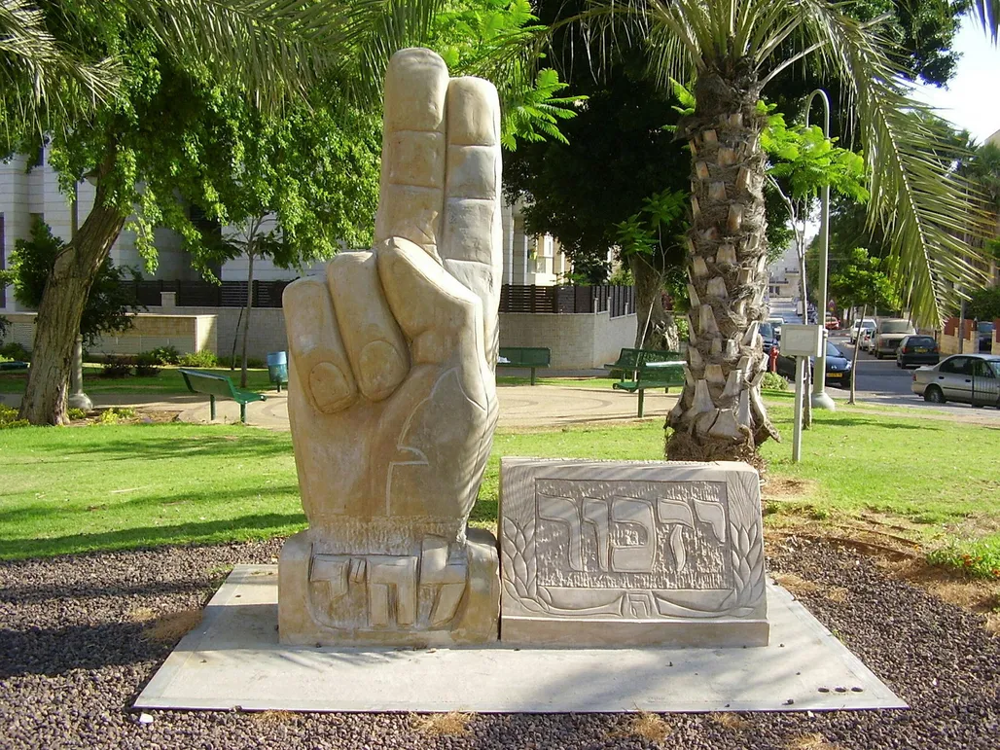

# Die Bemühungen der zionistischen Miliz, Nazis für den Kampf gegen die Briten zu rekrutieren, werden aufgedeckt

:::lead
Die Haganah verhörte 1942 Mitglieder der Lehi - und die kürzlich veröffentlichten Abschriften werfen Licht auf ein dunkles Kapitel in der Geschichte der rechtsgerichteten Miliz: „Stern sagte, dass im Krieg kein Platz für Gefühle ist“.
:::

Im Jahr 1942 entführten Haganah-Kämpfer Efraim Zetler, ein Mitglied der Lehi-Miliz, vor dem Haus seines Vaters in Kfar Sava. „Sie fuhren eine Stunde lang mit ihm herum... hielten ihn fest, verbanden ihm die Augen und fesselten seine Beine“, sagte sein Vater später. „Unterwegs wechselten sie das Auto und brachten ihn dann zu einer Obstplantage und in ein Verpackungshaus, wo sie ihn mit verbundenen Augen auf einige leere Kisten setzten.“ In den folgenden 20 Tagen wurde der 18-jährige Zelter zu seiner Rolle in der extremistischen Gruppe befragt, die von Avraham „Yair“ Stern angeführt wurde, der später im selben Jahr von den Briten getötet werden sollte.

Die Abschriften von Zetlers Verhör, die letzten Monat vom israelischen Staatsarchiv veröffentlicht wurden, enthalten Informationen über ein dunkles Kapitel in der Geschichte von Lehi - seine Verbindungen zu Nazideutschland.

„Wir werden mit jeder Militärmacht kommunizieren, die bereit ist, bei der Errichtung des Königreichs Israel zu helfen, selbst wenn es Deutschland ist“, sagte Zetler den erstaunten Vernehmern. „Die einzige Bedingung ist, dass wir Waffen bekommen, damit wir uns gegen die Engländer auflehnen können“, fügte er hinzu.

„Wenn Deutschland bereit ist, uns im Kampf gegen den Feind Nummer 1, die Engländer, zu helfen, werden wir uns mit ihm zusammentun“, fuhr er fort und sagte über Deutschland: „Es ist kein Feind der Juden in Israel.“ Lehi würde mit Deutschland zusammenarbeiten, wenn es dem Untergrund hilft, „dieses Land zu bekommen“.

„Wir müssen gegen die Engländer kämpfen... Ich glaube, das ist der richtige Weg. England ist unser Feind“, fügte er hinzu.

Zetlers Verhör fand etwa zwei Wochen nach der Wannseekonferenz in Berlin statt, auf der Nazifunktionäre die Umsetzung der Endlösung erörterten. Einundachtzig Jahre später ist es immer noch schwer zu verstehen, wie Juden im Lande Israel daran glauben konnten, Nazi-Deutschland in den Kampf um die Befreiung des Heimatlandes von der britischen Kontrolle einzubeziehen.

Die Idee wurde erstmals zwei Jahre zuvor von Stern, dem Lehi-Führer, geäußert, der einen gewaltsamen Widerstand gegen die britische Herrschaft befürwortete. Seine Ansichten standen im Gegensatz zur Mehrheit des Jischuw, die den Kampf gegen die Briten bei Ausbruch des Zweiten Weltkriegs aufgegeben hatte, um sich dem Kampf gegen den gemeinsamen Feind, Nazideutschland, anzuschließen.

„Eine koschere Strategie, die mit einem Misserfolg endet, ist falsch; eine 'falsche' Strategie, die mit einem Sieg endet, ist die absolut koschere von allen“, so Stern.

## „Ein Pakt mit dem Deutschen Reich“.

Ende 1940 trafen sich Lehi-Agenten mit einem Beamten des deutschen Außenministeriums in Beirut. Das von ihnen angebotene Dokument schlug unter anderem eine Zusammenarbeit zwischen der jüdischen Miliz und den Nazis vor. Es schlug die „aktive Teilnahme von Lehi am Krieg an der Seite Deutschlands“ vor und berief sich auf eine „Interessenpartnerschaft“ zwischen „der deutschen Weltanschauung und den wahren nationalen Bestrebungen des jüdischen Volkes“.

Weiter hieß es in dem Dokument, dass „die Errichtung des historischen jüdischen Staates auf totalitärer nationaler Grundlage in einem Bündnisverhältnis mit dem Deutschen Reich mit der Erhaltung der deutschen Macht vereinbar ist.“

Die Nazis machten sich nicht die Mühe, darauf zu antworten. Damals bevorzugten sie Haj Amin al-Husseini, den palästinensischen Mufti von Jerusalem, der vor den Briten nach Deutschland geflüchtet war und versuchte, die Araber für Hitler zu gewinnen. Haj Amin hoffte, dass der deutsche Führer ihnen helfen würde, die Briten zu vertreiben.

Anders als die Nazis war die Haganah sehr an den Versuchen von Lehi interessiert, sich mit Deutschland anzufreunden. Zwei Akten aus dem Haganah-Archiv mit dem Titel „The Irgun and Lehi with the Axis Powers (World War II)“ wurden letzten Monat veröffentlicht.

„Ist es Ihnen egal, dass der gesamte Jischuw [jüdische Gemeinschaft im Mandatsgebiet Palästina] mit Ausnahme Ihrer Bande gegen Ihre Art zu handeln ist?“ fragte der Vernehmungsbeamte, worauf Zetler antwortete: „Hat der Yishuv jemals etwas über unsere Philosophie erfahren wollen? Es ist einfach, uns Mörder zu nennen.“ Er fügte hinzu, dass er Stern als einen „Propheten“ betrachte.

Zetler war der jüngere Bruder von Yehoshua, einem der leitenden Einsatzoffiziere von Lehi. Nachdem die Haganah ihre Ermittlungen abgeschlossen hatte, wurde er freigelassen, dann aber von den Briten verhaftet und in Internierungslager im Sudan, in Eritrea und Kenia geschickt. Nach der Gründung des Staates Israel kehrte er zurück, wurde zu den israelischen Verteidigungskräften eingezogen und kämpfte im Unabhängigkeitskrieg. Im Jahr 1950 wurde er durch eine Landmine getötet.

Etwa zur gleichen Zeit, als Efraim verhört wurde, wurde auch ein anderes Mitglied der Miliz, Yaakov Hershman, von der Haganah entführt und in einem Obstgarten verhört. Er wurde nach den ideologischen Grundwerten von Lehi befragt, wie er sie vom Stern gehört hatte. „Nation, Land, Heimat und Verbündete“, antwortete er.

Ein Vernehmungsbeamter fragte ihn dann, was er mit „Verbündeten“ meine, worauf Hershman antwortete: „Äußere Kräfte, die bereit sind, uns zu helfen, die Frage der Juden im Lande Israel mit Waffengewalt zu lösen“. Als er gebeten wurde, dies näher zu erläutern, erklärte er: „Das Ziel der Organisation ist es, zu herrschen. Die Briten regieren jetzt.... Wer hätte schon ein Interesse daran, dass England nicht mehr da ist?“ Dann nannte er diejenigen, die helfen könnten, darunter „die Achsenmächte“.

An dieser Stelle fragte der Vernehmungsbeamte Hershman: „Bedeutet das nicht, dass [Stern] Sie darauf vorbereitet, die Rolle eines Quislings im Land Israel zu spielen?“ Er bezog sich dabei auf Vidkun Quisling, den norwegischen Ministerpräsidenten während der deutschen Besatzung, der mit den Nazi-Besatzern kollaborierte. Sein Name ist ein Synonym für „Kollaborateur“ oder „Verräter“ geworden.

Hershman antwortete: „Vielleicht.“

Der Vernehmungsbeamte fuhr mit seinem Satz fort. „Wie erklären Sie sich, dass Sie diese Ideologie akzeptieren können? Es ist schwer zu verstehen. Eine Person bereitet Juden, Zionisten, auf das Kommen des Feindes Nummer 1 des jüdischen Volkes vor, um mit diesem Feind in Kontakt zu treten und von ihm die Macht zu erhalten, zu herrschen?“

Hershman antwortete: „Es sind Männer, die sich einer Idee verschrieben haben, die sie für richtig halten. Sie sehen in der Machtergreifung den Weg, die jüdische Frage so zu lösen, wie sie es für richtig halten, mit Waffengewalt ... es ist egal, wie sie diese Gewalt anwenden.“

## „Flirten“ mit den Achsenmächten

Yaacov Poliakov, ein Gründer und hochrangiger Offizier der Lehi, erzählte seinen Haganah-Vernehmern von einem Treffen, das er mit Stern hatte. „Stern sprach mit uns über die Frage der Beziehungen ... Er wollte seine Fühler ausstrecken ... und er äußerte uns gegenüber die Ansicht, dass wir unter bestimmten Bedingungen auf ausländische Länder zugehen sollten....so dass sie den Juden Geld und Waffen geben würden.“

Poliakov sagte, dass Stern „ein Beispiel aus dem vorhergehenden Krieg“ - dem Ersten Weltkrieg - gab und sagte, dass „die Juden für England kämpften und zur gleichen Zeit jemand mit Deutschland verhandelte, nur für den Fall, dass sie gewinnen würden“.

Poliakov zitierte ein Treffen mit Stern. „Wir haben ihn mit Fragen bombardiert: Wenn es Länder gibt, die Ihnen am Herzen liegen, dann müssen das Deutschland und Italien sein, die Juden verfolgen. Er antwortete, dass es im Krieg keinen Platz für Gefühle gibt: Man sollte mit demjenigen zusammenarbeiten, der Geld und Waffen gibt. ...Er sagte auch, dass die meisten Juden mit den Engländern zusammenarbeiten, warum machen wir nicht ein Geschäft mit einem Land, das der Feind Englands ist, und falls [Deutschland] gewinnt, wird es gut ausgehen.“

Die Irgun-Miliz, fügte Poliakov hinzu, habe auch über eine Zusammenarbeit mit Nazi-Deutschland nachgedacht. Er behauptete, dass Ya'akov Meridor, der von 1941 bis 1943 Kommandeur der Irgun und später Knessetmitglied und Likud-Minister war, ihm gesagt habe: „Wir haben es selbst versucht - wir haben angefangen. Wir haben unsere Verbindung zu Deutschland verloren. Wir sehen nichts Falsches an einer Beziehung mit der Achse. Wenn es uns die Unabhängigkeit bringt, sind wir bereit, einen Deal mit dem Teufel selbst zu machen.“ Sogar die „Elite“ der Irgun habe „mit der Achse geflirtet“, sagte Poliakov seinen Verhörern.

Die Nazis waren nicht die einzigen Partner, die sich der rechte Flügel des Mandatsgebiets Palästina während des Zweiten Weltkriegs gesucht hatte. Eines der kürzlich freigegebenen Dokumente aus den Haganah-Akten trägt den Titel „Über die italienische Orientierung“.

Darin heißt es: „Einem Mann wurde von seinen Bekannten in der Revisionistischen Partei gesagt, dass es in der Partei eine Strömung gibt, die die Beziehungen zu den Italienern verstärken will, weil der Sieg des Faschismus garantiert ist, so dass wir auf die Möglichkeit einer späteren Zusammenarbeit mit Italien vorbereitet sein müssen. Sie planen, in dieser Frage zwischen Hitler und Mussolini zu unterscheiden“.

In dem Papier, das nicht unterzeichnet ist und keine weiteren Einzelheiten enthält, wird behauptet, dass die Hauptbefürworter dieser Überzeugung der Dichter und spätere Herut-MK Uri Zvi Greenberg und Abba Ahimeir, einer der ideologischen Führer der Rechten, sind. Das Dokument behauptet auch, dass Zvi Mareseh, der für die Finanzen von Lehi zuständig war, „auf einer privaten Party“ sagte: „Es wäre nicht schlimm, wenn die Italiener das Land besetzen würden. Wir können mit ihnen eine Vereinbarung treffen.“

Ein weiteres Lehi-Mitglied, das von der Haganah verhört wurde, war Menachem Berger, der später Leiter der israelischen Anwaltskammer wurde. Während seines Verhörs sagte er, dass „mehrere Freunde“ über Kontakte mit der Achse gesprochen hätten, darunter Stern selbst und Yitzhak Shamir, ein Lehi-Mitglied, das später Premierminister Israels wurde. Als er jedoch sein Interesse an dieser Angelegenheit bekundete, wurde ihm gesagt: „Es ist nichts passiert, außer einem fehlgeschlagenen Versuch der Kontaktaufnahme.“
