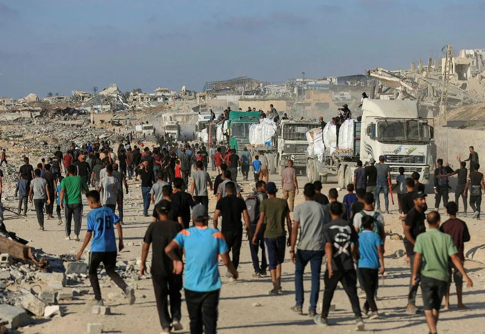
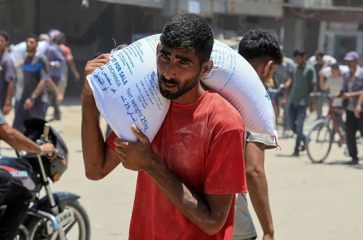
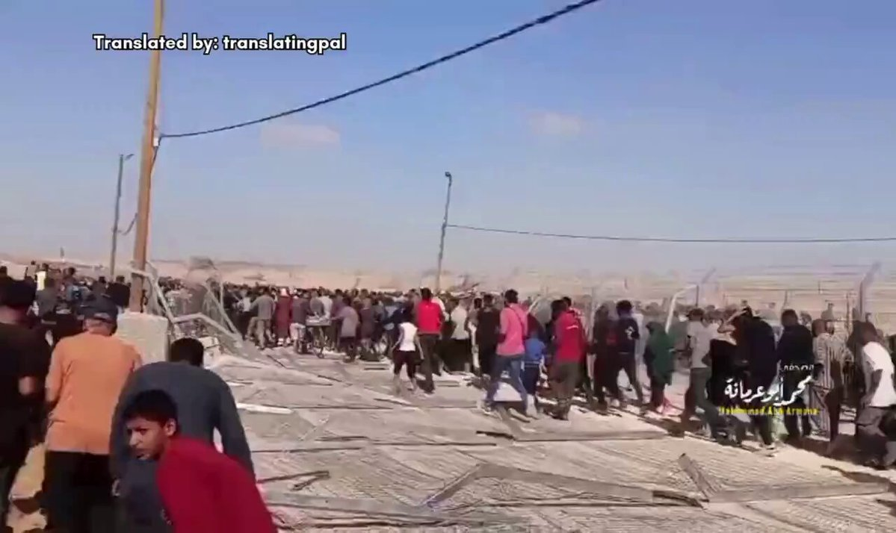
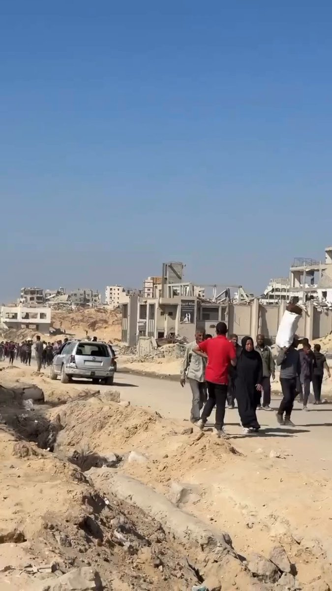
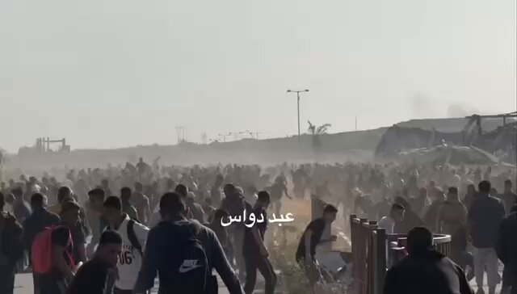
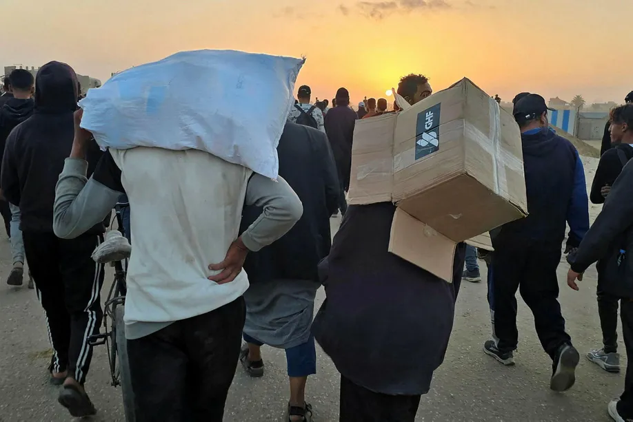

# „Es ist ein Schlachtfeld“: IDF-Soldaten erhalten den Befehl, gezielt auf unbewaffnete Palästinenser aus Gaza zu schießen, die auf humanitäre Hilfe warten.

:::lead
Offiziere und Soldaten der israelischen Streitkräfte (IDF) berichteten der Zeitung Haaretz, dass sie den Befehl erhalten hätten, auf unbewaffnete Menschenmengen in der Nähe von Lebensmittelverteilungsstellen im Gazastreifen zu schießen, selbst wenn keine Gefahr bestand. Hunderte Palästinenser wurden getötet, woraufhin die Militärstaatsanwaltschaft eine Untersuchung möglicher Kriegsverbrechen forderte. ■ Netanjahu und Katz weisen die Vorwürfe zurück und bezeichnen sie als „Blutverleumdungen“.
:::

Israelische Soldaten in Gaza berichteten Haaretz, dass die Armee im vergangenen Monat absichtlich auf Palästinenser in der Nähe von Hilfsgüterverteilungsstellen geschossen habe.

Gespräche mit Offizieren und Soldaten ergaben, dass Kommandeure den Truppen befahlen, auf Menschenmengen zu schießen, um sie zu vertreiben oder zu zerstreuen, obwohl klar war, dass sie keine Gefahr darstellten.

Ein Soldat beschrieb die Situation als völligen Zusammenbruch der ethischen Grundsätze der israelischen Streitkräfte in Gaza.

Nach Angaben des von der Hamas geführten Gesundheitsministeriums in Gaza wurden seit dem 27. Mai 549 Menschen in der Nähe von Hilfszentren und in Gebieten getötet, in denen Bewohner auf Lebensmittel-Lkw der Vereinten Nationen warteten. Über 4.000 Menschen wurden verletzt, aber die genaue Zahl der durch Schüsse der israelischen Streitkräfte getöteten oder verletzten Personen ist weiterhin unklar.

Haaretz hat erfahren, dass der Generalstaatsanwalt der Streitkräfte den Untersuchungsausschuss des Generalstabs der IDF – ein Gremium, das mit der Überprüfung von Vorfällen beauftragt ist, die mögliche Verstöße gegen das Kriegsrecht betreffen – angewiesen hat, mutmaßliche Kriegsverbrechen an diesen Orten zu untersuchen.

In einer Erklärung, die nach der Veröffentlichung dieses Enthüllungsberichts veröffentlicht wurde, wiesen Premierminister Benjamin Netanjahu und Verteidigungsminister Israel Katz die Vorwürfe zurück, die sie als „Blutverleumdungen” bezeichneten.

Die Hilfszentren der Gaza Humanitarian Foundation (GHF) nahmen Ende Mai ihren Betrieb im Gazastreifen auf. Die Umstände der Gründung der Stiftung und ihre Finanzierung sind unklar: Es ist bekannt, dass sie von Israel in Abstimmung mit US-Evangelikalen und privaten Sicherheitsfirmen gegründet wurde. Ihr derzeitiger CEO ist ein evangelikaler Führer, der US-Präsident Donald Trump und dem israelischen Premierminister Benjamin Netanjahu nahesteht.

Die GHF betreibt vier Lebensmittelverteilungsstellen – drei im Süden Gazas und eine im Zentrum –, die bei der IDF als „Schnellverteilungszentren“ (Mahpazim) bekannt sind. Sie werden von amerikanischen und palästinensischen Mitarbeitern betrieben und von der IDF aus einer Entfernung von mehreren hundert Metern gesichert.

Täglich kommen Tausende, manchmal sogar Zehntausende Bewohner Gazas, um an diesen Stellen Lebensmittel abzuholen.

Entgegen den ursprünglichen Versprechungen der Stiftung verläuft die Verteilung chaotisch, da sich Menschenmengen auf die Stapel von Kisten stürzen. Seit der Eröffnung der Schnellverteilungszentren hat Haaretz 19 Schießereien in deren Nähe gezählt. Die Identität der Schützen ist zwar nicht immer klar, doch die IDF lässt ohne ihr Wissen keine bewaffneten Personen in diese humanitären Zonen.

Die Verteilungszentren sind in der Regel jeden Morgen nur für eine Stunde geöffnet. Nach Angaben von Offizieren und Soldaten, die in diesen Gebieten Dienst taten, schießt die IDF auf Menschen, die vor der Öffnungszeit eintreffen, um sie daran zu hindern, sich zu nähern, oder nach Schließung der Zentren, um sie zu vertreiben. Da einige der Schießereien nachts – vor der Öffnung – stattfanden, ist es möglich, dass einige Zivilisten die Grenzen des ausgewiesenen Bereichs nicht sehen konnten.

„Es ist ein Schlachtfeld“, sagte ein Soldat. „Wo ich stationiert war, wurden jeden Tag zwischen einem und fünf Menschen getötet. Sie werden wie eine feindliche Streitmacht behandelt – keine Maßnahmen zur Kontrolle der Menschenmenge, kein Tränengas – nur scharfe Munition mit allem, was man sich vorstellen kann: schwere Maschinengewehre, Granatwerfer, Mörser. Sobald das Zentrum öffnet, hört das Schießen auf, und sie wissen, dass sie sich nähern können. Unsere Form der Kommunikation ist Schusswaffenfeuer.“

Der Soldat fügte hinzu: „Wir eröffnen früh am Morgen das Feuer, wenn jemand versucht, sich aus einigen hundert Metern Entfernung anzustellen, und manchmal stürmen wir sie einfach aus nächster Nähe. Aber es besteht keine Gefahr für die Streitkräfte.“ Ihm zufolge „ist mir kein einziger Fall von Gegenfeuer bekannt. Es gibt keinen Feind, keine Waffen.“ Er sagte auch, dass die Aktivitäten in seinem Einsatzgebiet als „Operation Salted Fish“ bezeichnet werden – der Name der israelischen Version des Kinderspiels „Rot, grün, blau“.

IDF-Offiziere sagten gegenüber Haaretz, dass die Armee weder der Öffentlichkeit in Israel noch im Ausland erlaubt, Aufnahmen von den Vorgängen rund um die Lebensmittelverteilungsstellen zu sehen. Ihrer Meinung nach ist die Armee zufrieden, dass die Operationen der GHF einen vollständigen Zusammenbruch der internationalen Legitimität für die Fortsetzung des Krieges verhindert haben. Sie glauben, dass es der IDF gelungen ist, Gaza in einen „Hinterhof“ zu verwandeln, insbesondere seit Beginn des Krieges mit dem Iran.

„Gaza interessiert niemanden mehr“, sagte ein Reservist, der diese Woche einen weiteren Einsatz im nördlichen Gazastreifen absolviert hatte. „Es ist ein Ort geworden, der seine eigenen Regeln hat. Der Verlust von Menschenleben bedeutet nichts. Es ist nicht einmal mehr ein ‚unglücklicher Vorfall‘, wie man früher sagte.“

Ein Offizier, der im Sicherheitsdienst eines Verteilungszentrums tätig ist, beschrieb die Vorgehensweise der IDF als zutiefst fehlerhaft: „Mit der Zivilbevölkerung zu arbeiten, wenn die einzige Möglichkeit der Interaktion darin besteht, das Feuer zu eröffnen – das ist, gelinde gesagt, höchst problematisch“, sagte er gegenüber Haaretz. „Es ist weder ethisch noch moralisch akzeptabel, dass Menschen unter Panzerbeschuss, Scharfschützen und Mörsergranaten eine [humanitäre Zone] erreichen oder nicht erreichen müssen.“

Der Offizier erklärte, dass die Sicherheit an den Standorten in mehrere Ebenen unterteilt ist. Innerhalb der Verteilungszentren und des „Korridors“, der zu ihnen führt, befinden sich amerikanische Arbeiter, und die IDF darf in diesem Bereich nicht operieren. Eine weitere äußere Ebene besteht aus palästinensischen Aufsehern, von denen einige bewaffnet sind und der Abu-Shabab-Miliz angehören.

Der Sicherheitsbereich der IDF umfasst Panzer, Scharfschützen und Mörser, deren Zweck laut dem Offizier darin besteht, die Anwesenden zu schützen und sicherzustellen, dass die Verteilung der Hilfsgüter stattfinden kann.

„Nachts eröffnen wir das Feuer, um der Bevölkerung zu signalisieren, dass dies eine Kampfzone ist und sie sich nicht nähern dürfen“, sagte der Offizier. „Einmal“, erzählte er, „hörten die Mörser auf zu schießen, und wir sahen, wie sich Menschen näherten. Also nahmen wir das Feuer wieder auf, um ihnen klar zu machen, dass sie das nicht durften. Am Ende landete eine der Granaten auf einer Gruppe von Menschen.“

In anderen Fällen, so sagte er, „feuerten wir mit Maschinengewehren aus Panzern und warfen Granaten. Es gab einen Vorfall, bei dem eine Gruppe von Zivilisten getroffen wurde, als sie unter dem Schutz des Nebels vorrückte. Das war nicht beabsichtigt, aber solche Dinge passieren.“

Er merkte an, dass es bei diesen Vorfällen auch Todesfälle und Verletzte unter den Soldaten der IDF gab. „Eine Kampfbrigade verfügt nicht über die Mittel, um mit der Zivilbevölkerung in einem Kriegsgebiet umzugehen. Mörsergranaten abzufeuern, um hungrige Menschen fernzuhalten, ist weder professionell noch human. Ich weiß, dass sich unter ihnen Hamas-Kämpfer befinden, aber es gibt auch Menschen, die einfach nur Hilfe erhalten wollen. Als Land haben wir die Verantwortung, dafür zu sorgen, dass dies sicher geschieht“, sagte der Offizier.

Der Offizier wies auf ein weiteres Problem mit den Verteilungszentren hin – ihre mangelnde Konsistenz. Die Bewohner wissen nicht, wann die einzelnen Zentren öffnen, was den Druck auf die Standorte erhöht und zur Gefährdung der Zivilbevölkerung beiträgt.

„Ich weiß nicht, wer die Entscheidungen trifft, aber wir geben der Bevölkerung Anweisungen und halten uns dann entweder nicht daran oder ändern sie“, sagte er.

„Anfang dieses Monats gab es Fälle, in denen wir darüber informiert wurden, dass eine Nachricht herausgegeben worden war, wonach das Zentrum am Nachmittag öffnen würde, und die Menschen kamen früh am Morgen, um als Erste in der Schlange für Lebensmittel zu stehen. Weil sie zu früh kamen, wurde die Verteilung an diesem Tag abgesagt.“

## Auftragnehmer als Sheriffs

Nach Angaben von Kommandanten und Kämpfern sollte die IDF einen sicheren Abstand zu palästinensischen Wohngebieten und Lebensmittelverteilungsstellen einhalten. Die Aktionen der Streitkräfte vor Ort stimmen jedoch nicht mit den Einsatzplänen überein.

„Heute erhält jeder private Auftragnehmer, der in Gaza mit Baumaschinen arbeitet, 5.000 Schekel [etwa 1.500 Dollar] für jedes Haus, das er abreißt“, sagte ein erfahrener Kämpfer. „Sie verdienen ein Vermögen. Aus ihrer Sicht ist jeder Moment, in dem sie keine Häuser abreißen, ein Verlust an Geld, und die Streitkräfte müssen ihre Arbeit sichern. Die Auftragnehmer, die wie eine Art Sheriff agieren, reißen entlang der gesamten Front ab, wo immer sie wollen.“

Infolgedessen, fügte der Kämpfer hinzu, bringt die Abrisskampagne der Auftragnehmer sie zusammen mit ihren relativ kleinen Sicherheitskräften in die Nähe von Verteilungsstellen oder entlang der Routen, die von Hilfsgüter-Lkw genutzt werden.

„Um sich zu schützen, kommt es zu einer Schießerei, bei der Menschen getötet werden“, sagte er. „Das sind Gebiete, in denen sich Palästinenser aufhalten dürfen – wir sind diejenigen, die näher herangerückt sind und entschieden haben, dass sie uns gefährden. Wenn ein Bauunternehmer also weitere 5.000 Schekel verdienen und ein Haus abreißen will, wird es als akzeptabel angesehen, Menschen zu töten, die nur auf der Suche nach Nahrung sind.“

Ein hochrangiger Offizier, dessen Name in Zeugenaussagen über die Schießereien in der Nähe von Hilfsstandorten immer wieder auftaucht, ist Brigadegeneral Yehuda Vach, Kommandeur der Division 252 der IDF. Haaretz berichtete zuvor, wie Vach den Netzarim-Korridor in eine tödliche Route verwandelte, Soldaten vor Ort gefährdete und verdächtigt wurde, ohne Genehmigung die Zerstörung eines Krankenhauses in Gaza angeordnet zu haben.

Nun sagt ein Offizier der Division, Vach habe beschlossen, Versammlungen von Palästinensern, die auf UN-Hilfsgüterlastwagen warteten, durch das Öffnen des Feuers aufzulösen. „Das ist Vachs Politik“, sagte der Offizier, „aber viele der Kommandeure und Soldaten akzeptierten sie ohne Frage. [Die Palästinenser] sollen nicht dort sein, also geht es darum, dafür zu sorgen, dass sie verschwinden, auch wenn sie nur wegen der Lebensmittel dort sind.“

Vachs Division ist nicht die einzige, die in diesem Gebiet operiert. Sie ist für den Norden Gazas zuständig, daher betrifft Vachs Politik diejenigen, die UN-Hilfsgüterlastwagen plündern, und nicht die GHF-Standorte.

[ Video auf X ansehen](https://twitter.com/gazanotice/status/1927413223239668119)

Ein Panzersoldat der Reserve, der kürzlich bei der Division 252 im Norden Gazas gedient hat, bestätigte die Berichte und erklärte das „Abschreckungsverfahren“ der IDF zur Auflösung von Menschenansammlungen, die gegen militärische Anordnungen verstoßen.

„Die Teenager, die auf die Lastwagen warten, verstecken sich hinter Erdhügeln und stürmen auf sie zu, wenn sie vorbeifahren oder an Verteilungsstellen anhalten“, sagte er. „Wir sehen sie normalerweise schon aus Hunderten von Metern Entfernung; es ist keine Situation, in der sie eine Bedrohung für uns darstellen.“

In einem Fall wurde der Soldat angewiesen, eine Granate auf eine Menschenmenge abzufeuern, die sich in der Nähe der Küste versammelt hatte. „Technisch gesehen soll es sich um Warnschüsse handeln – entweder um die Menschen zurückzudrängen oder sie daran zu hindern, weiter vorzustoßen“, sagte er. „Aber in letzter Zeit ist das Abfeuern von Granaten einfach zur gängigen Praxis geworden. Jedes Mal, wenn wir schießen, gibt es Verletzte und Tote, und wenn jemand fragt, warum eine Granate notwendig ist, gibt es nie eine gute Antwort. Manchmal ärgert es die Kommandeure schon, wenn man nur die Frage stellt.“

In diesem Fall begannen einige Menschen nach dem Abfeuern der Granate zu fliehen, und laut dem Soldaten eröffneten andere Streitkräfte daraufhin das Feuer auf sie. „Wenn es ein Warnschuss sein soll und wir sehen, dass sie zurück nach Gaza laufen, warum schießen wir dann auf sie?“, fragte er. „Manchmal wird uns gesagt, dass sie sich noch verstecken und wir in ihre Richtung schießen müssen, weil sie nicht weggegangen sind. Aber es ist offensichtlich, dass sie nicht weggehen können, wenn wir in dem Moment, in dem sie aufstehen und weglaufen, das Feuer eröffnen.“

[ Video auf X ansehen](https://twitter.com/gazanotice/status/1935354239108174125)

Der Soldat sagte, dies sei zur Routine geworden. „Man weiß, dass es nicht richtig ist. Man spürt, dass es nicht richtig ist – dass die Kommandeure hier das Gesetz in ihre eigenen Hände nehmen. Aber Gaza ist ein Paralleluniversum. Man macht schnell weiter. Die Wahrheit ist, dass die meisten Menschen nicht einmal innehalten, um darüber nachzudenken.“

Anfang dieser Woche eröffneten Soldaten der Division 252 das Feuer an einer Kreuzung, an der Zivilisten auf Hilfslieferungen warteten. Ein Kommandant vor Ort gab den Befehl, direkt auf die Mitte der Kreuzung zu schießen, was zum Tod von acht Zivilisten, darunter auch Teenager, führte. Der Vorfall wurde dem Chef des Südkommandos, Generalmajor Yaniv Asor, zur Kenntnis gebracht, aber bis jetzt hat er außer einer vorläufigen Überprüfung keine Maßnahmen ergriffen und keine Erklärung von Vach bezüglich der hohen Zahl von Todesopfern in seinem Sektor verlangt.

„Ich war bei einem ähnlichen Vorfall dabei. Nach unseren Informationen wurden dort mehr als zehn Menschen getötet“, sagte ein weiterer hochrangiger Reserveoffizier, der die Truppen in diesem Gebiet befehligte. „Als wir fragten, warum sie das Feuer eröffnet hatten, wurde uns gesagt, es sei ein Befehl von oben gewesen und die Zivilisten hätten eine Gefahr für die Truppen dargestellt. Ich kann mit Sicherheit sagen, dass die Menschen nicht in der Nähe der Truppen waren und diese nicht gefährdeten. Es war sinnlos – sie wurden einfach umgebracht, ohne Grund. Diese Sache, unschuldige Menschen zu töten – das ist zur Normalität geworden. Uns wurde ständig gesagt, dass es in Gaza keine Nichtkombattanten gibt, und offenbar hat sich diese Botschaft bei den Truppen festgesetzt.“

Ein hochrangiger Offizier, der mit den Kämpfen in Gaza vertraut ist, glaubt, dass dies eine weitere Verschlechterung der moralischen Standards der IDF bedeutet. „Die Macht, die hochrangige Feldkommandeure gegenüber der Führung des Generalstabs ausüben, gefährdet die Befehlskette“, sagte er.

Ihm zufolge „ist meine größte Befürchtung, dass die Schüsse und die Verletzungen von Zivilisten in Gaza nicht das Ergebnis operativer Notwendigkeit oder schlechter Entscheidungen sind, sondern vielmehr das Produkt einer Ideologie, die von den Feldkommandanten vertreten wird und die sie als Operationsplan an die Truppen weitergeben.“

## Beschuss von Zivilisten

In den letzten Wochen ist die Zahl der Todesopfer in der Nähe von Lebensmittelverteilungsstellen stark gestiegen – laut dem Gesundheitsministerium von Gaza waren es 57 am 11. Juni, 59 am 17. Juni und etwa 50 am 24. Juni. Als Reaktion darauf fand im Südkommando eine Diskussion statt, bei der sich herausstellte, dass die Truppen begonnen hatten, Menschenmengen mit Artilleriegeschossen zu zerstreuen.

„Sie sprechen über den Einsatz von Artillerie an einer Kreuzung voller Zivilisten, als wäre das ganz normal“, sagte eine Militärquelle, die an dem Treffen teilgenommen hatte. „Es wurde ausschließlich darüber diskutiert, ob der Einsatz von Artillerie richtig oder falsch ist, ohne überhaupt zu fragen, warum diese Waffe überhaupt benötigt wurde. Alle sind nur besorgt darüber, ob es unserer Legitimität schaden könnte, wenn wir unsere Operationen in Gaza fortsetzen. Der moralische Aspekt spielt praktisch keine Rolle. Niemand hält inne, um zu fragen, warum jeden Tag Dutzende Zivilisten auf der Suche nach Nahrung getötet werden.“

[ Video auf X ansehen](https://twitter.com/gazanotice/status/1929066494769639634)

Ein anderer hochrangiger Offizier, der mit den Kämpfen in Gaza vertraut ist, sagte, dass die Normalisierung der Tötung von Zivilisten oft dazu geführt habe, dass in der Nähe von Hilfsgüterverteilungszentren auf sie geschossen werde.

„Die Tatsache, dass mit scharfer Munition auf die Zivilbevölkerung geschossen wird – sei es mit Artillerie, Panzern, Scharfschützen oder Drohnen – widerspricht allem, wofür die Armee eigentlich stehen sollte“, sagte er und kritisierte die Entscheidungen, die vor Ort getroffen wurden. „Warum werden Menschen getötet, die Lebensmittel sammeln, nur weil sie aus der Reihe getanzt sind oder weil es einem Kommandanten nicht gefällt, dass sie sich vordrängeln? Warum sind wir an einem Punkt angelangt, an dem ein Teenager bereit ist, sein Leben zu riskieren, nur um einen Sack Reis von einem Lastwagen zu holen? Und genau auf diese Menschen feuern wir mit Artillerie?“

Neben dem Beschuss durch die IDF wurden laut Militärquellen einige der Todesfälle in der Nähe der Hilfsgüterverteilungszentren durch Schüsse von Milizen verursacht, die von der Armee unterstützt und bewaffnet werden. Einem Offizier zufolge unterstützt die IDF weiterhin die Abu-Shabab-Gruppe und andere Fraktionen.

„Es gibt viele Gruppen, die sich gegen die Hamas stellen – Abu Shabab ist noch einige Schritte weiter gegangen“, sagte er. „Sie kontrollieren Gebiete, in die die Hamas nicht vordringt, und die IDF fördert das.“

Ein anderer Offizier bemerkte: „Ich bin dort stationiert, und selbst ich weiß nicht mehr, wer auf wen schießt.“

In einer geschlossenen Sitzung mit hochrangigen Beamten der Militärstaatsanwaltschaft, die diese Woche angesichts der täglichen Todesfälle von Dutzenden Zivilisten in der Nähe von Hilfszonen stattfand, wiesen die Justizbeamten an, dass die Vorfälle vom Fact-Finding Assessment Mechanism des Generalstabs der IDF untersucht werden sollen. Dieses Gremium, das nach dem Vorfall mit der Mavi-Marmara-Flottille eingerichtet wurde, hat die Aufgabe, Fälle zu untersuchen, in denen der Verdacht auf Verstöße gegen das Kriegsrecht besteht, um internationale Forderungen nach einer Untersuchung von IDF-Soldaten wegen mutmaßlicher Kriegsverbrechen abzuwehren.

Während des Treffens erklärten hochrangige Justizbeamte, dass die weltweite Kritik an der Tötung von Zivilisten zunehme. Hochrangige Offiziere der IDF und des Südkommandos behaupteten jedoch, dass es sich um Einzelfälle handele und dass die Schüsse auf Verdächtige gerichtet gewesen seien, die eine Bedrohung für die Truppen darstellten.

Eine Quelle, die an dem Treffen teilgenommen hatte, berichtete Haaretz, dass Vertreter der Militärstaatsanwaltschaft die Behauptungen der IDF zurückgewiesen hätten. Ihrer Meinung nach halten die Argumente den Tatsachen vor Ort nicht stand. „Die Behauptung, dass es sich um Einzelfälle handelt, steht im Widerspruch zu Vorfällen, bei denen Granaten aus der Luft abgeworfen und Mörser und Artillerie auf Zivilisten abgefeuert wurden“, sagte ein Justizbeamter. „Es geht hier nicht um ein paar Tote – wir sprechen von Dutzenden von Opfern jeden Tag.“

Obwohl der Militärstaatsanwalt den Fact-Finding Assessment Mechanism angewiesen hat, die jüngsten Schießereien zu untersuchen, stellen diese nur einen kleinen Teil der Fälle dar, in denen Hunderte von unbeteiligten Zivilisten getötet wurden.

Hochrangige IDF-Beamte äußerten sich frustriert darüber, dass das Südkommando diese Vorfälle nicht gründlich untersucht und die Todesfälle unter der Zivilbevölkerung in Gaza ignoriert. Laut militärischen Quellen führt der Chef des Südkommandos, Generalmajor Yaniv Asor, in der Regel nur vorläufige Untersuchungen durch, wobei er sich hauptsächlich auf die Berichte der Feldkommandeure stützt. Er hat keine Disziplinarmaßnahmen gegen Offiziere ergriffen, deren Soldaten Zivilisten Schaden zugefügt haben, obwohl dies einen klaren Verstoß gegen die Befehle der IDF und das Kriegsrecht darstellt.

Ein Sprecher der IDF antwortete darauf: „Die Hamas ist eine brutale Terrororganisation, die die Bevölkerung Gazas hungern lässt und sie gefährdet, um ihre Herrschaft im Gazastreifen aufrechtzuerhalten. Die Hamas tut alles in ihrer Macht Stehende, um die erfolgreiche Verteilung von Lebensmitteln in Gaza zu verhindern und humanitäre Hilfe zu stören. Die IDF erlaubt der amerikanischen zivilgesellschaftlichen Organisation (GHF), unabhängig zu arbeiten und Hilfsgüter an die Bewohner Gazas zu verteilen. Die IDF operiert in der Nähe der neuen Verteilungsgebiete, um die Verteilung zu ermöglichen und gleichzeitig ihre operativen Aktivitäten im Gazastreifen fortzusetzen.“

„Im Rahmen ihrer operativen Tätigkeit in der Nähe der Hauptzufahrtsstraßen zu den Verteilungszentren führen die IDF-Streitkräfte systematische Lernprozesse durch, um ihre operative Reaktion in dem Gebiet zu verbessern und mögliche Reibungen zwischen der Bevölkerung und den IDF-Streitkräften so weit wie möglich zu minimieren. Vor kurzem haben die Streitkräfte daran gearbeitet, das Gebiet neu zu organisieren, indem sie neue Zäune und Beschilderungen aufgestellt und zusätzliche Wege angelegt haben. Nach Vorfällen, bei denen Berichte über Schäden an Zivilisten vorlagen, die zu den Verteilungszentren kamen, wurden eingehende Untersuchungen durchgeführt und den Truppen vor Ort auf der Grundlage der gewonnenen Erkenntnisse Anweisungen erteilt. Diese Vorfälle wurden zur Prüfung an den Debriefing-Mechanismus des Generalstabs weitergeleitet.“

Die israelische Armee gab nach der Veröffentlichung dieses Enthüllungsberichts eine zusätzliche Stellungnahme ab, in der sie erklärte, dass sie „die in dem Artikel erhobene Anschuldigung entschieden zurückweist – die IDF hat die Streitkräfte nicht angewiesen, absichtlich auf Zivilisten zu schießen, einschließlich derer, die sich den Verteilungszentren nähern. Um es klar zu sagen: Die Richtlinien der IDF verbieten absichtliche Angriffe auf Zivilisten.“

Die Armee fügte hinzu, dass „jeder Vorwurf einer Abweichung vom Gesetz oder von den Anweisungen der IDF gründlich untersucht und gegebenenfalls weitere Maßnahmen ergriffen werden. Die in dem Artikel vorgebrachten Vorwürfe des gezielten Beschusses von Zivilisten werden vor Ort nicht anerkannt.“
