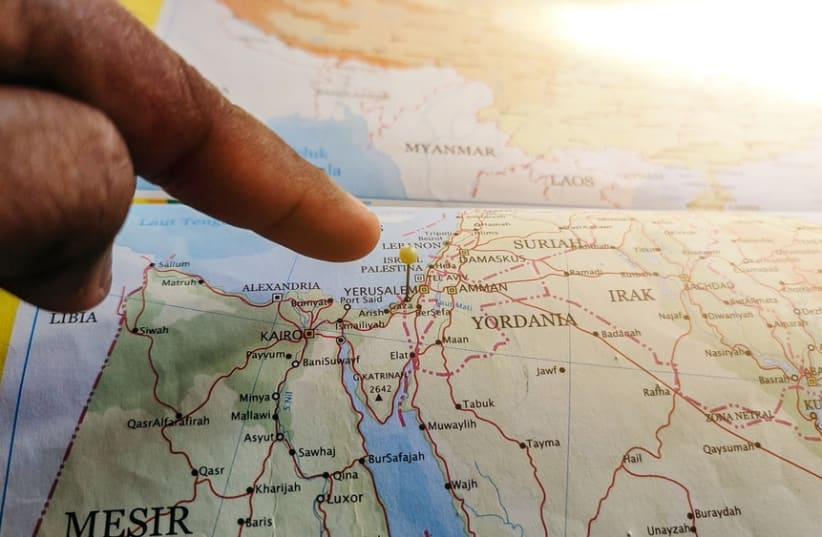

# Gehört der Libanon zu Israels versprochenem Gebiet?

Die Tora-Verse enthalten tiefgründige Botschaften, die wir aufschlussreich für unser tägliches Leben nutzen können. Rabbi Shay Tahan, der Rosch Kollel von Shaarei Ezra in Brooklyn, NY, öffnet gnädigerweise die Pforten, um sie zu verstehen.

Der jüngste Konflikt im Libanon wirft die uralte Frage nach den nördlichen Grenzen des biblischen Eretz Jisrael auf. Wo genau hat Haschem die Grenzen festgelegt, und sind wir verpflichtet, diese Gebiete zu erobern? Gelten die Mitzwot von Terumah und Ma'aser für diese Gebiete als Teil von Eretz Jisrael, oder werden sie als außerhalb der Grenzen betrachtet?

Die Tora gibt klare Richtlinien bezüglich der Gebiete, die wir bei der Inbesitznahme des Landes erobern sollten.

In der letzten Generation ist der Begriff „Groß-Israel“ in den Vordergrund gerückt. Er wird manchmal in politischen oder religiösen Diskussionen über die idealen oder zukünftigen Grenzen Israels verwendet, oft im Zusammenhang mit messianischen oder zionistischen Bestrebungen. Manche interpretieren ihn als einen Aufruf zur Wiederherstellung der biblischen Grenzen Israels. Der Begriff hat jedoch unterschiedliche Bedeutungen, die von symbolischen oder spirituellen Interpretationen bis hin zu buchstäblichen geografischen Ansprüchen reichen.

Dieser Begriff bezieht sich auf das Konzept der biblischen Grenzen des Landes Israel, wie sie dem jüdischen Volk in verschiedenen Teilen der Tora versprochen wurden. Er wird oft mit dem im Bund mit Avraham (Brit Bein HaBetarim) beschriebenen Land in Verbindung gebracht, das sich vom „Fluss Ägyptens“ (von einigen als Nil oder ein kleinerer Fluss im Sinai interpretiert) bis zum Fluss Perat erstreckt. Diese ausgedehnte Region umfasst Teile des heutigen Israels, das Westjordanland, Gaza, den Libanon, Syrien, Jordanien und den Irak.

Als Haschem Avraham Avinu am Brit Bein HaBetarim das Land Israel versprach, sagt der Pasuk (בראשית טז): „An jenem Tag schloss Haschem einen Bund mit Avram und sprach: Deinen Nachkommen habe ich dieses Land gegeben - vom Strom Ägyptens bis zum großen Strom, dem Euphrat.“

Im Segen am Ende von Parschat Ekev sagt uns Haschem, dass uns jedes Land, das wir innerhalb der genannten Grenzen erobern werden, zugesprochen wird. Im Norden sagt die Tora: „Jeder Ort, auf den deine Fußsohle tritt, soll dir gehören - von der Wüste und dem Libanon, vom Fluss - dem Euphrat - bis zum westlichen Meer, das deine Grenze sein soll.“ Diese Verheißung des Schöpfers ordnet das Land Libanon eindeutig dem verheißenen Land Israel zu, oder dem, was manche als „das ganze Land Israel“ oder „das große Israel“ bezeichnen.

Der Ramban schreibt, dass der Libanon innerhalb der Grenzen Israels liegt, und fügt hinzu, dass wir verpflichtet und befohlen sind, ihn zu erobern.

Das Sefer Jehoschua beginnt damit, dass Haschem zu Jehoschua spricht und den oben genannten Befehl wiederholt: „Jeder Ort, den dein Fuß betreten wird, ist dir gegeben worden, wie ich zu Mosche gesprochen habe - von der Wüste und dem Libanon bis zum großen Strom, dem Euphrat.“

Der Stamm Asser wird hauptsächlich mit Regionen in Verbindung gebracht, die Teile des Libanon umfassen. Nach der Eroberung des Landes unter Jehoschua legten die Stämme ihre Gebiete fest, wobei sich Asser bis in die an den Libanon angrenzenden Gebiete erstreckte. Der Text beschreibt die Grenzen des Stammes Asser mit Grenzabschnitten und Listen von Städten, von denen einige Grenzstädte sind, die die Grenze des Stammes markieren. Innerhalb des Erbteils des Stammes Asser liegt das Tal Akko, nördlich des Berges Karmel, dessen nördlichster Punkt die Stadt Sidon ist.

Die Ausdehnung des Landes Israel auf zusätzliche Gebiete, wie im Konzept von „Groß-Israel“, hat mehrere potenzielle halachische Implikationen. Diese drehen sich hauptsächlich um Gebote, die speziell an das Land gebunden sind, bekannt als mitzvot hateluyot ba'aretz- (vom Land abhängige mitzvot). Einige wichtige halachische Implikationen sind:

1. **Vom Land abhängige Mitzvot**: Bestimmte landwirtschaftliche Gebote gelten nur im Land Israel. Dazu gehören:

- **Shmitta** (das Sabbatjahr, in dem das Land alle sieben Jahre ruhen muss).

- **Terumot und Ma'aserot** (Zehnte, die an die Kohanim, die Leviten und die Armen abgegeben werden).

- **Orlah** (das Verbot, Früchte von Bäumen während der ersten drei Jahre ihres Wachstums zu essen).

Die Ausweitung der Grenzen Israels würde bedeuten, dass die Verpflichtung zur Einhaltung dieser Mitzwot auch in den neu hinzugekommenen Gebieten gilt.

2. **Zwei Tage Jomtow**: Es gibt einen Unterschied zwischen denjenigen, die innerhalb der Grenzen Israels leben, die einen Tag Jomtow einhalten, und denjenigen, die außerhalb leben, die zwei Tage einhalten. Wenn sich das Land auf die größeren Grenzen Israels ausdehnen würde, würde diese Unterscheidung also gelten. (Gemäß der Halacha, die der Ritva ריטב „א ר ‚ה יח, א folgt; סוכה מג, א argumentierend auf dem Rambam רמב ‘ם הל' קדוש החודש ה, ט-יב)

3. **Einwohner und Ansiedlung**: Einigen Meinungen zufolge kann das Leben in den biblischen Grenzen von Eretz Jisrael als eine Mitzwa angesehen werden. Die Ausweitung der Grenzen Israels könnte die Verpflichtung für Juden erweitern, sich in diesen Gebieten niederzulassen und zu wohnen.

4. **Reisen außerhalb des Landes**: Man darf die Grenzen von Eretz Jisrael nicht verlassen, wenn man dort wohnt, außer um Tora zu lernen, zu heiraten oder um seinen Lebensunterhalt zu verdienen. Daher können sie in diese zusätzlichen Gebiete reisen, wenn sie erobert werden.

5. **Krieg und Eroberung**: Das Konzept des milchemet mitzvah (ein befohlener Krieg) beinhaltet die Eroberung bestimmter Gebiete, die in der Tora versprochen wurden. Wenn neues Land als Teil der biblischen Grenzen identifiziert wird, kann es halachische Diskussionen über die Verpflichtung geben, es zu erobern und zu besiedeln.

Der Fluss Perat, der gemeinhin mit dem Euphrat identifiziert wird, liegt im Nahen Osten. Er fließt durch mehrere Länder, darunter die Türkei, Syrien und den Irak, bevor er in den Persischen Golf mündet. In biblischen Zusammenhängen wird der Euphrat oft als eine wichtige Grenze in den Verheißungen an das jüdische Volk in Bezug auf das Land Israel erwähnt.

Wenn man sich eine Landkarte ansieht, ist man erstaunt, wie weit dieser Fluss nach Norden reicht und wie groß das Land Israel wirklich ist. Auch wenn wir vielleicht nicht in der Lage sind, es in unserer Zeit ganz zurückzuerobern, wird Haschem es uns sicher bald zurückgeben.
