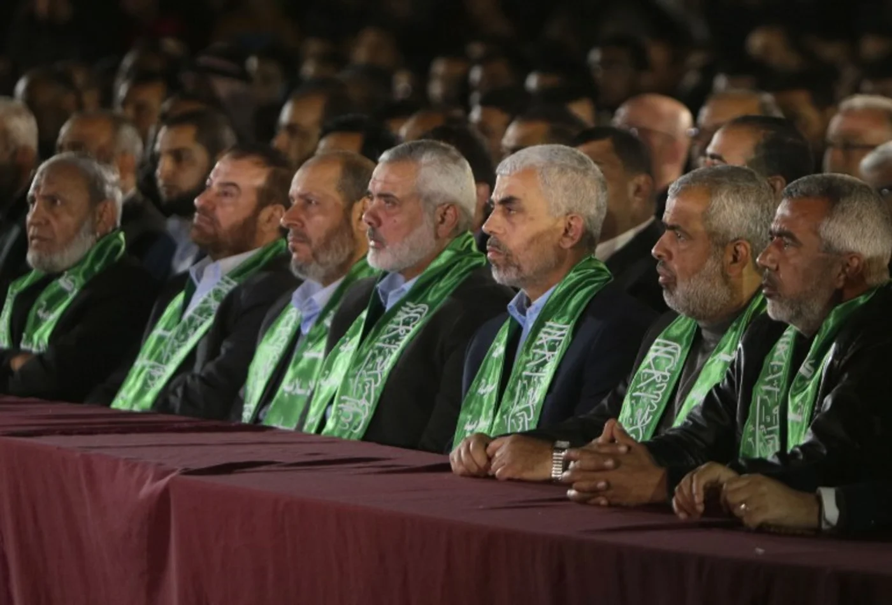
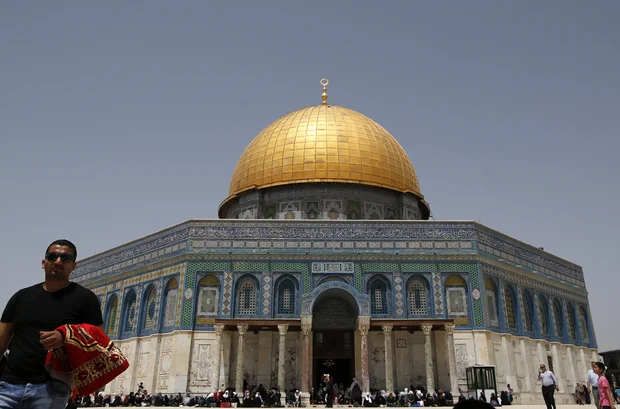
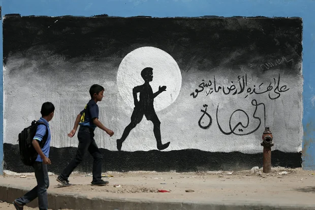
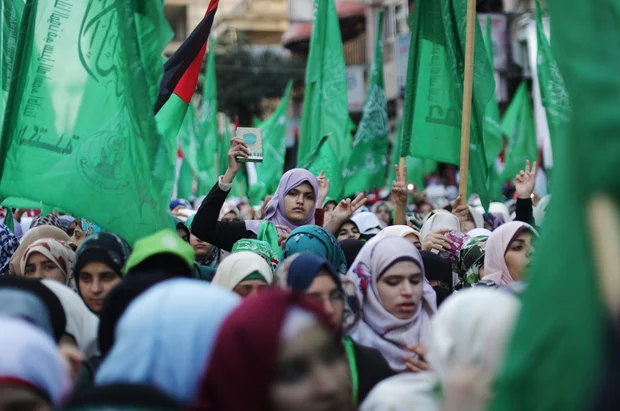

# Hamas im Jahr 2017: Das Dokument im Wortlaut

:::lead
Hamas erläutert allgemeine Grundsätze und Ziele in einem 42-seitigen Dokument
:::

Gepriesen sei Allah, der Herr der Welten. Der Friede und die Segnungen Allahs seien auf Muhammad, dem Meister der Gesandten und dem Anführer der Mudschahidin, und auf sein Haus und alle seine Gefährten.

## Präambel

Palästina ist das Land des arabisch-palästinensischen Volkes, aus dem es stammt, dem es anhängt und zu dem es gehört, und über das es sich ausbreitet und kommuniziert.

Palästina ist ein Land, dessen Status durch den Islam erhöht wurde, einen Glauben, der es hochschätzt, der ihm seinen Geist und seine gerechten Werte einhaucht und der die Grundlage für die Doktrin der Verteidigung und des Schutzes dieses Landes bildet.

Palästina ist die Sache eines Volkes, das von einer Welt im Stich gelassen wurde, die es versäumt hat, ihm seine Rechte zu sichern und ihm das zurückzugeben, was ihm entrissen wurde, eines Volkes, dessen Land weiterhin unter einer der schlimmsten Arten von Besatzung auf dieser Welt leidet.

> Palästina ist ein Land, das durch ein rassistisches, menschenfeindliches und koloniales zionistisches Projekt in Besitz genommen wurde.

Palästina ist ein Land, das von einem rassistischen, menschenfeindlichen und kolonialen zionistischen Projekt in Besitz genommen wurde, das auf einem falschen Versprechen (der Balfour-Erklärung), auf der Anerkennung einer usurpierenden Entität und auf der gewaltsamen Durchsetzung vollendeter Tatsachen beruhte.

Palästina symbolisiert den Widerstand, der so lange andauern wird, bis die Befreiung vollzogen, die Rückkehr erfüllt und ein vollständig souveräner Staat mit Jerusalem als Hauptstadt errichtet ist.

Palästina ist die wahre Partnerschaft zwischen Palästinensern aller Zugehörigkeiten für das erhabene Ziel der Befreiung.

Palästina ist der Geist der Ummah und ihr zentrales Anliegen; es ist die Seele der Menschheit und ihr lebendiges Gewissen.

Dieses Dokument ist das Ergebnis eingehender Beratungen, die uns zu einem starken Konsens geführt haben. Als Bewegung sind wir uns sowohl in der Theorie als auch in der Praxis über die Vision einig, die auf den folgenden Seiten skizziert wird. Es ist eine Vision, die auf einer soliden Grundlage und auf bewährten Prinzipien steht. Dieses Dokument zeigt die Ziele, die Meilensteine und die Art und Weise auf, wie die nationale Einheit erzwungen werden kann. Es legt auch unser gemeinsames Verständnis der palästinensischen Sache, die Arbeitsprinzipien, mit denen wir sie vorantreiben, und die Grenzen der Flexibilität zu ihrer Auslegung fest.

## Die Bewegung

1. Die islamische Widerstandsbewegung „Hamas“ ist eine palästinensische islamische nationale Befreiungs- und Widerstandsbewegung. Ihr Ziel ist es, Palästina zu befreien und dem zionistischen Projekt entgegenzutreten. Ihr Bezugsrahmen ist der Islam, der ihre Grundsätze, Ziele und Mittel bestimmt.

## Das Land Palästina

2. Palästina, das sich vom Jordan im Osten bis zum Mittelmeer im Westen und von Ras al-Naqurah im Norden bis Umm al-Rashrash im Süden erstreckt, ist eine integrale territoriale Einheit. Es ist das Land und die Heimat des palästinensischen Volkes. Die Vertreibung und Verbannung des palästinensischen Volkes aus seinem Land und die Errichtung der zionistischen Einheit in diesem Land heben das Recht des palästinensischen Volkes auf sein gesamtes Land nicht auf und verschaffen der usurpierenden zionistischen Einheit keine Rechte in diesem Land.

3. Palästina ist ein arabisch-islamisches Land. Es ist ein gesegnetes, heiliges Land, das einen besonderen Platz im Herzen jedes Arabers und jedes Muslims hat.

## Das palästinensische Volk

4. Die Palästinenser sind die Araber, die bis 1947 in Palästina gelebt haben, unabhängig davon, ob sie von dort vertrieben wurden oder dort geblieben sind; und jeder Mensch, der nach diesem Datum von einem arabisch-palästinensischen Vater geboren wurde, ob innerhalb oder außerhalb Palästinas, ist ein Palästinenser.

> Katastrophen ... können die Identität des palästinensischen Volkes weder auslöschen noch negieren.

5. Die palästinensische Identität ist authentisch und zeitlos; sie wird von Generation zu Generation weitergegeben. Die Katastrophen, die das palästinensische Volk als Folge der zionistischen Besatzung und ihrer Vertreibungspolitik erlitten hat, können die Identität des palästinensischen Volkes weder auslöschen noch negieren. Ein Palästinenser darf seine nationale Identität oder seine Rechte nicht dadurch verlieren, dass er eine zweite Staatsangehörigkeit annimmt.

6. Das palästinensische Volk ist ein Volk, das sich aus allen Palästinensern innerhalb und außerhalb Palästinas zusammensetzt, unabhängig von ihrer Religion, Kultur oder politischen Zugehörigkeit.

## Islam und Palästina

7. Palästina befindet sich im Herzen der arabischen und islamischen Umma und genießt einen besonderen Status. In Palästina befindet sich Jerusalem, dessen Umkreis von Allah gesegnet ist. Palästina ist das Heilige Land, das Allah für die Menschheit gesegnet hat. Es ist die erste Qiblah der Muslime und das Ziel der nächtlichen Reise des Propheten Muhammad, Friede sei mit ihm. Es ist der Ort, von dem aus er in die oberen Himmel aufgestiegen ist. Es ist der Geburtsort von Jesus Christus, Friede sei mit ihm. Sein Boden enthält die Überreste von Tausenden von Propheten, Gefährten und Mudschaheddin. Es ist das Land von Menschen, die entschlossen sind, die Wahrheit zu verteidigen - innerhalb Jerusalems und seiner Umgebung -, die sich von denen, die sich ihnen widersetzen, und von denen, die sie verraten, nicht abschrecken oder einschüchtern lassen, und sie werden ihre Mission fortsetzen, bis Allahs Verheißung erfüllt ist.

8. Aufgrund seines ausgewogenen Mittelweges und seines gemäßigten Geistes bietet der Islam für die Hamas eine umfassende Lebensweise und eine Ordnung, die zu allen Zeiten und an allen Orten geeignet ist. Der Islam ist eine Religion des Friedens und der Toleranz. Er bietet den Anhängern anderer Glaubensrichtungen und Religionen ein Dach, unter dem sie ihren Glauben in Sicherheit und Geborgenheit ausüben können. Die Hamas glaubt auch, dass Palästina immer ein Modell für Koexistenz, Toleranz und zivilisatorische Innovation war und sein wird.

9. Die Hamas glaubt, dass die Botschaft des Islam die Werte Wahrheit, Gerechtigkeit, Freiheit und Würde hochhält und alle Formen von Ungerechtigkeit verbietet und Unterdrücker ungeachtet ihrer Religion, Ethnie, ihres Geschlechts oder ihrer Nationalität anklagt. Der Islam wendet sich gegen alle Formen von religiösem, ethnischem oder konfessionellem Extremismus und Bigotterie. Er ist die Religion, die ihren Anhängern den Wert vermittelt, sich gegen Aggressionen zu wehren und die Unterdrückten zu unterstützen; er motiviert sie, großzügig zu spenden und Opfer zu bringen, um ihre Würde, ihr Land, ihre Völker und ihre heiligen Orte zu verteidigen.

## Jerusalem

10. Jerusalem ist die Hauptstadt von Palästina. Sein religiöser, historischer und zivilisatorischer Status ist von grundlegender Bedeutung für die Araber, die Muslime und die ganze Welt. Seine islamischen und christlichen heiligen Stätten gehören ausschließlich dem palästinensischen Volk und der arabischen und islamischen Ummah. Kein einziger Stein Jerusalems kann aufgegeben oder zurückgegeben werden. Die von den Besatzern in Jerusalem ergriffenen Maßnahmen wie Judaisierung, Siedlungsbau und Schaffung von Fakten vor Ort sind im Grunde genommen null und nichtig.

11. Die gesegnete al-Aqsa-Moschee gehört ausschließlich unserem Volk und unserer Ummah, und die Besatzung hat keinerlei Recht darauf. Die Pläne, Maßnahmen und Versuche der Besatzung, al-Aqsa zu judaisieren und zu teilen, sind null, nichtig und illegitim.

## Flüchtlinge und Rückkehrrecht

12. Die palästinensische Sache ist in ihrem Wesen die Sache eines besetzten Landes und eines vertriebenen Volkes. Das Recht der palästinensischen Flüchtlinge und Vertriebenen, in ihre Häuser zurückzukehren, aus denen sie vertrieben wurden oder in die sie nicht zurückkehren durften - sei es in den 1948 oder 1967 besetzten Gebieten (d.h. in ganz Palästina) -, ist ein natürliches Recht, sowohl individuell als auch kollektiv. Dieses Recht wird durch alle göttlichen Gesetze sowie durch die Grundprinzipien der Menschenrechte und des Völkerrechts bestätigt. Es ist ein unveräußerliches Recht, auf das keine Partei verzichten kann, weder die palästinensische noch die arabische oder die internationale.

13. Die Hamas lehnt alle Versuche ab, die Rechte der Flüchtlinge zu beseitigen, einschließlich der Versuche, sie außerhalb Palästinas und durch die Projekte des alternativen Heimatlandes anzusiedeln. Die Entschädigung der palästinensischen Flüchtlinge für den Schaden, den sie infolge der Vertreibung und der Besetzung ihres Landes erlitten haben, ist ein absolutes Recht, das mit ihrem Recht auf Rückkehr einhergeht. Sie sollen bei ihrer Rückkehr eine Entschädigung erhalten, was ihr Recht auf Rückkehr weder negiert noch schmälert.

## Das zionistische Projekt

14. Das zionistische Projekt ist ein rassistisches, aggressives, koloniales und expansionistisches Projekt, das auf der Aneignung des Eigentums anderer beruht; es ist feindlich gegenüber dem palästinensischen Volk und seinem Streben nach Freiheit, Befreiung, Rückkehr und Selbstbestimmung. Das israelische Staatsgebilde ist der Spielball des zionistischen Projekts und seine Basis der Aggression.

15. Das zionistische Projekt richtet sich nicht nur gegen das palästinensische Volk; es ist der Feind der arabischen und islamischen Umma und stellt eine ernste Bedrohung für deren Sicherheit und Interessen dar. Es steht auch den Bestrebungen der Umma nach Einheit, Wiedergeburt und Befreiung feindlich gegenüber und ist die Hauptursache für ihre Probleme. Das zionistische Projekt stellt auch eine Gefahr für die internationale Sicherheit und den Frieden sowie für die Menschheit und ihre Interessen und Stabilität dar.

> Die Hamas bekräftigt, dass ihr Konflikt mit dem zionistischen Projekt und nicht mit den Juden aufgrund ihrer Religion besteht

16. Die Hamas bekräftigt, dass ihr Konflikt mit dem zionistischen Projekt und nicht mit den Juden aufgrund ihrer Religion besteht. Die Hamas kämpft nicht gegen die Juden, weil sie Juden sind, sondern sie kämpft gegen die Zionisten, die Palästina besetzen. Dennoch sind es die Zionisten, die das Judentum und die Juden ständig mit ihrem eigenen kolonialen Projekt und illegalen Gebilde identifizieren.

17. Die Hamas lehnt die Verfolgung eines Menschen oder die Untergrabung seiner Rechte aus nationalistischen, religiösen oder konfessionellen Gründen ab. Die Hamas ist der Ansicht, dass das jüdische Problem, der Antisemitismus und die Verfolgung der Juden Phänomene sind, die grundsätzlich mit der europäischen Geschichte und nicht mit der Geschichte der Araber und Muslime oder ihrem Erbe verbunden sind. Die zionistische Bewegung, die mit Hilfe westlicher Mächte Palästina besetzen konnte, ist die gefährlichste Form der Siedlungsbesetzung, die bereits aus weiten Teilen der Welt verschwunden ist und aus Palästina verschwinden muss.

## Die Position zur Besatzung und zu politischen Lösungen

18. Die Balfour-Erklärung, das britische Mandatsdokument, die UNO-Resolution zur Teilung Palästinas und alle daraus abgeleiteten oder ihnen ähnlichen Resolutionen und Maßnahmen werden als null und nichtig betrachtet. Die Errichtung „Israels“ ist völlig illegal und verstößt gegen die unveräußerlichen Rechte des palästinensischen Volkes und gegen seinen Willen und den Willen der Ummah; sie verstößt auch gegen die Menschenrechte, die durch internationale Konventionen garantiert werden, darunter vor allem das Recht auf Selbstbestimmung.

19. Es gibt keine Anerkennung der Legitimität der zionistischen Einheit. Was auch immer dem Land Palästina in Form von Besetzung, Siedlungsbau, Judaisierung oder Veränderung seiner Merkmale oder Verfälschung von Tatsachen widerfahren ist, ist illegitim. Rechte erlöschen nie.

20. Die Hamas glaubt, dass kein Teil des Landes Palästina kompromittiert oder aufgegeben werden darf, unabhängig von den Ursachen, den Umständen und dem Druck und unabhängig davon, wie lange die Besatzung dauert. Die Hamas lehnt jede Alternative zur vollständigen und uneingeschränkten Befreiung Palästinas vom Fluss bis zum Meer ab. Ohne ihre Ablehnung der zionistischen Entität zu kompromittieren und ohne auf irgendwelche palästinensischen Rechte zu verzichten, betrachtet die Hamas jedoch die Errichtung eines vollständig souveränen und unabhängigen palästinensischen Staates mit Jerusalem als Hauptstadt nach dem Vorbild des 4. Juni 1967 und die Rückkehr der Flüchtlinge und Vertriebenen in ihre Häuser, aus denen sie vertrieben wurden, als eine Formel des nationalen Konsenses.

> Es gibt keine Anerkennung der Legitimität der zionistischen Einheit.

21. Die Hamas bekräftigt, dass die Osloer Abkommen und ihre Zusätze gegen die geltenden Regeln des Völkerrechts verstoßen, da sie Verpflichtungen mit sich bringen, die die unveräußerlichen Rechte des palästinensischen Volkes verletzen. Daher lehnt die Bewegung diese Abkommen und alles, was sich daraus ergibt, ab, wie z.B. die Verpflichtungen, die den Interessen unseres Volkes abträglich sind, insbesondere die Sicherheitskoordination (Zusammenarbeit).

22. Die Hamas lehnt alle Abkommen, Initiativen und Siedlungsprojekte ab, die darauf abzielen, die palästinensische Sache und die Rechte unseres palästinensischen Volkes zu untergraben. In dieser Hinsicht darf jede Haltung, jede Initiative und jedes politische Programm diese Rechte in keiner Weise verletzen und ihnen nicht zuwiderlaufen oder ihnen widersprechen.

23. Die Hamas betont, dass die Übergriffe gegen das palästinensische Volk, die Aneignung seines Landes und die Vertreibung aus seinem Heimatland nicht als Frieden bezeichnet werden können. Alle auf dieser Grundlage getroffenen Vereinbarungen werden nicht zum Frieden führen. Widerstand und Dschihad für die Befreiung Palästinas werden ein legitimes Recht, eine Pflicht und eine Ehre für alle Söhne und Töchter unseres Volkes und unserer Umma bleiben.

## Widerstand und Befreiung

24. Die Befreiung Palästinas ist die Pflicht des palästinensischen Volkes im Besonderen und die Pflicht der arabischen und islamischen Ummah im Allgemeinen. Sie ist auch eine humanitäre Verpflichtung, die sich aus dem Gebot der Wahrheit und der Gerechtigkeit ergibt. Die Organisationen, die sich für Palästina einsetzen, seien sie national, arabisch, islamisch oder humanitär, ergänzen sich gegenseitig und sind harmonisch und stehen nicht im Konflikt miteinander.

25. Der Widerstand gegen die Besatzung mit allen Mitteln und Methoden ist ein legitimes Recht, das durch die göttlichen Gesetze und durch internationale Normen und Gesetze garantiert wird. Im Mittelpunkt steht der bewaffnete Widerstand, der als die strategische Wahl zum Schutz der Grundsätze und Rechte des palästinensischen Volkes angesehen wird.

26. Die Hamas lehnt jeden Versuch ab, den Widerstand und seine Waffen zu untergraben. Sie bekräftigt auch das Recht unseres Volkes, die Mittel und Mechanismen des Widerstands zu entwickeln. Die Bewältigung des Widerstands im Sinne einer Eskalation oder Deeskalation oder im Sinne einer Diversifizierung der Mittel und Methoden ist ein integraler Bestandteil des Prozesses der Konfliktbewältigung und sollte nicht auf Kosten des Prinzips des Widerstands gehen.

## Das palästinensische politische System

27. Ein echter Staat Palästina ist ein Staat, der befreit wurde. Es gibt keine Alternative zu einem vollständig souveränen palästinensischen Staat auf dem gesamten nationalen palästinensischen Boden, mit Jerusalem als Hauptstadt.

28. Die Hamas glaubt an die Gestaltung ihrer palästinensischen Beziehungen auf der Grundlage von Pluralismus, Demokratie, nationaler Partnerschaft, Akzeptanz des Anderen und der Annahme des Dialogs und hält daran fest. Das Ziel ist es, die Einheit der Reihen und das gemeinsame Handeln zu stärken, um die nationalen Ziele zu erreichen und die Bestrebungen des palästinensischen Volkes zu erfüllen.

> Die PLO ist ein nationaler Rahmen für das palästinensische Volk.

29. Die PLO ist ein nationaler Rahmen für das palästinensische Volk innerhalb und außerhalb von Palästina. Sie sollte daher auf demokratischen Grundlagen erhalten, entwickelt und wieder aufgebaut werden, um die Beteiligung aller Bestandteile und Kräfte des palästinensischen Volkes in einer Weise zu gewährleisten, die die Rechte der Palästinenser schützt.

30. Die Hamas betont die Notwendigkeit des Aufbaus palästinensischer nationaler Institutionen auf der Grundlage solider demokratischer Prinzipien, zu denen in erster Linie freie und faire Wahlen gehören. Dieser Prozess sollte auf der Grundlage einer nationalen Partnerschaft und im Einklang mit einem klaren Programm und einer klaren Strategie erfolgen, die die Rechte, einschließlich des Rechts auf Widerstand, wahren und die Bestrebungen des palästinensischen Volkes erfüllen.

31. Die Hamas bekräftigt, dass die Rolle der Palästinensischen Behörde darin bestehen sollte, dem palästinensischen Volk zu dienen und seine Sicherheit, seine Rechte und sein nationales Projekt zu schützen.

32. Die Hamas unterstreicht die Notwendigkeit, die Unabhängigkeit der palästinensischen nationalen Entscheidungsfindung zu wahren. Äußere Kräfte sollten sich nicht einmischen dürfen. Gleichzeitig bekräftigt die Hamas die Verantwortung der Araber und Muslime und ihre Pflicht und Rolle bei der Befreiung Palästinas von der zionistischen Besatzung.

33. Die palästinensische Gesellschaft wird durch ihre prominenten Persönlichkeiten, Würdenträger, zivilgesellschaftlichen Institutionen, Jugend-, Studenten-, Gewerkschafts- und Frauengruppen bereichert, die sich gemeinsam für die Verwirklichung der nationalen Ziele und den Aufbau der Gesellschaft einsetzen, Widerstand leisten und die Befreiung erreichen.

34. Die Rolle der palästinensischen Frauen ist von grundlegender Bedeutung für den Aufbau der Gegenwart und der Zukunft, so wie sie es schon immer für den Prozess der palästinensischen Geschichte war. Sie spielt eine zentrale Rolle im Projekt des Widerstands, der Befreiung und des Aufbaus des politischen Systems.

## Die arabische und islamische Ummah

35. Die Hamas ist der Ansicht, dass die palästinensische Frage das zentrale Anliegen der arabischen und islamischen Umma ist.

36. Die Hamas glaubt an die Einheit der Ummah mit all ihren verschiedenen Bestandteilen und ist sich der Notwendigkeit bewusst, alles zu vermeiden, was die Ummah zersplittern und ihre Einheit untergraben könnte.

37. Die Hamas glaubt an die Zusammenarbeit mit allen Staaten, die die Rechte des palästinensischen Volkes unterstützen. Sie lehnt eine Einmischung in die inneren Angelegenheiten eines jeden Landes ab. Sie lehnt es auch ab, in Streitigkeiten und Konflikte, die zwischen verschiedenen Ländern stattfinden, hineingezogen zu werden. Die Hamas verfolgt eine Politik der Öffnung gegenüber den verschiedenen Staaten der Welt, insbesondere gegenüber den arabischen und islamischen Staaten. Sie bemüht sich um ausgewogene Beziehungen auf der Grundlage einer Kombination aus den Erfordernissen der palästinensischen Sache und den Interessen des palästinensischen Volkes einerseits und den Interessen der Umma, ihrer Wiedergeburt und ihrer Sicherheit andererseits.

## Der humanitäre und internationale Aspekt

38. Die palästinensische Frage ist eine Frage von großer humanitärer und internationaler Bedeutung. Die Unterstützung und der Beistand für diese Sache ist eine humanitäre und zivilisatorische Aufgabe, die durch die Voraussetzungen der Wahrheit, der Gerechtigkeit und der gemeinsamen humanitären Werte bedingt ist.

39. Aus rechtlicher und humanitärer Sicht ist die Befreiung Palästinas eine legitime Aktion, ein Akt der Selbstverteidigung und Ausdruck des natürlichen Rechts aller Völker auf Selbstbestimmung.

40. In ihren Beziehungen zu den Nationen und Völkern der Welt glaubt die Hamas an die Werte der Zusammenarbeit, der Gerechtigkeit, der Freiheit und der Achtung des Willens des Volkes.

41. Die Hamas begrüßt die Haltung von Staaten, Organisationen und Institutionen, die die Rechte des palästinensischen Volkes unterstützen. Sie begrüßt die freien Völker der Welt, die die palästinensische Sache unterstützen. Gleichzeitig verurteilt sie die Unterstützung, die irgendeine Partei dem zionistischen Gebilde gewährt oder die Versuche, seine Verbrechen und Aggressionen gegen die Palästinenser zu vertuschen, und fordert die Strafverfolgung der zionistischen Kriegsverbrecher.

42. Die Hamas lehnt die Versuche ab, der arabischen und islamischen Umma eine Hegemonie aufzuerlegen, ebenso wie sie die Versuche ablehnt, den übrigen Nationen und Völkern der Welt eine Hegemonie aufzuerlegen. Die Hamas verurteilt auch alle Formen von Kolonialismus, Besatzung, Diskriminierung, Unterdrückung und Aggression in der Welt.
