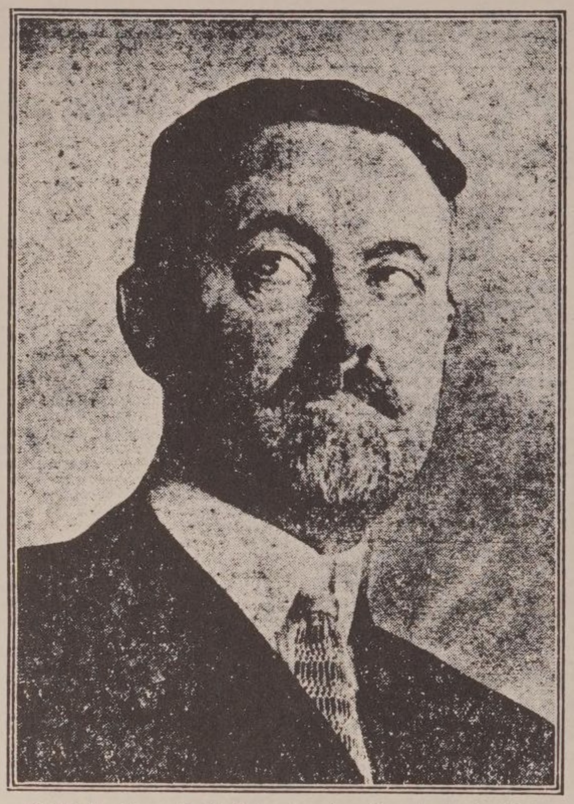

# Gegen Palästina als jüdischen Staat

:::lead
Erste Veröffentlichung des Berichts der amerikanischen Kommission für Palästina und Syrien - würde das Heilige Land in ein vereinigtes Syrien einbeziehen

Amerika und der Weltfrieden
:::

Drei Jahre lang wurde der wichtige vertrauliche Bericht der amerikanischen Sonderkommission für Syrien und Palästina, die von Charles R. Crane und Präsident Henry Churchill King vom Oberlin College geleitet wurde, geheim gehalten. Er war viel zu freimütig; er enthielt zu viel Klartext über die politischen und sonstigen Verhältnisse in diesem Pulverfass der Welt, dem Nahen Osten, in dem es heute vor Unruhen nur so brodelt, und der sich durchaus als der Funke erweisen könnte, der den nächsten Krieg auslöst. Es darf nicht vergessen werden, dass der deutsche Ehrgeiz, die Schatzkammer der Türkei zu kontrollieren, der Traum von „Berlin nach Bagdad“, eines der Elemente war, die zu dem großen Krieg führten.

Jetzt ist es möglich, den Inhalt dieses Crane-King-Berichts zu veröffentlichen. Und er kommt zu einem Zeitpunkt, an dem die amerikanischen Interessen, die durch die Abfederung der überfüllten Bevölkerungen in Syrien und Armenien bereits tief erregt sind, besonders akut sind. Wie sehr das amerikanische Volk auch die Fiktion seiner Isolation verehren mag, so ist es doch seit langem mit den Angelegenheiten in der Türkei befasst. Es hat dort Colleges, Missionen, Schulen und Krankenhäuser gegründet, alle mit friedlichen Absichten, aber jedes ein kleines Zentrum für neue Feuer der Freiheit und des Fortschritts. Hätte Amerika nichts anderes getan, so hätte allein dieses Werk den Nahen Osten früher oder später in Flammen aufgehen lassen. Aber es hat in letzter Zeit noch viel mehr getan. Es hat nicht nur Millionen von Dollars in Form von Nahrungsmitteln und Kleidung als Antwort auf die herzzerreißenden Appelle des leidenden Volkes gesandt, es hat sich nicht nur mehr als jede andere Nation um die Zukunft Palästinas gekümmert, sondern es ist jetzt auch stark daran interessiert, was mit den reichen Ölfeldern Mesopotamiens geschieht, in Dollar und Cent. Obwohl Amerika sich weigert, den Nationenbund zu akzeptieren oder irgendeine Mandatsverantwortung zu übernehmen, hat es eine gleichberechtigte Stimme bei der Entscheidung über die Mandate in den asiatischen Gebieten des ehemaligen türkischen Reiches gefordert. Alle diese Probleme sind jetzt in der Schwebe.

Diese Sympathie und dieses Interesse Amerikas wird in allen Teilen des Nahen Ostens sehr wohl verstanden, und wenn es zu eifrigen Appellen um Hilfe und Unterstützung aller Art seitens der Bevölkerung führt, so weckt es auch die scharfe Besorgnis, den Argwohn, ja sogar die Feindseligkeit anderer Nationen, die jetzt krampfhaft versuchen, sich der riesigen Reichtümer dieses alten Reiches zu bemächtigen. Die amerikanische Hilfe, die von der Bevölkerung sehnlichst erwartet wird, wird von den Beamten nicht gerade mit Begeisterung aufgenommen.

## Amerikas Unentschlossenheit.

Der jüngste Besuch von Charles R. Crane in Syrien und die Meldung, dass er vor einem französischen Militärgericht angeklagt und verurteilt wurde, hat einen wahren Sturm ausgelöst. Und während Amerika auf der Stelle tritt, zerrissen von Unentschlossenheit in Bezug auf seine Außenpolitik, unentschlossen, ob es „ mitmachen“ oder „ sich raushalten“ soll, und jeden Tag durch einen Prozess des Abdriftens tiefer hineingerät, stecken die Franzosen, Briten und Italiener eifrig und emsig ihre Ansprüche ab, ob es sich nun um tatsächliche Besitzstände oder um Einflusssphären handelt, in allen Teilen des Nahen Ostens—im Allgemeinen auf der Grundlage der berüchtigten Geheimverträge, die während des Krieges geschlossen wurden, und ohne viel Rücksicht auf die Wünsche der am meisten betroffenen Menschen. Kurzum, hier werden mit raffiniertem Geschick alle bekannten Faktoren der gierigen Ausbeutung geschaffen. Eifersüchtige Handelsrivalitäten, Gleichgültigkeit gegenüber der „Zustimmung der Regierten“, die zum Krieg führen. Und wenn dieser Krieg kommt, kann Amerika ihm ebenso wenig entkommen wie dem großen Krieg, dessen Wurzeln ebenfalls tief in den alten Böden Syriens und Mesopotamiens vergraben waren.

Alle diese komplizierten Probleme tauchten auf der Pariser Friedenskonferenz auf. Die alten Geheimverträge tauchten dort im Halbdunkel der Auseinandersetzungen der Zehn und der Vier auf, und viele fieberhafte Tage wurden damit verbracht, zwischen Clemenceau, Lloyd George und Orlando über die jeweiligen Anteile Frankreichs, Großbritanniens und Italiens an der Beute des türkischen Reiches zu streiten. Der Verfasser hat bereits einen vollständigen Bericht über diese unangenehmen Vorgänge auf der Grundlage der geheimen Protokolle der Vier und der privaten Dokumente und Unterlagen von Präsident Wilson vorgelegt. Es genügt hier zu sagen, dass Präsident Wilson, der gegen seinen Willen in den Morast der Intrigen hineingezogen wurde, nur einen Ausweg sah, um dem türkischen Volk Gerechtigkeit widerfahren zu lassen. Dieser bestand darin, eine Untersuchung vor Ort durch eine unparteiische Kommission durchführen zu lassen, die Wünsche des Volkes zu konsultieren und endgültige Entscheidungen auf der Grundlage der so gewonnenen Fakten zu treffen. Dies war in der Tat die einzige ehrliche, faire und gerechte Methode.

Es wurde bereits berichtet, wie der Präsident im März 1919, als das Syrien-Problem zum ersten Mal in Paris auftauchte, eine solche Kommission vorschlug und die amerikanischen Mitglieder dazu ernannte. Sie wurde zunächst „prinzipiell akzeptiert“, wie die Diplomaten sagen, aber sie wurde auf jede erdenkliche Weise behindert und verzögert, insbesondere von den Franzosen. Tatsache ist, dass weder die Franzosen noch die Briten, deren Soldaten die Kontrolle über das Land hatten, überhaupt eine Kommission wollten. Immer wieder brachte der Präsident die Angelegenheit im Rat der Vier zur Sprache, aber es gab immer einen Grund, sie beiseite zu schieben. In der Zwischenzeit hielten sich die amerikanischen Mitglieder, Mr. Crane und Präsident King, in Paris auf, allerdings nicht ohne Erfolg, denn Paris beherbergte zu dieser Zeit viele Vertreter der zur Diskussion stehenden Regionen und bot ausgezeichnete Möglichkeiten für Vorstudien der gesamten Situation.

## Kontroverse über die Türkei.

Während der Erörterung der verworrenen italienischen Vereinbarungen wurde die Kontroverse über die Türkei völlig hoffnungslos; Clemenceau, Lloyd George und Orlando wollten sich auf keinen Fall einigen. Da sich niemand für eines der beteiligten Prinzipien interessierte, nahm Präsident Wilson an der Diskussion teil und suchte nach einem praktikablen Ausweg, der sogar so weit ging, dass er das amerikanische Volk aufforderte, ein Mandat für einen Teil der asiatischen Türkei, möglicherweise Armenien, anzunehmen. Aber Mitte Mai begann er, völlig hoffnungslos und angewidert zu sein, und begann erneut, die Idee der Kommission zu erwägen, und teilte schließlich am 21. Mai den Vieren mit, dass er die amerikanische Kommission, Crane und King, angewiesen habe, sofort in die Türkei zu reisen.

Die Amerikaner verließen daraufhin Paris am 25. und 29. Mai und kamen am 10. Juni in Joppa an. Neben Crane und King waren Dr. Albert H. Lybyer, Dr. George R. Montgomery und Captain William Yale als Berater sowie Captain Donald M. Brodie als Sekretär die wichtigsten Mitglieder der Kommission.

Die Kommission verbrachte vierzig Tage auf ihrer Reise durch Syrien und Palästina und besuchte in dieser Zeit sechsunddreißig verschiedene Städte und Ortschaften—ein wahres Beispiel für die Effizienz der Amerikaner bei der Erkundung von Gebieten. Die Methode der Untersuchung bestand aus Gesprächen mit Delegationen der verschiedenen politischen, wirtschaftlichen, sozialen und religiösen Gruppen der Bevölkerung und aus der Sammlung von Petitionen. Es war in vielerlei Hinsicht das charakteristischste und interessanteste Abenteuer in der internationalen Politik, das je von Amerikanern unternommen wurde, und es war die einzige von der Pariser Friedenskonferenz eingesetzte Kommission, die sowohl den Grundsatz als auch die Methode von Präsident Wilson, die wirklichen Wünsche der Bevölkerungen, über deren Schicksal entschieden wurde, zu erforschen, wirklich umsetzte. Aus der Sicht der alten Diplomatie war dies ein wahrhaft naives Unternehmen, das den traditionellen europäischen Methoden so wenig ähnelte, wie es hemdsärmelige Amerikaner nur tun konnten. Denn wer wollte schon wissen, was die Menschen in Kleinasien fühlten, dachten oder sich wünschten.

Die Ergebnisse und Empfehlungen dieser Kommission wurden in einem langen Bericht von über 40.000 Wörtern festgehalten, der seit seiner Erstellung in den Akten des Außenministeriums vergraben geblieben ist.

Der Bericht gliedert sich in drei allgemeine Teile: erstens eine Darstellung der Arbeit der Kommission und ein Bericht über die bestehenden Verhältnisse; zweitens die allgemeinen Empfehlungen an die Friedenskonferenz für die türkischen Siedlungen. Der dritte und interessanteste Teil ist ein vertraulicher Sonderbericht „nur für die Amerikaner“, in dem die Kommissare mit noch größerer Offenheit darlegen, was sie vorgefunden haben.

## Reisen der amerikanischen Kommission.

Es ist schade, dass die Geschichte der Wanderschaft dieser neuen Amerikaner in das Land von Homer und Alexander und Moses, mit dem Bild der wunderbar unterschiedlichen Delegationen, die sie empfingen—Moslems. Christen. Drusen. Juden—konnte nicht vollständig dargestellt werden. Sie saßen auf den Sitzen der Mächtigen und besuchten die heiligen Stätten in Jerusalem; sie fuhren mit dem Automobil nach Bethlehem und Nazareth; sie verbrachten Tage in der alten arabischen Stadt Damaskus und besuchten Tyrus und Sidon; und überall, wo sie hinkamen, hörte das gemeine Volk ihnen gerne zu—und überhäufte sie unablässig mit Bitten: Die Beamten der Besatzungsmächte hingegen waren oft abweisend, manchmal sogar feindselig.

Wo immer sie hinkamen, verteilten sie zuerst eine gedruckte Erklärung, in der sie ihre Ziele darlegten, von der hier ein Abschnitt wiedergegeben wird:

> Die Amerikaner, die keine politischen Ambitionen in Europa oder im Nahen Osten haben und es vorziehen, sich, wenn es möglich wäre, aus allen europäischen, asiatischen oder afrikanischen Verwicklungen herauszuhalten, aber dennoch aufrichtig wünschen, dass aus diesem Krieg der dauerhafteste Frieden und die größten Ergebnisse für die Menschheit hervorgehen, erkennen an, dass sie sich der Verantwortung für gerechte Regelungen unter den Nationen nach dem Krieg und unter dem Nationenbund nicht gänzlich entziehen können. In diesem Sinne gehen sie an die Probleme des Nahen Ostens heran.

Bei einer solchen Untersuchung solch verworrener und komplizierter Probleme musste sich die Kommission, obwohl sie von Männern beraten wurde, die mit der Geschichte und der Politik der asiatischen Türkei bestens vertraut waren, gegen Propaganda von allen Seiten schützen. Sie bewegte sich durch Gebiete, die in Palästina von britischen Streitkräften, in Damaskus und Arabien von arabischen Truppen und in Syrien von den Franzosen besetzt waren. In ihrem vertraulichen Bericht „nur für Amerikaner“ legten sie die Haltung der verschiedenen Besatzungsmächte in aller Deutlichkeit dar.

Das Verhalten der Franzosen in ihrer Besatzungszone, die die syrische Küste von Tyrus bis Alexandretta umfasst, wird wie folgt beschrieben:

> Es war zu offensichtlich, dass die französischen Militärgouverneure in der gesamten Verwaltung des besetzten feindlichen Gebiets im Westen mit unterschiedlicher Energie und unterschiedlichem Erfolg darauf hingearbeitet hatten, den Wunsch nach einem französischen Mandat tatsächlich oder zumindest dem Anschein nach zu erreichen. Ihre Propaganda, die sie zum Teil direkt, zum Teil über einheimische Beamte und Agenten betrieben, nahm viele Formen an. Die Kommission sah inspirierte Artikel in den Zeitungen, Einschüchterungs- und Spionageversuche, die Behinderung der Versuche von Einzelpersonen und Gruppen, die Kommission zu erreichen, durch französische Soldaten und die Einsetzung von Beamten, die für ihre Positionen offensichtlich ungeeignet waren und frisch ernannt wurden, anstelle von anderen, die abgesetzt worden waren, weil sie sich geweigert hatten, ein französisches Mandat zu unterstützen. Es gab authentische Informationen über Drohungen und Bestechungsgelder und sogar über Inhaftierung und Verbannung zu diesem Zweck. Die Leitung der Sitzungen in Tyrus, Baabda und Tripolis war so schlecht, dass sie die Intelligenz und fast die Würde der Kommission beleidigte, und wurde an anderen Orten nur durch die größere Intelligenz und die natürliche Höflichkeit einiger französischer Offiziere gerettet, die ihre Methoden geheim hielten.

## Vertrauliche Zusammenfassung.

Eine wichtige Ergänzung zu diesen Bemerkungen ist die vertrauliche Zusammenfassung der Kommissare über die Haltung der Syrer gegenüber den Franzosen.

Während die Kommission im Vorfeld mit einer gewissen Abneigung gegenüber Frankreich in Syrien gerechnet hatte, waren die Stärke, die Universalität und die Hartnäckigkeit der antifranzösischen Gefühle unter praktisch allen Moslems und nichtkatholischen Christen (mit Ausnahme einer Abteilung der griechisch-orthodoxen) eine deutliche Überraschung. Die Freunde der Franzosen beteuerten, dass dies auf die deutsche und türkische Propaganda zurückzuführen sei, die von der arabischen und britischen abgelöst wurde, und dass es sich nicht um ein tiefsitzendes Problem handele. Die Kommission gab sich grosse Mühe, diese Behauptungen durch Befragung zu überprüfen. • • •

Das antifranzösische Gefühl scheint bei einem großen Teil der syrischen Bevölkerung tief verwurzelt zu sein. Dies wird deutlich, wenn man die Hauptgründe untersucht, die die Syrer für ihre Ablehnung jeglicher französischer Einmischung in ihre Angelegenheiten angeben. Sie sagen:

> 1. Die Franzosen sind Feinde der Religion, da sie zu Hause keine haben und im Ausland die Katholiken aus rein politischen Motiven unterstützen.
> 2. Sie verurteilen die französische Haltung gegenüber Frauen.
> 3. Die französische Ausbildung ist oberflächlich und in der Charakterbildung der angelsächsischen unterlegen. Sie führt zu einer Vertrautheit mit jener Art von französischer Literatur, die irreligiös und unmoralisch ist. Die Moslems erkennen, dass die Zeit für die Bildung ihrer Frauen gekommen ist, und sie sagen, dass diejenigen, die eine französische Ausbildung erhalten, dazu neigen, unkontrollierbar zu werden.
> 4. Die Franzosen haben die Einheimischen in Algerien und Tunesien nicht als Gleiche behandelt, sondern Unterschiede bei der Ausübung von Ämtern und verschiedenen Bürgerrechten durchgesetzt. Dieses Argument wurde sehr oft vorgebracht und in einigen Details ausgeführt.
> 5. Die Franzosen haben eine ausgeprägte Neigung gezeigt, den Christen in Syrien einen unangemessenen Anteil an Ämtern, Konfessionen und dergleichen zuzugestehen. Die Nichtkatholiken beschweren sich darüber, dass Katholiken und Maroniten in gleicher Weise diskriminiert werden.
> 6. Durch diese Diskriminierung und durch verschiedene Intrigen seit der Besetzung haben die Franzosen die religiöse Spaltung in Syrien, die während des Krieges stark verringert worden war, verstärkt. Sie gefährden damit die Möglichkeit eines syrischen Nationalismus auf nichtreligiöser Grundlage.
> 7. Die Franzosen neigen zu einer Kolonisierungspolitik, mit der sie die einheimischen Sprachen durch die französische Sprache ersetzen und das Volk zu Franzosen machen wollen. Die Syrer wollen den Gebrauch der arabischen Sprache und ihre Eigenständigkeit bewahren. Außerdem ist es Teil dieser Politik, dass die Franzosen Syrien niemals verlassen würden.
> 8. Die Franzosen haben im Krieg so viele Männer verloren, dass sie nicht in der Lage sind, den notwendigen Schutz oder eine angemessene Verwaltung zu gewährleisten. Dies wird durch die wenigen Soldaten und den minderwertigen Typus der französischen Offiziere und Beamten, die jetzt in Syrien sind, veranschaulicht. (Die Freunde der Franzosen bestreiten, dass es Frankreich an guten Beamten mangelt, und beschuldigen das französische Außenministerium, diejenigen, die ausgesandt werden, schlecht auszuwählen. Und während für die Engländer der Dienst im Osten eine Karriere ist und die besten jungen Männer anzieht, scheint er für die Franzosen eine Art Exil zu sein, und die Besten ziehen es vor, zu Hause zu bleiben). Es wurde bekräftigt, dass Bestechung und Intrigen im französischen Gebiet jetzt schlimmer sind als unter den Türken.
> 9. Die Franzosen haben durch den Krieg finanziell so sehr gelitten, dass sie nicht über die Mittel verfügen, um Frankreich selbst wiederherzustellen oder die bereits vorhandenen Besitztümer auszubauen. Daher können sie Syrien nicht die nötige finanzielle und wirtschaftliche Unterstützung zukommen lassen.
> 10. Die Franzosen neigen zur finanziellen Ausbeutung der unterworfenen Gebiete und würden Syrien nicht für seine eigene Entwicklung, sondern für den Profit der Franzosen regieren.

Es ist nicht nötig, hier zu versuchen, den Wahrheitsgehalt dieser Aussagen abzuschätzen. Es genügt festzustellen, dass die meisten Syrer im Wesentlichen an all dies glauben und daher sehr stark gegen eine französische Kontrolle des Landes sind.

Es ist unmöglich, auf die Einzelheiten des umfangreichen Beweismaterials einzugehen, das zusammengetragen wurde, aber die Schlussfolgerungen der Kommission, die sich auf diese Fakten stützen, haben sie selbst niedergelegt. Inmitten des Wirrwarrs von Beratern und der extremen Vielfalt von Ansichten haben sich bestimmte allgemeine Meinungsströmungen herauskristallisiert.

## „Vereinigtes Syrien.“

Zunächst wünschte ein großer Teil der Bevölkerung überall die Unabhängigkeit, allerdings mit gewissen Meinungsverschiedenheiten darüber, was zum „Vereinigten Syrien“ gehören sollte. Andere waren für eine obligatorische Kontrolle durch die Amerikaner, Briten oder Franzosen. Die Schlußfolgerungen der Kommission, die nach einer sorgfältigen Prüfung aller Beweise gezogen wurden, sind sehr aufschlußreich. Sie empfehlen für die Behandlung von Syrien:

> Wir empfehlen, als das Wichtigste von allem und in strikter Übereinstimmung mit unseren Anweisungen, dass jede ausländische Verwaltung (ob von einer oder mehreren Mächten) nach Syrien kommen sollte, keineswegs als Kolonisationsmacht im alten Sinne dieses Begriffs, sondern als Mandatar unter dem Nationenbund, mit dem klaren Bewusstsein, dass das Wohlergehen und die Entwicklung“ des syrischen Volkes für sie ein ‚heiliges Vertrauen‘ darstellen.

> Wir empfehlen, die Einheit Syriens zu bewahren, wie es die große Mehrheit des syrischen Volkes mit Nachdruck fordert.

> Wir empfehlen, dass Syrien einer einzigen verbindlichen Macht unterstellt wird, da dies der natürliche Weg ist, um eine wirkliche und effiziente Einheit zu gewährleisten.

> Wir empfehlen, Emir Feisal zum Oberhaupt des neuen vereinigten syrischen Staates zu machen.

Von besonderem Interesse in Anbetracht der starken Aufregung, die in den Vereinigten Staaten herrscht, sind die mutigen und sachlichen Beobachtungen der Kommission zum Thema Zionismus, die hier vollständig zitiert werden:

> Wir empfehlen, an fünfter Stelle, eine ernsthafte Änderung des extremen zionistischen Programms für Palästina, das eine unbegrenzte Einwanderung von Juden vorsieht, mit dem Ziel, Palästina zu einem rein jüdischen Staat zu machen.
>
> 1. Die Kommissare begannen ihr Studium des Zionismus mit einer Neigung zu seinen Gunsten, aber die tatsächlichen Tatsachen in Palästina, verbunden mit der Kraft der allgemeinen Prinzipien, die von den Alliierten verkündet und von den Syrern akzeptiert wurden, haben sie zu der hier gegebenen Empfehlung getrieben.
> 2. Die Kommission wurde von der zionistischen Kommission für Palästina reichlich mit Literatur über das zionistische Programm versorgt; sie hörte in Konferenzen viel über die zionistischen Kolonien und ihre Ansprüche und sah persönlich etwas von dem, was erreicht worden war. Sie fanden viel Zustimmung zu den Bestrebungen und Plänen der Zionisten und hatten große Anerkennung für die Hingabe vieler Kolonisten und für ihren Erfolg bei der Überwindung großer natürlicher Hindernisse durch moderne Methoden.
> 3. Die Kommission erkannte auch an, dass die Zionisten von den Alliierten durch die oft zitierte Erklärung von Herrn Balfour, die von anderen Vertretern der Alliierten gebilligt wurde, eindeutig bestärkt worden waren. Hält man sich jedoch an die strikten Bedingungen der Balfour-Erklärung—„die Errichtung einer nationalen Heimstätte für das jüdische Volk in Palästina“, „wobei klar verstanden wird, dass nichts unternommen werden darf, was die bürgerlichen und religiösen Rechte der bestehenden nichtjüdischen Gemeinschaften in Palästina beeinträchtigen könnte“—, so kann kaum bezweifelt werden, dass das extreme zionistische Programm stark modifiziert werden muss. Denn „eine nationale Heimstätte für das jüdische Volk“ ist nicht gleichbedeutend damit, Palästina zu einem jüdischen Staat zu machen; noch kann die Errichtung eines solchen jüdischen Staates ohne die schwerste Verletzung der „bürgerlichen und religiösen Rechte der bestehenden nicht-jüdischen Gemeinschaften in Palästina“ erreicht werden. Die Tatsache, dass die Zionisten eine praktisch vollständige Beseitigung der gegenwärtigen nicht-jüdischen Bewohner Palästinas durch verschiedene Formen des Kaufs anstreben, kam in der Konferenz der Kommission mit jüdischen Vertretern wiederholt zum Ausdruck.

In seiner Rede vom 4. Juli 1918 stellte Präsident Wilson den folgenden Grundsatz als eines der vier „großen Ziele, für die die assoziierten Völker der Welt kämpfen“, auf: „Die Regelung jeder Frage, ob es sich nun um ein Territorium, eine Souveränität, eine wirtschaftliche Regelung oder eine politische Beziehung handelt, auf der Grundlage der freien Annahme dieser Regelung durch die unmittelbar betroffenen Völker und nicht auf der Grundlage der materiellen Interessen oder Vorteile einer anderen Nation oder eines anderen Volkes, das um seines eigenen äußeren Einflusses oder seiner eigenen Herrschaft willen eine andere Regelung wünscht.“ Wenn dieser Grundsatz gelten soll und somit die Wünsche der Bevölkerung Palästinas ausschlaggebend dafür sein sollen, was mit Palästina geschehen soll, dann ist zu bedenken, dass die nichtjüdische Bevölkerung Palästinas—fast neun Zehntel der Gesamtbevölkerung—das gesamte zionistische Programm entschieden ablehnt. Die Aufstellungen zeigen, dass sich die Bevölkerung Palästinas in keiner Sache so einig war wie in dieser. Ein so gesinntes Volk der unbegrenzten jüdischen Einwanderung und dem ständigen finanziellen und sozialen Druck zu unterwerfen, das Land aufzugeben, wäre eine grobe Verletzung des soeben zitierten Prinzips und der Rechte des Volkes, auch wenn es sich innerhalb der Formen des Gesetzes bewegt.

Es ist auch festzustellen, dass das Empfinden gegen das zionistische Programm nicht auf Palästina beschränkt ist, sondern ganz allgemein von der Bevölkerung in ganz Syrien geteilt wird, wie unsere Konferenz deutlich zeigte. Mehr als 72 Prozent–insgesamt 1.550–aller Petitionen in ganz Syrien waren gegen das zionistische Programm gerichtet. Nur zwei Forderungen–die nach einem geeinten Syrien und die nach Unabhängigkeit–hatten eine größere Unterstützung. Dieses allgemeine Empfinden wurde nur vom „Allgemeinen Syrischen Kongress“ in der siebten, achten und zehnten Resolution seiner Erklärung zum Ausdruck gebracht:

> 7. Wir widersetzen uns den Bestrebungen der Zionisten, im südlichen Teil Syriens, der als Palästina bekannt ist, ein jüdisches Gemeingut zu schaffen, und widersetzen uns der zionistischen Einwanderung in irgendeinen Teil unseres Landes; denn wir erkennen ihren Titel nicht an, sondern betrachten sie als eine große Gefahr für unser Volk in nationaler, wirtschaftlicher und politischer Hinsicht. Unsere jüdischen Mitbürger sollen unsere gemeinsamen Rechte genießen und die gemeinsamen Pflichten übernehmen.

> 8. Wir fordern, dass weder der südliche Teil Syriens, der als Palästina bekannt ist, noch die westliche Küstenzone, zu der der Libanon gehört, vom syrischen Land abgetrennt wird. Wir wünschen, dass die Einheit des Landes gegen eine Teilung unter allen Umständen garantiert wird.

> 10. Die grundlegenden Prinzipien, die Präsident Wilson zur Verurteilung von Geheimverträgen aufgestellt hat, zwingen uns, mit Nachdruck gegen jeden Vertrag zu protestieren, der die Teilung unseres syrischen Landes vorsieht, und gegen jede private Verpflichtung, die auf die Errichtung des Zionismus im südlichen Teil Syriens abzielt: Deshalb fordern wir die vollständige Annullierung dieser Konventionen und Abkommen.

Die Friedenskonferenz sollte nicht die Augen vor der Tatsache verschließen, dass die antizionistischen Empfindungen in Palästina und Syrien stark sind und nicht leichtfertig übergangen werden können. Kein von den Kommissaren befragter britischer Offizier glaubte, dass das zionistische Programm ohne Waffengewalt durchgesetzt werden könnte. Die Offiziere waren allgemein der Meinung, dass eine Truppe von nicht weniger als 50.000 Soldaten erforderlich wäre, um das Programm überhaupt in Angriff zu nehmen. Das allein ist schon ein Beweis dafür, dass die nichtjüdische Bevölkerung Palästinas und Syriens die Ungerechtigkeit des zionistischen Programms sehr wohl wahrnimmt. Entscheidungen, deren Durchführung Armeen erfordert, sind manchmal notwendig, aber sie sind sicherlich nicht grundlos im Interesse einer schweren Ungerechtigkeit zu treffen. Denn die anfängliche Behauptung, die oft von zionistischen Vertretern vorgebracht wird, sie hätten ein „Recht“ auf Palästina, das auf einer 2.000 Jahre zurückliegenden Besiedlung beruhe, kann kaum ernsthaft in Betracht gezogen werden.

Es gibt noch eine weitere Überlegung, die mit Recht nicht ignoriert werden kann. Wenn die Welt sich darauf freuen soll, dass Palästina ein definitiv jüdischer Staat wird, wie schrittweise dies auch immer geschehen mag. Diese Überlegung ergibt sich aus der Tatsache, dass Palästina für Juden, Christen und Moslems gleichermaßen „das Heilige Land“ ist. Millionen von Christen und Moslems in der ganzen Welt sind genauso besorgt wie die Juden über die Verhältnisse in Palästina, insbesondere über die Verhältnisse, die die religiösen Gefühle und Rechte berühren. Die Beziehungen in diesen Fragen sind in Palästina äußerst heikel und schwierig. Beim besten Willen kann man bezweifeln, ob die Juden den Christen oder den Moslems als die richtigen Wächter der heiligen Stätten oder als die Hüter des Heiligen Landes als Ganzes erscheinen können. Der Grund dafür ist folgender: Die Orte, die den Christen am heiligsten sind - diejenigen, die mit Jesus zu tun haben - und die auch den Moslems heilig sind, sind den Juden nicht nur nicht heilig, sondern sie sind ihnen zuwider. Unter diesen Umständen ist es für Moslems und Christen einfach unmöglich, sich damit zufrieden zu geben, diese Orte in jüdischer Hand oder unter jüdischer Obhut zu haben. Es gibt noch andere Orte, bei denen die Moslems das gleiche Gefühl haben müssen. In der Tat haben die Moslems, gerade weil ihnen die heiligen Stätten aller drei Religionen heilig sind, unter diesem Gesichtspunkt ganz natürlich viel zufriedenstellendere Verwalter der heiligen Stätten abgegeben, als es die Juden sein könnten. Man muss davon ausgehen, dass die genaue Bedeutung der vollständigen jüdischen Besetzung Palästinas in dieser Hinsicht von denjenigen, die das extreme zionistische Programm vertreten, nicht vollständig erkannt worden ist. Denn sie würde mit schicksalhafter Gewissheit die antijüdischen Empfindungen sowohl in Palästina als auch in allen anderen Teilen der Welt, die Palästina als „das Heilige Land“ betrachten, verstärken.

In Anbetracht all dieser Erwägungen und aus tiefer Sympathie für die jüdische Anliegen sehen sich die Kommissionsmitglieder gezwungen, der Friedenskonferenz zu empfehlen, nur ein stark reduziertes zionistisches Programm in Angriff zu nehmen, und selbst das nur sehr allmählich einzuleiten. Dies würde bedeuten, dass die jüdische Einwanderung definitiv begrenzt werden müsste und dass das Projekt, Palästina zu einem eindeutig jüdischen Gemeinwesen zu machen, aufgegeben werden müsste.

Es gäbe dann keinen Grund, warum Palästina nicht in einen vereinigten syrischen Staat einbezogen werden könnte, ebenso wie andere Teile des Landes, wobei die heiligen Stätten von einer internationalen und interreligiösen Kommission betreut würden, etwa wie jetzt, unter der Aufsicht und Genehmigung des Mandatars und des Völkerbundes. Die Juden würden in dieser Kommission natürlich vertreten sein.

## Amerika erste Wahl.

Nach einer ausführlichen Erörterung des Problems, welche Macht das einheitliche Mandat für ganz Syrien übernehmen soll, legt die Kommission schließlich dar, dass nach den Beschlüssen der Friedenskonferenz vom 30. Januar. 1919 in den Gebieten, die „vollständig vom türkischen Reich abgetrennt“ werden sollen, „die Wünsche dieser Gemeinschaften bei der Auswahl der Mandatsmacht im Vordergrund stehen müssen.“ Weiter heißt es dort:

> Unsere Umfrage ließ keinen Zweifel an der Entscheidung der Mehrheit des syrischen Volkes aufkommen. Obwohl es nicht bekannt war, ob Amerika überhaupt ein Mandat annehmen würde, und obwohl die Kommission in diesem Punkt nicht nur keine Zusicherungen geben konnte, sondern eher die Erwartung entmutigen musste, war Amerika dennoch die erste Wahl von 1.152 der eingereichten Petitionen—mehr als 60 Prozent.—während keine andere Macht mehr als 16 Prozent als erste Wahl hatte. • • • Sie erklärten, dass ihre Wahl auf die Kenntnis von Amerikas Leistungen zurückzuführen sei; auf die selbstlosen Ziele, mit denen es in den Krieg eingetreten war; auf das Vertrauen, das Scharen von Syrern, die in Amerika gewesen waren, in Amerika empfanden; auf den Geist, der sich in den amerikanischen Bildungseinrichtungen in Syrien zeigte, insbesondere im College in Beirut, mit seiner bekannten und ständigen Ermutigung des syrischen Nationalgefühls; ihre Überzeugung, dass Amerika keine territorialen oder kolonialen Ambitionen habe und sich bereitwillig zurückziehen würde, wenn der syrische Staat gut etabliert sei, da ihre Behandlung sowohl von Kuba als auch von den Philippinen ihnen ein Beweis für ihren wahrhaft demokratischen Geist und ihre reichhaltigen Ressourcen zu sein schien.

> Wenn aus irgendeinem Grund das Mandat für Syrien nicht an Amerika vergeben wird, dann empfiehlt der Kommissar, in Übereinstimmung mit dem ausdrücklichen Wunsch der Mehrheit des syrischen Volkes, dass das Mandat an Großbritannien vergeben wird. Die Aufstellungen zeigen, dass es in ganz Syrien 1.073 Petitionen für Großbritannien als Mandatar gab, falls Amerika das Mandat nicht übernehmen würde. Diese Zahl übersteigt bei weitem jede ähnliche Äußerung für die Franzosen. Im Gegenteil—aus welchen Gründen auch immer—mehr als 60 Prozent aller Petitionen, die der Kommission vorgelegt wurden, protestierten direkt und nachdrücklich gegen ein französisches Mandat.

Die obigen Auszüge umfassen die wohl wichtigsten Teile dieses gewissenhaften und gewichtigen Berichts. Er hat keinen Einfluß auf die Regelung der darin behandelten Fragen gehabt, weil unsere Vertreter in Paris keinen Gebrauch davon gemacht haben. Es gibt genügend Gründe für seine Unterdrückung. Zu der Zeit, als der Bericht erstellt wurde, hatte sich unsere Regierung endgültig von der aktiven Beteiligung an den die Türkei betreffenden Regelungen zurückgezogen; und außerdem entwickelte sich die Lage im Inland in Bezug auf den Frieden in einer Weise, dass ein Programm oder amerikanische Mandate über fast alle ehemaligen türkischen Gebiete, wie es die Kommission empfahl, ein völlig vergebliches Unterfangen gewesen wäre.
Aber der Bericht hat zu lange geschlummert. Er verlangt zumindest eine Berücksichtigung bei der Festlegung unserer Politik in diesen Fragen.

Die Regelung in Kleinasien, die wir jetzt im Hinblick auf die Mandate billigen sollen, widerspricht den Feststellungen unserer Kommission in drei wesentlichen Punkten. Sie trennt Palästina vom übrigen Syrien, sie kommt dem zionistischen Programm in der erstgenannten Region sehr entgegen, und sie überträgt Frankreich die Kontrolle über Syrien. Amerika ist natürlich nicht dem Nationenbund beigetreten, kann aber jede Einmischung in die religiöse, erzieherische und humanitäre Arbeit seines Volkes in dieser Region nicht ohne Interesse betrachten, und es wird unweigerlich seinen vollen Anteil an den Folgen der Handlungen der anderen großen Nationen im Nahen Osten zu tragen haben. Sollten sie zu einem weiteren großen Krieg führen.
