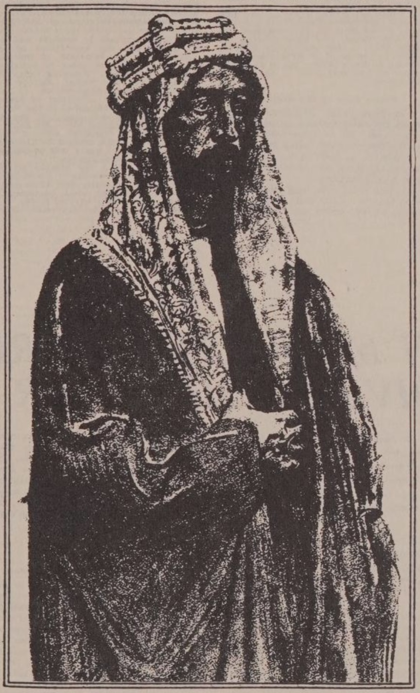

# Grundlage der syrischen Ansprüche

## Freund von Prinz Feisal, Sohn des gerade auf den Thron gewählten Königs von Hedjaz, berichtet von den Hoffnungen der arabischen Nationalisten

_Der Autor dieses Artikels wurde im Nahen Osten geboren und spricht Arabisch. Er hat mit Prinz Feisal in Damaskus und London in dessen Muttersprache gesprochen. Er wurde von der arabischen Regierung von Beirut nach Damaskus berufen, um mit der Crane-King-Kommission zu konferieren; und er hat das syrische Problem mit dem verstorbenen Sir Mark Sykes erörtert, der den Sykes-Picot-Vertrag von 1916 ausgehandelt hat._

Von Frederick Jones Bliss  
Ehemaliger Field Officer des Palestine Exploration Fund.

Die Ereignisse der letzten fünf Jahre scheinen fast unausweichlich zu dem nationalistischen Staatsstreich in Syrien geführt zu haben, der am 20. März mit der Krönung des Emirs Feisal zum König von Syrien seinen Höhepunkt erreichen sollte. Späteren Meldungen zufolge hat Herr Lloyd George im Parlament erklärt, dass die britische und die französische Regierung die jüngste Wahl Feisals durch den Allsyrischen Kongress in Damaskus nicht als gültig anerkennen können.

Lassen Sie mich gleich sagen, dass Feisal immer ein loyaler Verbündeter Englands war und auch weiterhin sein will. Jede Erschwerung dieser Loyalität ist auf die Ergebnisse der britischen Kriegsdiplomatie zurückzuführen, die vielleicht notwendigerweise unter einem Mangel an Koordination zwischen den Agenten des Außenministeriums litt. Zu glauben, dass die Diplomatie in Kriegszeiten nach den hohen ethischen Maßstäben beurteilt werden kann, die in Friedenszeiten zwingend erforderlich sind, bedeutet, von der Herrschaft eines „vollkommenen Rates“ zu träumen und die plötzlichen und unvorhergesehenen Erfordernisse militärischer Notwendigkeiten zu vergessen.

Die obige Bemerkung dient nicht der Entschuldigung, sondern der Erläuterung der sich gegenseitig ausschließenden Vereinbarungen, die Großbritannien mit den Franzosen, den Arabern und den Zionisten getroffen hat. Diese Abmachungen wurden von verschiedenen Vertretern zu verschiedenen Zeiten getroffen, die möglicherweise keine Kenntnis von den Einzelheiten der Verhandlungen des jeweils anderen hatten. Der Premierminister, unter dessen letzter Autorität sie getroffen wurden, wurde, bevor sie in die Tat umgesetzt werden konnten, von einem Mann abgelöst, dessen Macht eher im „Siegeswillen“ als in der Kenntnis der Geschichte, der Geographie und der gesamten Kunst der Außenpolitik liegt und der ein mangelhaftes politisches Gedächtnis besitzt.

## Für ein arabisches Reich.

Wie ich von Feisal gehört habe, ist sein Hauptziel ein ungeteiltes arabisches Reich, das Palästina, Syrien und Mesopotamien umfasst. So verstand er auch die Vereinbarung, die 1913 zwischen Colonel Lawrence und seinem eigenen Vater Huessein, dem Großscherif von Mekka und jetzigen König des Hedschas, getroffen wurde. Die Einheit der arabischsprachigen Länder war also Feisals Hauptziel. Er akzeptierte das Prinzip der Mandate, da er das Bedürfnis seines Volkes nach Unterricht in der Kunst des Regierens sowie in finanziellen und wirtschaftlichen Angelegenheiten anerkannte, aber er war der festen Überzeugung, dass die Anwendung dieses obligatorischen Prinzips in keiner Weise die alles beherrschende Forderung nach Einheit beeinträchtigen durfte.

Die vorläufige Aufteilung in drei Zonen bis zu den endgültigen Beschlüssen der Friedenskonferenz (die zur Zeit der Besetzung Syriens gefasst wurden), wobei die Briten in Palästina blieben, die Franzosen die zivile Kontrolle über das syrische Küstengebiet (mit dem Libanon) ausübten und die Araber unter seiner Leitung die innere Verwaltung des Hinterlandes von Damaskus als Zentrum aus leiteten, aber alle drei Zonen unter britischer Militärkontrolle standen—diese Aufteilung betrachtete er als eine notwendige und angemessene Arbeitsteilung unter den an der Eroberung beteiligten Alliierten. Als der Oberste Rat im September 1919 ankündigte, dass in Kürze eine Neuordnung des Status quo in Kraft treten würde, bei der die britische militärische Kontrolle über Syrien durch die französische ersetzt werden sollte, wurde sein bereits geweckter Verdacht, dass das angebliche Provisorium eine vorherbestimmte Lösung andeuten würde, immens verstärkt. Diese Nachricht erreichte ihn bei seiner Ankunft in Marseille aus Syrien Anfang September. Dass die Dauerhaftigkeit einer solchen Teilung seinen Hoffnungen auf ein ungeteiltes arabisches Reich von der ägyptischen Grenze bis nach Persien ein Ende setzen würde, war ihm schmerzlich bewusst. Er sah, dass diese Teilung die Feindschaft der Nationalisten—Moslems, Christen und Drusen gleichermaßen—erwecken würde, deren Programm auf dem Allarabischen Kongress, der im Juni 1919 in Damaskus tagte, klar formuliert wurde.

## Einzelnes Mandat bevorzugt.

Bei allen Meinungsverschiedenheiten darüber, ob es wünschenswert sei, diese oder jene zwingende Macht einzuladen, war die Überzeugung, dass es nur ein Mandat geben sollte, fast allgemein verbreitet. Eine Ausnahme bildete natürlich das „Ulster“ Syriens, d.h. der Libanon, dessen Einwohner zu drei Vierteln römisch-katholische Maroniten sind und die, zumindest in der ersten Zeit des Waffenstillstands, ein auf den Großlibanon beschränktes französisches Mandat begrüßt hätten. Diese Partei hatte Tausende von Anhängern in Beirut und anderen Küstenstädten. Sie machen wahrscheinlich nicht mehr als ein Siebtel der gesamten Bevölkerung Syriens und Palästinas aus.

Ich sah Feisal bald nach seiner Ankunft in London, und er erklärte mit Nachdruck, dass die vorgeschlagene Änderung zu einem allgemeinen Aufstand führen würde. Während seines monatelangen Aufenthalts in England versuchte er, das Außenministerium von den ernsten Aspekten der Angelegenheit zu überzeugen. Gegen Ende seines Aufenthalts erzählte er mir, dass er die Bedingungen gegenüber verschiedenen Mitgliedern des britischen Kabinetts hervorgehoben und sie nacheinander genannt habe. Sein Vorschlag, einen vierköpfigen Rat—einen britischen Vertreter, einen französischen, einen amerikanischen und ihn selbst—mit einer erneuten Prüfung der vorgeschlagenen Änderung zu befassen, scheiterte. Clemenceau willigte jedoch ein, die Angelegenheit persönlich mit ihm in Paris zu besprechen. Diese Gespräche waren für den Prinzen offensichtlich unbefriedigend, obwohl man sich offenbar auf eine Art modus vivendi einigte. Die Briten zogen sich im Dezember aus Syrien zurück. Die Landung Feisals in Beirut im Januar 1920 wurde von den Nationalisten mit großem Beifall begrüßt, deren kühne Unabhängigkeitsbekundungen von den Franzosen nicht behindert wurden, die jedoch eine Gruppe französischer Soldaten abstellten, die den Aufmarsch mit aufgesetzten Bajonetten eskortierten. Feisal begab sich fast sofort nach Damaskus.

Seitdem haben sich die Ereignisse rasch überschlagen. Der Rückschlag der Franzosen in Marasch hat zweifellos einen Einfluss auf ihre Entschlossenheit gehabt. Was die Haltung Feisals gegenüber den türkischen Nationalisten betrifft, so heißt es in einigen Botschaften, er habe den Arabern verboten, mit ihnen zusammenzuarbeiten, während aus anderen hervorgeht, dass er die Androhung einer solchen Zusammenarbeit gebilligt hat, falls die Einheit Syriens durch die Entscheidung der Mächte beeinträchtigt würde. Auf diese Berichte kann man sich jedoch in keiner Weise verlassen.

## Wer die Araber sind.

In den aktuellen Zeitungskommentaren zur Lage in Syrien wird das Wort „Araber“ allzu oft missverständlich verwendet. Manchmal wird zwischen den Moslems und den Christen unterschieden, indem die Moslems als Araber bezeichnet werden, was impliziert, dass die Christen etwas ganz anderes sind. Tatsächlich ist das einzige einigermaßen reine arabische Blut in Syrien und Palästina unter den Bedawin und in einigen wenigen Adelsfamilien zu finden, in einem Fall sicherlich christlich. Alle Syrer bezeichnen sich selbst ebenso gerne als „Kinder der Araber“ wie sie den Begriff Syrer verwenden. Die gesamte Bevölkerung kann aufgrund einer gemeinsamen Sprache als arabisch bezeichnet werden. Zur Zeit der arabischen Eroberung wurde, grob gesagt, die Hälfte der bereits gemischten Bevölkerung Moslems und die andere Hälfte blieb Christen. Die Einmischung arabischen Blutes war auf Mischehen mit den Eroberern zurückzuführen, die vermutlich bei den zum Islam Konvertierten viel häufiger vorkamen als bei denen, die den Glauben beibehielten. Die christlichen und muslimischen Teile der sesshaften Bevölkerung haben weit mehr miteinander gemein als mit den Bedawin.

Die Position von Feisal steht auf soliden und stichhaltigen Füßen, vorausgesetzt, dass er von der Mehrheit der syrischen und palästinensischen Bevölkerung unterstützt wird, was allem Anschein nach sicher ist (ich kann nicht für Mesopotamien sprechen). Die Angelegenheit ist sehr einfach. Die Vereinigten Staaten haben sich der Entente mit bestimmten Versprechen angeschlossen, und es ist unsere Aufgabe, dafür zu sorgen, dass diese Versprechen auch eingehalten werden. Zwei offizielle Erklärungen Frankreichs und Englands, die den Syrern das Selbstbestimmungsrecht zugestehen und den Sykes-Picot-Vertrag von 1916 (der unter anderem zwei besondere Einflusszonen anerkannte, Palästina für die Briten und Syrien für die Franzosen) ipso facto für null und nichtig erklären.

## Eine offizielle Erklärung.

Hier ein Zitat aus dem „Text der zwischen der britischen und französischen Regierung vereinbarten und dem Präsidenten der Vereinigten Staaten von Amerika übermittelten Erklärung“: „Das Ziel, das Frankreich und Großbritannien im Auge haben, wenn sie im Osten den Krieg führen, den der deutsche Ehrgeiz auf die Welt losgelassen hat, ist es, die vollständige und endgültige Befreiung all jener Völker zu sichern, die so lange von den Türken unterdrückt wurden, und nationale Regierungen und Verwaltungen zu errichten, die ihre Autorität aus der Initiative und dem freien Willen des Volkes selbst ableiten.“

Diese Erklärung wurde am 14. November veröffentlicht. 1918 in den Palestine News, dem offiziellen Organ der ägyptischen Expeditionsstreitkräfte unter General Allenby, veröffentlicht und in der arabischen und französischen Presse (in Übersetzung) nachgedruckt. Ich habe damals meinen Freund, den verstorbenen Sir Mark Sykes (von dem man sagt, dass er den Vertrag, den er mit Picot geschlossen hat, sehr bedauert hat), nach der Autorität der oben zitierten Erklärung befragt, und er erklärte, dass jedes Wort davon in wiederholten Mitteilungen zwischen Paris und London und London und Paris sorgfältig abgewogen wurde. Es ist bezeichnend, dass man seither so wenig von dieser Erklärung gehört hat.

Auch der zweiundzwanzigste Abschnitt (teilweise) des Völkerbundvertrages, der von der Friedenskonferenz am 28. April 1919 angenommen wurde, erklärt: „Bestimmte Gemeinschaften, die früher zum türkischen Reich gehörten, haben ein Entwicklungsstadium erreicht, in dem ihre Existenz als unabhängige Nationen vorläufig anerkannt werden kann, vorbehaltlich der administrativen Beratung und Betreuung durch einen Mandatar, bis sie in der Lage sind, allein zu stehen. Die Wünsche dieser Gemeinschaften müssen bei der Auswahl des Mandatars eine wichtige Rolle spielen.“

Darüber hinaus gibt es zwei Erklärungen von Präsident Wilson: die eine bildet den zwölften der Vierzehn Punkte, die andere ist in seiner Rede in Mount Vernon am 4. Mai 1918 enthalten. Darin wird unter anderem das Recht solcher Nationalitäten wie Syrien auf „eine absolut ungerechtfertigte Möglichkeit der autonomen Entwicklung“ (zwölfter Punkt) anerkannt; und dass ihre „politischen Beziehungen“ „auf der Grundlage der freien Akzeptanz dieser Regelung durch die unmittelbar betroffenen Völker beruhen sollten und nicht auf der Grundlage des materiellen Interesses oder Vorteils irgendeiner anderen Nation oder eines anderen Volkes, das um seines äußeren Einflusses oder seiner Herrschaft willen eine andere Regelung wünschen könnte.“ (Mount Vernon-Rede)

## Verzweifelt über unsere Hilfe.

Jüngsten Meldungen zufolge ist Feisals Plan für ein unabhängiges, ungeteiltes arabisches Königreich, das Palästina, Syrien und Mesopotamien umfasst, nicht dazu gedacht, „die gegenwärtige europäische Verwaltung auszugleichen“, und er würde „die Unterstützung durch britische und französische Berater befürworten.“ Er hat offenbar die Hoffnung auf die von ihm so leidenschaftlich gewünschte amerikanische Hilfe verloren. Dieser fast universelle arabische Wunsch nach amerikanischer Hilfe (der durch die Hoffnungen, die durch die ausgezeichnete, unparteiische Arbeit dieser Crane-King-Kommission geweckt wurden, stark stimuliert wurde) beruhte auf der Überzeugung, dass sie als einzige von allen Mächten das Mandat uneigennützig als ein Mandat, ein Bildungsmandat und daher vorübergehend behandeln würde.

Die Wurzeln der seit einiger Zeit bestehenden, aber offenbar inzwischen modifizierten Abneigung gegen die Franzosen sind nicht so leicht zu bestimmen. Die Befürchtung, dass sie kommen würde, um zu bleiben, könnte auch in Bezug auf England gehegt werden. Jedenfalls lehnte der Allsyrische Kongress vom Juni 1919, dessen zweite Wahl England war, den Gedanken an französische Hilfe ab. Möglicherweise hatten die vorangegangenen acht Monate französischer Verwaltung in Beirut viel mit dieser Angelegenheit zu tun. Dieser Verwaltung mangelte es an Macht, Effizienz, Unparteilichkeit und Taktgefühl. Sie wurde mit der Zeit immer unbeliebter, sogar bei den Maroniten, die sie so sehr begrüßt hatten. Tatsächlich hatte der unbemerkte Erfolg der Allenby-Offensive den Alliierten plötzlich ein großes Gebiet in die Hände gespielt, das einer Verwaltung bedurfte. Diese Aufgabe fiel den Franzosen zu, die offenbar nicht sofort die richtigen Männer zur Verfügung hatten. Viele der Beamten wurden inzwischen durch besser qualifizierte Männer ersetzt.

Feisal ist offenbar nicht abgeneigt, die Autonomie des Libanon unter der Oberhoheit des arabischen Reiches anzuerkennen, analog zu seinem Verhältnis zum türkischen Reich.

Ob das vorgeschlagene neue arabische Königreich ein Erfolg wird, ist ein Fall von „solvitur ambulando“. Ein wichtiges Element für diesen Erfolg, wenn er denn eintritt, wird der Charakter von Feisal sein. Im Rückblick auf meine intime Bekanntschaft mit ihm sowohl in Damaskus als auch in London kann ich ohne zu zögern meine Überzeugung zum Ausdruck bringen, dass er eine Seele ist, demokratisch, liberal gesinnt, stark, patriotisch, nicht persönlich ehrgeizig in irgendeinem unerwünschten Sinne, eher von überlegter als von impulsiver Natur, begierig nach uneigennützigem Rat aus jeder Quelle und keineswegs ein religiöser Fanatiker. Zu seinen vertrauenswürdigsten und treuesten Beratern gehören die syrischen Christen. Er hat gesagt, dass eine seiner größten Hoffnungen darin besteht, ein amerikanisches College in Jiddah, dem Hafen von Mekka, zu errichten. Ist es nicht möglicherweise bezeichnend, dass der in der Botschaft angekündigte Tag der Krönung der Samstag war und nicht der heilige muslimische Freitag?

Feisals charmantes Auftreten, bei dem sich Zurückhaltung mit reizvoller Offenheit abwechselt, ist keineswegs sein geringster Vorzug. Er ist sehr anpassungsfähig. Am Mittagstisch des Dekanats Rochester im alten England, wo wir gemeinsam zu Gast waren, hätte er in der korrektesten europäischen Kleidung als italienischer Adliger durchgehen können. Später wurde das unvermeidliche Foto gemacht. Das Anlegen der arabischen Kopfbedeckung und des Umhangs verwandelte ihn augenblicklich in einen Wüstenprinzen. Schon sein Gang wurde zum „Bühnenschritt“ des Arabers.

Nach meinem besten Wissen und Gewissen ist Feisals persönlicher Charakter über jeden Zweifel erhaben. Meine Meinung wird von denen geteilt, die ihm am nächsten stehen. Die sichersten Hoffnungen der arabischen Nationalisten liegen in der einfachen Tatsache, dass ihr Führer ein guter Mensch ist.
