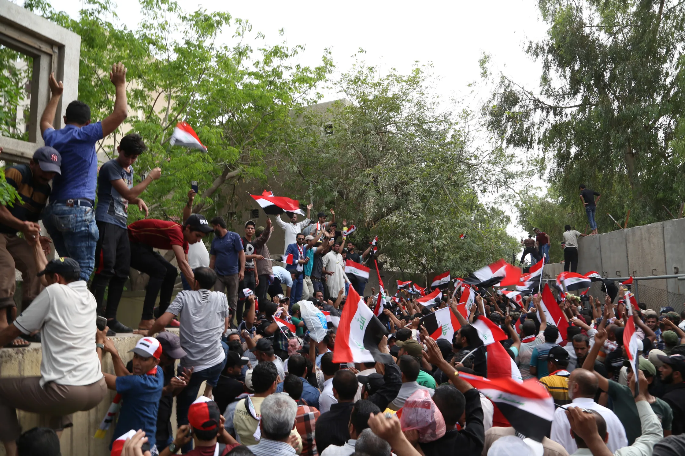

# Wie Der Fluch Von Sykes-picot Den Nahen Osten Noch Immer Heimsucht

Im Nahen Osten werden heutzutage nur wenige Männer so sehr an den Pranger gestellt wie Sir Mark Sykes und François Georges-Picot. Sykes, ein britischer Diplomat, bereiste dasselbe Terrain wie T. E. Lawrence (von Arabien), war Soldat im Burenkrieg, erbte einen Baronstitel und gewann einen Sitz für die Konservativen im Parlament. Er starb jung, mit neununddreißig Jahren, während der Grippeepidemie von 1919. Picot war ein französischer Anwalt und Diplomat, der bis zu seinem Tod im Jahr 1950 ein langes, aber unbedeutendes Leben führte, vor allem in abgelegenen Posten. Doch die beiden Männer leben in dem geheimen Abkommen weiter, das sie während des Ersten Weltkriegs ausarbeiten sollten, um die riesige Landmasse des Osmanischen Reichs in britische und französische Einflussgebiete aufzuteilen. Das Sykes-Picot-Abkommen war der Beginn eines neunjährigen Prozesses—und weiterer Abkommen, Erklärungen und Verträge—, in dessen Verlauf aus dem osmanischen Kadaver die modernen Staaten des Nahen Ostens entstanden. Die neuen Grenzen hatten letztlich wenig Ähnlichkeit mit der ursprünglichen Sykes-Picot-Karte, aber ihre Karte wird immer noch als Ursache für vieles angesehen, was seitdem geschehen ist.

„Hunderttausende sind wegen Sykes-Picot und all der Probleme, die es geschaffen hat, getötet worden“, sagte mir Nawzad Hadi Mawlood, der Gouverneur der irakischen Provinz Erbil, als ich ihn in diesem Frühjahr traf. „Es hat den Lauf der Geschichte—und der Natur—verändert.”

Am 16. Mai jährt sich die Unterzeichnung des Abkommens zum hundertsten Mal, und es stellt sich die Frage, ob die Grenzen des Abkommens die aktuellen Unruhen in der Region überstehen können. „Das seit hundert Jahren bestehende System ist zusammengebrochen“, erklärte Barham Salih, ehemaliger stellvertretender irakischer Ministerpräsident, im März auf dem [Sulaimani-Forum](https://archive.ph/o/iZ2E4/auis.edu.krd/video/sulaimani-forum-2016-opening) in Irakisch-Kurdistan. „Es ist nicht klar, welches neue System an seine Stelle treten wird.“

Die koloniale Aufteilung war immer angreifbar. Ihre Landkarte ignorierte lokale Identitäten und politische Präferenzen. Die Grenzen wurden mit dem Lineal festgelegt—willkürlich. Bei einem Briefing für den britischen Premierminister H. H. Asquith im Jahr 1915 [erklärte](https://archive.ph/o/iZ2E4/www.jamesbarr.org.uk/ALITSextract4.html) Sykes: „Ich möchte eine Linie vom ‚E‘ in Akkon bis zum letzten ‚K‘ in Kirkuk ziehen. Er ließ seinen Finger über eine Karte gleiten, die auf einem Tisch in der Downing Street Nr. 10 ausgebreitet war und von der heutigen Stadt an der israelischen Mittelmeerküste bis zu den nördlichen Bergen des Irak reichte.

„Sykes-Picot war ein Fehler, ganz sicher“, sagte Zikri Mosa, ein Berater des kurdischen Präsidenten Masoud Barzani, zu mir. „Es war wie eine Zwangsehe. Sie war von Anfang an zum Scheitern verurteilt. Es war unmoralisch, denn es wurde über die Zukunft der Menschen entschieden, ohne sie zu fragen.“

Die bittere Reaktion auf den Sykes-Picot-Prozess spiegelt sich seit einem Jahrhundert in den politisch mächtigsten Ideologien wider, die auf der Grundlage eines einheitlichen Nationalismus für die gesamte arabische Welt entstanden sind: dem Nasserismus in Ägypten und dem Baathismus im Irak und Syrien. Drei Jahre lang versuchten Ägypten und Syrien, obwohl sie auf verschiedenen Kontinenten liegen, dies tatsächlich, indem sie sich zur Vereinigten Arabischen Republik zusammenschlossen; das Experiment zerfiel nach einem Putsch 1961 in Damaskus.

Auch der Islamische Staat versucht, die alten Grenzen aufzuheben. Nachdem er 2014 über Syrien und den Irak hinweggefegt war, verkündete Kalif Abu Bakr al-Baghdadi: „Dieser gesegnete Vormarsch wird nicht aufhören, bis wir den letzten Nagel in den Sarg der Sykes-Picot-Verschwörung geschlagen haben.“

Doch die Prämisse der amerikanischen Politik (und jeder anderen äußeren Macht) besteht heute darin, die mit Sykes-Picot verbundenen Grenzen zu bewahren, um den zerrissenen Irak zu stabilisieren, den grausamen Bürgerkrieg in Syrien zu beenden und den Islamischen Staat zu bekämpfen. Seit August 2014 haben die Vereinigten Staaten mehr als [elf Millionen Dollar](https://archive.ph/o/iZ2E4/www.cnsnews.com/news/article/penny-starr/dod-special-report-fighting-islamic-terrorists-iraqsyria-65-billion-571-0) pro Tag in militärische Operationen investiert, darunter [fast neuntausend](https://archive.ph/o/iZ2E4/www.defense.gov/News/Special-Reports/0814_Inherent-Resolve) Luftangriffe auf den Irak und mehr als fünftausend auf Syrien. Für die weltweit schlimmste humanitäre Flüchtlingskrise, die sich nun von Syrien aus über Länder und Kontinente ausbreitet, hat Washington 2016 [siebenhundert Millionen Dollar](https://archive.ph/o/iZ2E4/www.state.gov/r/pa/prs/ps/2016/04/255835.htm) zugesagt, wobei noch mehr versprochen wurde. Der Rest der Welt—von Europa bis zu den Golfscheichtümern, von Russland bis zum Iran—hat Milliarden in die Aufrechterhaltung der Grenzen gesteckt, auch wenn sie unterschiedliche politische Ergebnisse anstreben.

In den letzten Monaten ihrer Amtszeit verschärft die Obama-Regierung diese Strategie. Seit dem 8. April haben hochrangige Beamte—Vizepräsident Joe Biden, Außenminister John Kerry und Verteidigungsminister Ash Carter—Bagdad überraschende Besuche abgestattet, um die zunehmend fragile irakische Regierung zu stützen. Die politische Krise in Bagdad geht dem Krieg gegen ISIS voraus. Bei den jüngsten Parlamentsdebatten kam es zu Prügeleien und Schlägereien mit Wasserflaschen; Dutzende von Gesetzgebern haben in diesem Monat einen Sitzstreik abgehalten, um den Rücktritt ihres Parlamentspräsidenten zu fordern. Zehntausende [demonstrieren](https://archive.ph/o/iZ2E4/www.aljazeera.com/news/2016/04/tens-thousands-iraqis-protest-central-baghdad-160426104004117.html) seit Monaten in mehreren Provinzen, um politische und wirtschaftliche Reformen sowie ein Ende der grassierenden Korruption zu fordern. Am Samstag durchbrachen die Demonstranten die befestigten Sprengwände rund um die Grüne Zone—und brachten einen Teil davon zum Einsturz, als wäre es die Berliner Mauer—und [stürmten](https://archive.ph/o/iZ2E4/https://www.washingtonpost.com/world/protesters-storm-iraqi-parliament-in-baghdad/2016/04/30/0862fd3a-0ec1-11e6-8ab8-9ad050f76d7d_story.html) das Parlament. Wie Reuters berichtet, schwenkten die Demonstranten Fahnen, tanzten in den Gängen und riefen den fliehenden Gesetzgebern zu: „Die Feiglinge sind weggelaufen“. Die Abgeordneten hatten es wieder einmal nicht geschafft, ein Quorum für die Abstimmung über ein neues Kabinett von Technokraten zu erreichen, das die derzeitigen Spitzenbeamten ersetzen sollte, die nach Quoten auf der Grundlage von Sekten und ethnischer Zugehörigkeit ausgewählt worden waren. Der Irak verhängte den Ausnahmezustand und sperrte alle Straßen in die Hauptstadt. Die US-Botschaft, die UN-Mission und andere Botschaften innerhalb der Grünen Zone wurden abgeriegelt.

„Jetzt ist nicht die Zeit für Regierungsstillstand oder Reibereien“, sagte Präsident Obama Anfang des Monats. Bidens Besuch „konzentrierte sich darauf, die nationale Einheit des Irak zu fördern“, so das Weiße Haus. Doch Premierminister Haider al-Abadi läuft zunehmend Gefahr, zum irakischen Humpty Dumpty zu werden.

Auch die Vereinigten Staaten stocken ihre militärische Präsenz auf. Am 18. April kündigte Präsident Obama die Entsendung von Apache-Hubschraubern, hochentwickelten mobilen Raketen und weiteren zweihundert Soldaten in den Irak an. Die Gesamtzahl der amerikanischen Streitkräfte beläuft sich nun auf etwa fünftausend. Die Zahl der Luftangriffe ist in diesem Jahr um sechzig Prozent gegenüber dem Vorjahreszeitraum gestiegen.

Noch schlimmer ist die Lage in Syrien, wo die Vereinigten Staaten ihre Rolle ebenfalls verstärken. Die im Januar begonnenen Friedensgespräche sind nach drei erfolglosen Runden bestenfalls prekär. Der Waffenstillstand ist in dieser Woche in einer Explosion der Kämpfe zusammengebrochen, insbesondere um Aleppo, Syriens größte Stadt und ehemalige Handelshauptstadt. Am Montag forderte Obama die Entsendung von zweihundertfünfzig weiteren US-Spezialkräften nach Syrien, um die fünfzig, die bereits vor Ort sind, zu verstärken und „den Schwung beizubehalten“. Dies ist die größte Ausweitung der Rolle der USA seit Ausbruch des Bürgerkriegs im Jahr 2011.

Die Vereinigten Staaten beanspruchen Fortschritte im militärischen Kampf gegen den Islamischen Staat. Seit November hat das Pseudo-Kalifat des IS vierzig Prozent seines Territoriums im Irak und zehn Prozent in Syrien verloren, ebenso wie Zehntausende von Kämpfern, Tonnen von Waffen und Hunderte von Millionen Dollar, die in Lagerhäusern gelagert sind, die von der US-geführten Koalition bombardiert wurden. Pentagon-Beamte [erklärten](https://archive.ph/o/iZ2E4/www.cbsnews.com/news/less-foreign-isis-recruits/) letzte Woche, dass die Zahl der neuen ISIS-Rekruten im Irak und in Syrien von fünfzehnhundert pro Monat im letzten Jahr auf jetzt zweihundert pro Monat gesunken ist. Die ISIS-Kämpfer sterben schneller, als sie ersetzt werden können. Zum ersten Mal scheint ISIS nicht mehr unbesiegbar zu sein.

Die Region beginnt nun, nervös über das politische Chaos und die Herausforderung durch ISIS hinauszublicken. Die Angst ist tief verwurzelt, dass sowohl der Irak als auch Syrien—ein Gebiet, das sich vom Mittelmeer bis zum Golf erstreckt—so schwach geworden sind, dass sie möglicherweise nicht überlebensfähig sind, unabhängig davon, ob ISIS besiegt wird. Dies ist das Thema politischer Debatten, Medienkommentare, Teehausgespräche und akademischer Konferenzen.

„Kann der Irak so bleiben, wie er am Tag vor dem Angriff von ISIS war? Nein, ich glaube nicht“, sagte Jan Kubis, der UN-Beauftragte für den Irak, auf dem Sulaimani-Forum. „Die Menschen müssen verstehen, dass etwas nicht stimmte, als ISIS durch das Land fegen konnte. Und etwas stimmt nicht, wenn ein Teil des Landes befreit wurde, aber die Menschen wissen, dass die Dinge noch nicht richtig sind, um zurückzukehren.“

Die Debatte über die Zukunft des Irak hat sich verschoben, seit Senator Joe Biden 2006 in einem umstrittenen [Op-Ed](https://archive.ph/o/iZ2E4/www.nytimes.com/2006/05/01/opinion/01biden.html?pagewanted=all) der Times drei autonome Regionen vorschlug, in denen Schiiten, Sunniten und Kurden ihren eigenen politischen Raum haben sollten. Nach dreizehn Jahren Krieg ist das Gewebe der jungen Nation fadenscheinig. Der Irak in seiner jetzigen Form ist weniger als ein Jahrhundert alt; Saddam Hussein regierte ihn ein Viertel seines Bestehens lang. Seit seinem Sturz hat Bagdad kein politisches Konzept entwickelt, um sicherzustellen, dass sich die verschiedenen Bevölkerungsgruppen für die Rettung des Landes in seiner jetzigen Form einsetzen. Auch die Wirtschaft eines wichtigen Ölproduzenten wurde von einer lähmenden Mischung [getroffen](https://archive.ph/o/iZ2E4/www.brookings.edu/research/opinions/2015/12/13-raq-economic-reform-for-2016-alkhatteeb): grob verschwenderische Misswirtschaft, eine von unqualifiziertem Personal aufgeblähte Bürokratie, ausufernde Gier, eine fünfhundertprozentige Haushaltserhöhung seit 2004 und ein drastischer Verfall der Ölpreise. Der Nationalismus hat sich verflüchtigt. Die Iraker sind sehr stolz auf die alte Zivilisation ihres Landes; die Verbindung zu ihrem gegenwärtigen Zustand ist die existenzielle Herausforderung.

In Syrien untergräbt die schiere physische und menschliche Verwüstung die Aussichten auf einen lebensfähigen Staat für die nächsten Jahre. Die Zahlen sind fast unfassbar: Mehr als [die Hälfte](https://archive.ph/o/iZ2E4/https://www.worldvision.org/wv/news/Syria-war-refugee-crisis-FAQ) der Bevölkerung ist auf humanitäre Hilfe angewiesen, um den Tag zu überstehen. Etwa drei Millionen Kinder gehen nicht zur Schule—bei einer Bevölkerung von zweiundzwanzig Millionen. Neben der erschütternden Zahl der Todesopfer wurden anderthalb Millionen Menschen verletzt oder dauerhaft behindert. Die Lebenserwartung ist seit Beginn des Bürgerkriegs im Jahr 2011 um [fünfzehn Jahre](https://archive.ph/o/iZ2E4/www.worldcrunch.com/syria-crisis/-mistakes-were-made-interview-with-a-captured-isis-fighter-in-syria/c13s20992/) gesunken. Fast jeder fünfte Bürger ist bereits aus dem Land geflohen. Es gibt kaum Anreize für sie, zurückzukehren. Die materielle Zerstörung beläuft sich auf mindestens zweihundertfünfzig Milliarden Dollar in einem Staat von der Größe Washingtons. Und sie nimmt jeden Tag zu.

Ein Jahrhundert nach Sykes-Picot haben die beiden Krisen die von den Europäern auferlegte Fassade der Staatlichkeit entfernt und die Leere darunter offenbart. Der Irak wurde von Großbritannien und Syrien von Frankreich verwaltet, mit begrenztem Aufbau einer Nation, bevor beiden die Unabhängigkeit gewährt wurde. Sie wehten unter neuen Flaggen, bauten opulente Paläste für ihre Führer, förderten Handelseliten und bildeten viele Männer in Uniform aus. Aber beide hatten schwache öffentliche Institutionen, winzige Zivilgesellschaften, zwielichtige und ungerechte Wirtschaften und sinnlose Gesetze. Beide Länder wurden von Putschen und Instabilität heimgesucht. Syrien erlebte zwischen 1949 und 1970 zwanzig Putsche, von denen einige scheiterten, aber viele erfolgreich waren, im Durchschnitt einen pro Jahr, bis die Assad-Dynastie die Macht übernahm—ein weiterer Putsch. Der Kitt, der beide Länder zusammenhielt, waren zunehmend repressive Herrschaft und Angst.

Die Außenwelt, allen voran die Vereinigten Staaten, bemühte sich um die Rettung der beiden Länder. Nach seiner achtjährigen Intervention ist Washington jedoch nicht darauf erpicht, erneut die Verantwortung für die politischen Nachwirkungen zu übernehmen. „Wir müssen sehr bescheiden sein, was unsere Fähigkeit angeht, den Lauf der Dinge zu beeinflussen“, sagte Brett McGurk, Obamas Ansprechpartner für die Anti-ISIS-Koalition, letzten Monat in Washington. „Wir müssen sehr vorsichtig sein, bevor wir uns zu sehr engagieren. Wir müssen unsere Interessen sehr eng definieren und uns sehr aggressiv auf die Durchsetzung dieser Interessen konzentrieren.“

Auf dem Forum in Sulaimani [wies](https://archive.ph/o/iZ2E4/auis.edu.krd/iris/video/sulaimani-forum-2016-confronting-isis) McGurk auf weitere Gefahren hin, die die Aussichten auf einen Wiederaufbau des irakischen Staates untergraben. Er erzählte eine Anekdote über einen irakischen Führer, der einen Jesiden dazu aufforderte, sich nach dem Massaker der ISIS an seinem Volk in den Sinjar-Bergen im Jahr 2014 nicht auf Rache zu konzentrieren. Dieses Massaker und die Versklavung Hunderter jesidischer Frauen waren der Auslöser für die ersten US-Luftangriffe. McGurk sagte, der Jeside habe geantwortet: „Sie haben mir meine Frau, meine Tochter und meine Schwester genommen. Alles, was mir geblieben ist, ist meine Rache“. McGurk warnte: „Das ist etwas, womit der Irak jahrzehntelang zu tun haben wird.

In Syrien ist die Zahl der Todesopfer um ein Vielfaches höher und die konfessionelle und ethnische Kluft mindestens so tief wie im Irak. In beiden Ländern geht es nicht nur darum, einen Weg zu finden, um Staaten zu schaffen, die lebensfähiger sind als die verschiedenen Modelle, die seit dem Sykes-Picot-Prozess versucht wurden. Es geht auch darum, unter den gegenwärtigen Bedingungen den Willen der Öffentlichkeit zu mobilisieren.

„Man kann befreien. Man kann halten. Und man kann aufbauen“, sagte Salman al Jumaili, der irakische Planungsminister, letzten Monat auf dem Sulaimani-Forum. „Aber man kann sie nicht aufrechterhalten.

Einige der politischen Alternativen könnten sich als ebenso problematisch erweisen. Die Neugliederung des Irak oder Syriens in neue Einheiten könnte genauso kompliziert und möglicherweise genauso blutig sein wie die derzeitigen Kriege. Das Auseinanderbrechen Indiens, Jugoslawiens und des Sudans löste riesige Migrationsbewegungen, ethnische Säuberungen und rivalisierende Ansprüche auf Ressourcen und Territorien aus, die wiederum neue Konflikte auslösten, von denen einige auch Jahre später noch ungelöst sind.

„Die Zivilisation begann hier im sechsten Jahrhundert v. Chr.“, sagte der irakische Außenminister Ibrahim Jafari auf dem Forum. „Wir wollen keinen Irak ohne Sekten oder Nationalitäten. Aber wir wollen einen Irak ohne Radikalismus. Wir möchten, dass der Irak wie ein Blumenstrauß ist.“ Da das Chaos in Bagdad von Tag zu Tag größer wird, ist das sicherlich eine Illusion.

„Wir kennen das Schicksal der Menschen in dieser Region nicht“, sagte Salih, der ehemalige stellvertretende irakische Ministerpräsident, diese Woche zu mir. „Aber sicher ist, dass dieses Mal—anders als vor hundert Jahren, als Mr. Sykes und M. Picot die Linien in den Sand zeichneten—die Menschen in der Region viel mit der Gestaltung der neuen Ordnung zu tun haben werden.“ Das Problem für sie und die Außenwelt ist, dass sie nur wissen, was sie nicht wollen. Sie müssen erst noch herausfinden, welche politischen Systeme—und welche Grenzen—funktionieren werden.
