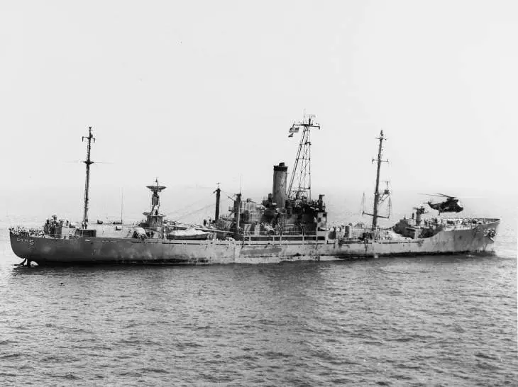

# USS Liberty-Veteranen sagen im Staat „Live Free or Die“ aus

**„LIVE FREE OR DIE“** ist das offizielle Motto des Staates New Hampshire. Dieses Motto wurde am 12. Januar 2024 während der dramatischen Zeugenaussage von Überlebenden der USS Liberty zur Unterstützung der House Bill 1041 des Staates New Hampshire wiederholt erwähnt, die die Einrichtung einer Kommission zur Untersuchung des israelischen Beschusses der USS Liberty am 8. Juni 1967 und seiner Folgen fordert. Dieses Gesetz, das von den republikanischen Abgeordneten Jason Gerhard und Michael Granger unterstützt wird, würde den Überlebenden und Familien der 34 getöteten Schiffskameraden helfen, aussagekräftige Antworten auf ihre vielen Fragen zu diesem Angriff zu erhalten. Von der ursprünglichen Besatzung, die aus 294 Offizieren und Zivilisten bestand, wurden an diesem Tag 34 Männer getötet und 174 weitere verwundet. „Diese Seeleute haben so viel geopfert, einige von ihnen haben bei diesem Angriff sogar ihr Leben verloren. Ich denke, das Mindeste, was wir tun können, ist, ihnen mit einer zufriedenstellenden Untersuchung endlich einen Abschluss zu geben“, sagte Gerhard vor dem Ausschuss für Staats- und Bundesbeziehungen und Veteranenangelegenheiten von New Hampshire.

::youtube[New Hampshire Committee Hearing on USS Liberty]{#ITq3lRP9ct4.w-full.aspect-video}

Commander David Edwin Lewis, der als freier Mann geboren, aufgewachsen und am 16. Oktober 2021 in Colebrook, NH, gestorben ist, war ein erfahrener Kryptologe, der sich an Bord der Liberty ein Purple Heart verdient hat. Gerhard las aus seinem Nachruf vor: „Für den Rest seines Lebens trug Eddie die Narben dieses Tages, und er engagierte sich stark in der Gruppe der Überlebenden, die bewiesen, dass der Staat Israel und die Johnson-Regierung den Angriff absichtlich inszenierten, um zu versuchen, die USA in den israelisch-ägyptischen Sechs-Tage-Krieg von 1967 hineinzuziehen.“

Larry Bowen, der für seinen Dienst auf der Liberty ebenfalls mit dem Purple Heart ausgezeichnet wurde, sagte dem Ausschuss: „Ich hatte noch nie die Gelegenheit, der amerikanischen Öffentlichkeit zu erzählen, was passiert ist. Unsere Regierung hat es versäumt, uns zu Hilfe zu kommen. Unsere Regierung hat uns eine Nachrichtensperre auferlegt, damit wir nicht darüber sprechen, und uns mit Gefängnis und Geldstrafen gedroht, falls wir es doch tun. Unsere Regierung hat es versäumt, eine gründliche Untersuchung des Angriffs durchzuführen. Die Marine hielt ein formelles Untersuchungsgericht ab und nahm Zeugenaussagen von mehreren meiner Schiffskameraden auf, erhielt dann aber die Anweisung, die erhaltenen Zeugenaussagen so zu ändern, dass sie mit der Behauptung einer falschen Identität übereinstimmten, die Israel bei seiner Entschuldigung für den Angriff aufstellte.

„Wir haben 56 und ein halbes Jahr auf die Möglichkeit gewartet, vor einem Regierungsgremium zu sprechen... Ich glaube, dass dieses Gesetz die Kommission in Gang setzen wird, die das tun wird, was der Kongress vor über 56 Jahren hätte tun sollen. Es gibt noch viele unbeantwortete Fragen im Zusammenhang mit dem Angriff und seinen Nachwirkungen. Bitte unterstützen Sie diese Bemühungen, um der Besatzung und den Familien meiner Schiffskameraden zu einem angemessenen Abschluss zu verhelfen. Gott segne Sie und helfe Ihnen, die richtige Entscheidung zu treffen.“

Auf die Frage, was eine Kommission so viele Jahre nach dem Vorfall bewirken könnte, erklärte Bowen, dass die National Security Agency und die Central Intelligence Agency geheime Informationen zurückhalten, die sie nicht herausgeben wollen. Ihr Schiff wurde ein halbes Dutzend Mal von israelischen Aufklärungsflugzeugen überflogen, erinnerte sich Bowen, aber „wir fühlten uns sicher, weil sie Verbündete waren, die uns den Rücken freihielten“. Die Angreifer setzten nicht gekennzeichnete Flugzeuge ein, um sie zu beschießen und Napalm abzuwerfen, so dass die Besatzung nicht wusste, wer sie angriff, bis die Torpedoschiffe mit dem Davidstern-Emblem kamen, um sie zu erledigen. „Es gab Sprachaufzeichnungen zwischen den israelischen Piloten und ihren Bodenkontrolleuren, die uns als amerikanisches Schiff identifizierten“, sagte Bowen. Die Besatzung glaubt, dass Israel hoffte, Ägypten würde für die Versenkung ihres Schiffes verantwortlich gemacht werden. In den Jahren seit dem Angriff sind viele Fakten zusammengekommen, die nie zusammengefügt wurden, schloss Bowen.

Bryce Lockwood, damals Gunnery Sergeant und heute Baptistenpfarrer im Ruhestand, reichte Fotos herum, die am Morgen nach dem Angriff von der Besatzung der USS America aufgenommen worden waren; auf einem der Fotos war er nur drei Meter vom Torpedoloch entfernt. „Jedes Protokoll zum Schutz vor Unfällen wurde gebrochen“, sagte Lockwood. „Sie benutzten nicht markierte Flugzeuge. Sie haben unsere Notruffrequenz gestört. Sie beschossen unsere Rettungsinseln mit Maschinengewehren. Wir befanden uns nicht in einer Kampfzone, sondern in internationalen Gewässern, 13,5 Meilen vor der Sinai-Halbinsel.

„Es hat keine Untersuchung durch den Kongress gegeben, wie es Artikel 1, Abschnitt 8, Klausel 10 der US-Verfassung vorschreibt, um Piraterieakte auf hoher See zu untersuchen. Als die USS Cole angegriffen wurde und 17 Amerikaner getötet wurden, gab es eine 9-monatige Untersuchung. Auf der Liberty seien doppelt so viele Menschen getötet worden, und diese fehlerhafte Untersuchung sei in fünf Tagen abgeschlossen worden, so Lockwood. Präsident Lyndon Johnson und Verteidigungsminister Robert McNamara befahlen Admiral Isaac Kidd und Ward Boston, die unmittelbar nach dem Angriff Aussagen von erschütterten Überlebenden aufnahmen, zu berichten, dass der Angriff auf das Schiff ein Fall von Verwechslung war.

Im Jahr 2005 legte James R. Gotcher, Rechtsberater der USS Liberty Veterans Association, Verteidigungsminister Donald H. Rumsfeld einen „Bericht über Kriegsverbrechen“ vor, in dem er die von Israel begangenen Verbrechen gegen Angehörige des US-Militärs dokumentierte, woraufhin dieser verpflichtet war, eine offizielle Untersuchung einzuleiten. Es gab keine Untersuchung.

Philip Tourney, Präsident der USS Liberty Veterans Association, der aus Cedaredge, CO, angereist war, um der Anhörung beizuwohnen, sagte, er wäre nach New Hampshire zu Fuß gegangen, um auszusagen, weil „ich noch nie die Chance hatte, vor einem Komitee zu sitzen, das bereit ist, uns zuzuhören.... Das ist das Wichtigste, was Sie je in Ihrem ganzen Leben getan haben... 34 Männer zu vertreten, die an diesem Tag getötet wurden, 25 von ihnen wurden von einem Torpedo in Stücke gesprengt. Dieser Angriff dauerte genauso lange wie der Angriff auf Pearl Harbor, und dennoch riefen LBJ und McNamara die Flugzeuge der USS Saratoga und der USS America zurück, die uns zu Hilfe geschickt worden waren. Wir wurden 17 Stunden lang zum Sterben zurückgelassen, obwohl die Hilfe nur 40 Minuten entfernt war. Wir haben unser Blut für unser Land vergossen und wir würden es wieder tun. Wir sind nicht aus Wut hier“, betonte Tourney. „Wir lieben unser Land, unsere Schiffskameraden und Sie alle. Wir sind alle Amerikaner. Wenn wir nicht auf uns gegenseitig aufpassen, sind wir erledigt. Wir befinden uns im Zustand 'Live Free or Die'. Niemand sonst hat den Mut gehabt, dies zu tun ... Gott hat unser Schiff gerettet ... aber unsere Regierung hat uns unsere Rechte genommen. Wirf uns nicht die Straße hinunter...“

Jason Gerhard bat Tourney zu klären, was genau nach dem israelischen Angriff geschah. Tourney sagte, dass 17 Stunden nach dem Angriff die Schwerverletzten von Bord gebracht wurden und die verbleibenden Matrosen den Befehl erhielten, nach Malta zu segeln - wahrscheinlich in der Hoffnung, dass die Beweise sinken würden - obwohl der nächstgelegene Hafen Kreta war.

Seit vier Jahrzehnten veröffentlicht der Washington Report Artikel über die USS Liberty, und Middle East Books hat zahlreiche Bücher veröffentlicht, die den Kampf der Besatzung um Gerechtigkeit dokumentieren. Der Besuch dieser Anhörung bestätigte den Reporter in seiner Überzeugung, dass die US-Regierung vor Ort arbeiten kann, auch wenn die Gesetzgeber auf dem Capitol Hill weiterhin Israels Version der Fakten in Vergangenheit und Gegenwart unterstützen. Obwohl diese Maßnahme vor den jüngsten Angriffen im Gazastreifen vorgeschlagen wurde, ist sie ein Versuch, die Bundesregierung in Gang zu bringen, damit sie ihre Arbeit macht, bekräftigte Gerhard. Es überrascht nicht, dass die versprochene Pressekonferenz nach der Sitzung nicht stattfand, und es gab auch keine weiteren Medienberichte. Solange es jedoch Gesetzgeber wie Jason Gerhard und Michael Granger gibt, besteht Hoffnung auf Gerechtigkeit für diese Veteranen. Bitte sehen Sie sich diesen historischen Prozess an.
